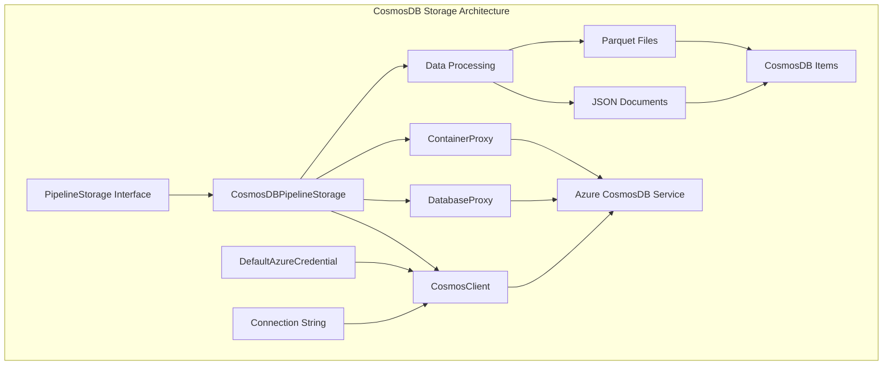
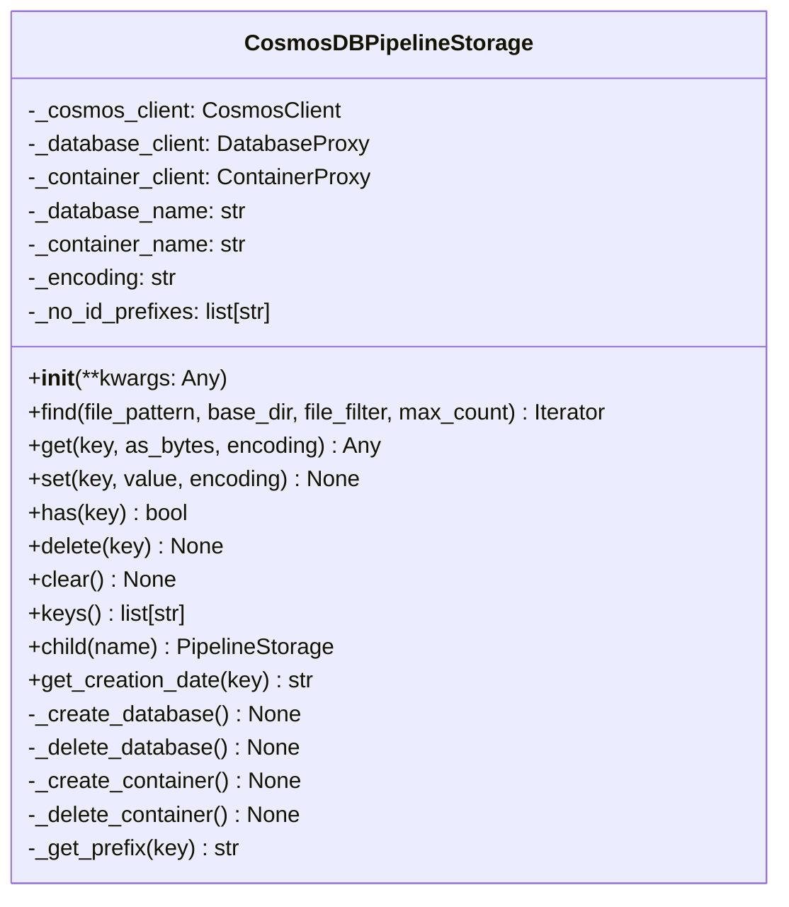
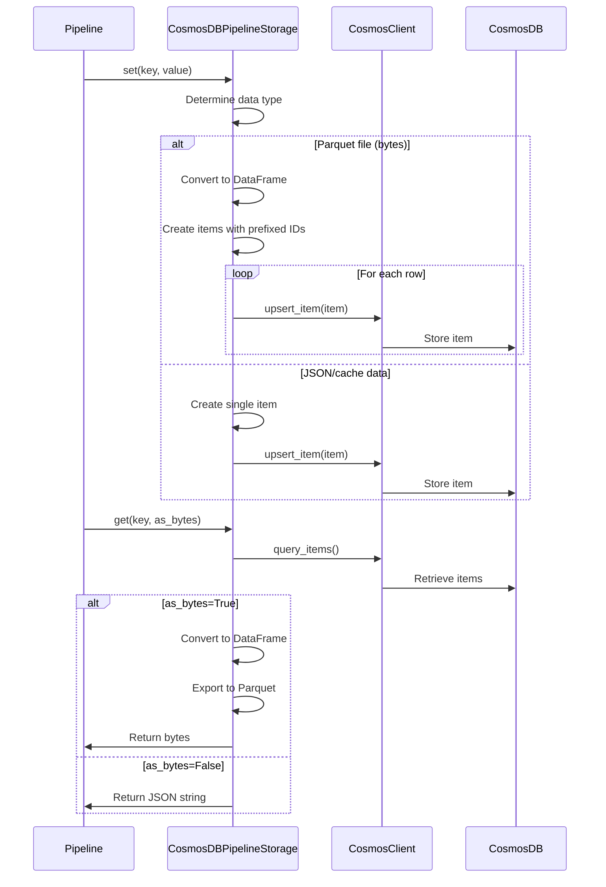
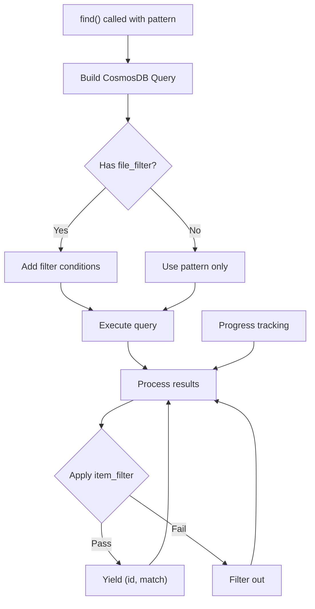
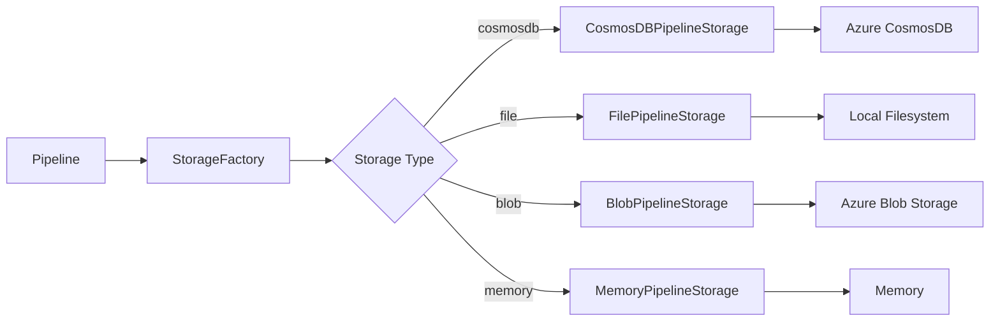

# CosmosDB Storage Module

## Introduction

The CosmosDB Storage module provides a cloud-native storage implementation for the GraphRAG pipeline using Azure CosmosDB. This module enables scalable, distributed storage of graph data, documents, and intermediate processing results in a NoSQL document database, offering high availability and global distribution capabilities.

## Architecture Overview

The CosmosDB Storage module implements the `PipelineStorage` interface to provide seamless integration with Azure CosmosDB. It handles both structured data (JSON documents) and binary data (Parquet files) by storing them as CosmosDB items with appropriate partitioning strategies.



## Core Components

### CosmosDBPipelineStorage

The main storage implementation that provides the interface between the GraphRAG pipeline and Azure CosmosDB. This class handles:

- **Database Management**: Automatic creation and deletion of CosmosDB databases
- **Container Management**: Dynamic container creation with appropriate partitioning
- **Data Operations**: CRUD operations for both JSON and binary data
- **Query Operations**: Pattern-based searching with filtering capabilities



## Data Flow Architecture

### Storage Operations Flow



### Query and Search Flow



## Key Features

### 1. Dual Authentication Support
- **Connection String**: For development and testing scenarios
- **Azure AD Authentication**: Using `DefaultAzureCredential` for production environments

### 2. Intelligent Data Handling
- **Parquet Files**: Automatically decomposed into individual CosmosDB items with prefixed IDs
- **JSON Documents**: Stored as single items with metadata
- **Binary Data**: Converted to appropriate formats for storage

### 3. Advanced Querying
- **Pattern Matching**: Regex-based document discovery
- **Filtering**: Custom key-value pair filtering
- **Partitioning**: Hash-based partitioning on ID field for optimal performance

### 4. Scalable Architecture
- **Container Management**: Dynamic container creation with appropriate partitioning
- **Database Management**: Automatic database provisioning
- **Error Handling**: Comprehensive exception handling and logging

## Configuration

The CosmosDB storage requires the following configuration parameters:

```python
{
    "base_dir": "database_name",  # CosmosDB database name
    "container_name": "container_name",  # Container name
    "cosmosdb_account_url": "https://account.documents.azure.com:443/",  # Optional
    "connection_string": "AccountEndpoint=...",  # Optional
    "encoding": "utf-8"  # Optional, defaults to utf-8
}
```

## Integration with Pipeline System

The CosmosDB storage integrates seamlessly with the GraphRAG pipeline system through the [Storage Factory](storage_factory.md):



## Data Models and Storage Patterns

### Document Storage
Documents from the [data_models](data_models.md) module are stored with appropriate metadata:

- **Entities**: Stored with their properties and relationships
- **Relationships**: Maintained as separate items with source/target references
- **Communities**: Stored with community detection results
- **Text Units**: Preserved with chunking information

### ID Management
The storage implements intelligent ID prefixing to handle different data types:

```python
# Parquet files: prefix:index or prefix:original_id
prefixed_id = f"{prefix}:{cosmosdb_item.get('id', index)}"

# JSON files: use original key
item_id = key
```

## Error Handling and Resilience

### Exception Management
- **CosmosResourceNotFoundError**: Graceful handling of missing resources
- **Connection Errors**: Comprehensive logging and fallback mechanisms
- **Data Conversion Errors**: Safe handling of format conversions

### Logging and Monitoring
- **Operation Logging**: Detailed logging of all storage operations
- **Progress Tracking**: Real-time progress updates for batch operations
- **Performance Metrics**: Query execution time and result counts

## Performance Considerations

### Partitioning Strategy
- **Hash Partitioning**: Uses `/id` as partition key for even distribution
- **Cross-partition Queries**: Enabled for pattern matching operations
- **Item Distribution**: Automatic distribution across physical partitions

### Query Optimization
- **Regex Matching**: Uses CosmosDB's `RegexMatch` function
- **Parameter Binding**: Prevents SQL injection and improves performance
- **Result Limiting**: Configurable maximum result counts

## Security Features

### Authentication
- **Azure AD Integration**: Uses `DefaultAzureCredential` for seamless authentication
- **Connection String**: Supports both secure and development authentication methods

### Data Protection
- **No Data Persistence in Code**: All data remains in CosmosDB
- **Secure Connections**: Uses HTTPS for all CosmosDB communications
- **Credential Management**: Leverages Azure's credential management system

## Limitations and Considerations

### Current Limitations
- **Key Listing**: Does not support listing all keys in storage
- **Child Storage**: Returns self instead of creating true child instances
- **Clear Operation**: Deletes entire database rather than specific containers

### Best Practices
- **Container Design**: Plan container structure based on query patterns
- **ID Prefixing**: Use consistent naming conventions for better organization
- **Error Handling**: Implement retry logic for transient failures
- **Monitoring**: Set up Azure Monitor for production deployments

## Dependencies

The CosmosDB storage module depends on:

- **Azure SDK**: `azure-cosmos` and `azure-identity` packages
- **Data Processing**: `pandas` for DataFrame operations
- **Core Interfaces**: [PipelineStorage](pipeline_storage.md) base class
- **Configuration**: [StorageConfig](storage_config.md) for initialization

## Usage Examples

### Basic Configuration
```python
storage = CosmosDBPipelineStorage(
    base_dir="graphrag_db",
    container_name="pipeline_data",
    cosmosdb_account_url="https://myaccount.documents.azure.com:443/"
)
```

### Pattern-based Search
```python
pattern = re.compile(r"entities_.*\.parquet")
results = storage.find(pattern, max_count=100)
for item_id, match in results:
    print(f"Found: {item_id}")
```

This comprehensive storage solution enables the GraphRAG system to leverage Azure CosmosDB's global distribution, automatic scaling, and enterprise-grade security features for managing graph data at scale.