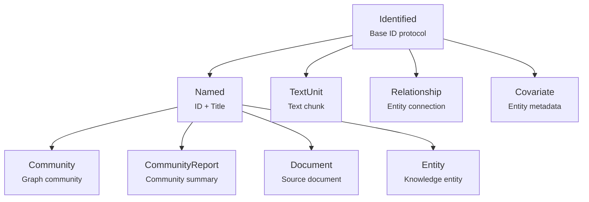
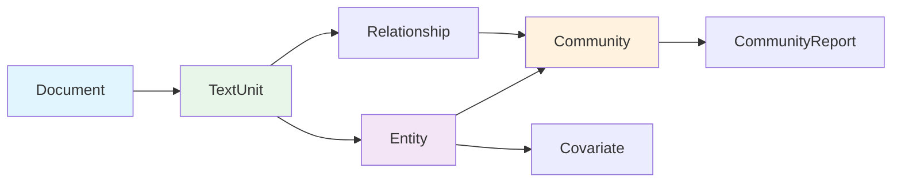

# Data Models Module Documentation

## Overview

The `data_models` module serves as the foundational layer for the GraphRAG system, providing the core data structures and protocols that represent the knowledge graph entities and their relationships. This module defines the fundamental building blocks for storing, organizing, and manipulating graph-based knowledge representations extracted from documents.

## Purpose

The data_models module is responsible for:
- Defining the core data structures for the knowledge graph
- Establishing inheritance hierarchies for different entity types
- Providing serialization/deserialization capabilities
- Enabling type-safe data manipulation throughout the system
- Supporting the representation of complex relationships between entities

## Architecture

### Core Inheritance Hierarchy

The module follows a well-structured inheritance pattern:



### Entity Relationships



## Core Components

### Base Protocols

For detailed information about the foundational protocols, see [base_protocols.md](base_protocols.md).

- **[Identified](base_protocols.md#identified)**: The foundational protocol providing unique identification capabilities
- **[Named](base_protocols.md#named)**: Extends Identified with title support for named entities

### Primary Entities

For detailed information about core entity types, see [core_entities.md](core_entities.md).

- **[Document](core_entities.md#document)**: Source documents containing text content
- **[TextUnit](core_entities.md#textunit)**: Text chunks that bridge documents and knowledge graph
- **[Entity](core_entities.md#entity)**: Knowledge entities extracted from text
- **[Relationship](core_entities.md#relationship)**: Connections between entities forming graph edges

### Community and Analysis Models

For detailed information about community detection and analysis models, see [community_models.md](community_models.md).

- **[Community](community_models.md#community)**: Clusters of related entities and relationships
- **[CommunityReport](community_models.md#communityreport)**: LLM-generated summaries of communities

### Metadata and Extension Models

For detailed information about metadata and extensibility models, see [metadata_models.md](metadata_models.md).

- **[Covariate](metadata_models.md#covariate)**: Flexible metadata associated with entities

## Key Features

### Serialization Support
All data models provide `from_dict()` class methods for easy deserialization from storage formats, supporting flexible key mapping for different data sources.

### Optional Fields
Most fields are optional (using `| None` type annotations), allowing for partial data representation and gradual population during processing pipelines.

### Embedding Support
Entities, relationships, and community reports support vector embeddings, enabling semantic search and similarity operations within the knowledge graph.

### Hierarchical Relationships
Communities support hierarchical organization with parent-child relationships, enabling multi-level graph analysis and summarization.

### Flexible Attributes
All major entities support arbitrary attribute dictionaries, allowing for extensible metadata without modifying core data structures.

## Integration with Other Modules

The data_models module serves as the foundation for:

- **[index_operations](index_operations.md)**: Uses these models for graph extraction, embedding, and community detection
- **[query_system](query_system.md)**: Leverages these models for search and retrieval operations
- **[storage](storage.md)**: Provides serialization formats for persistent storage
- **[vector_stores](vector_stores.md)**: Supplies embeddable entities for vector search operations

## Usage Patterns

### Entity-Relationship Graph Construction
```python
# Documents are processed to extract entities and relationships
document = Document(id="doc1", title="Example Document", text="...")
entities = [Entity(id="ent1", title="Entity 1"), Entity(id="ent2", title="Entity 2")]
relationships = [Relationship(id="rel1", source="ent1", target="ent2", description="connects")]
```

### Community Detection and Analysis
```python
# Entities and relationships are clustered into communities
community = Community(
    id="comm1", 
    title="Community 1",
    level="1",
    parent="",
    children=[],
    entity_ids=["ent1", "ent2"],
    relationship_ids=["rel1"]
)

# Communities receive generated reports
report = CommunityReport(
    id="report1",
    title="Community 1 Report",
    community_id="comm1",
    summary="This community contains...",
    full_content="Detailed analysis..."
)
```

### Text Unit Processing
```python
# Documents are divided into text units for granular analysis
text_unit = TextUnit(
    id="unit1",
    text="Relevant text excerpt...",
    entity_ids=["ent1"],
    relationship_ids=["rel1"],
    document_ids=["doc1"]
)
```

This modular design enables flexible knowledge graph construction, analysis, and querying while maintaining type safety and supporting extensible metadata throughout the system.