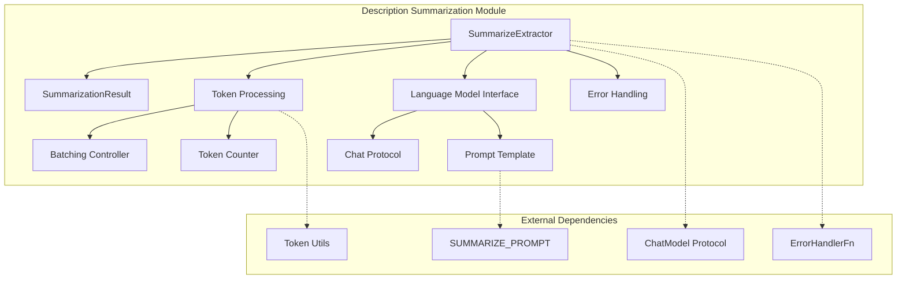
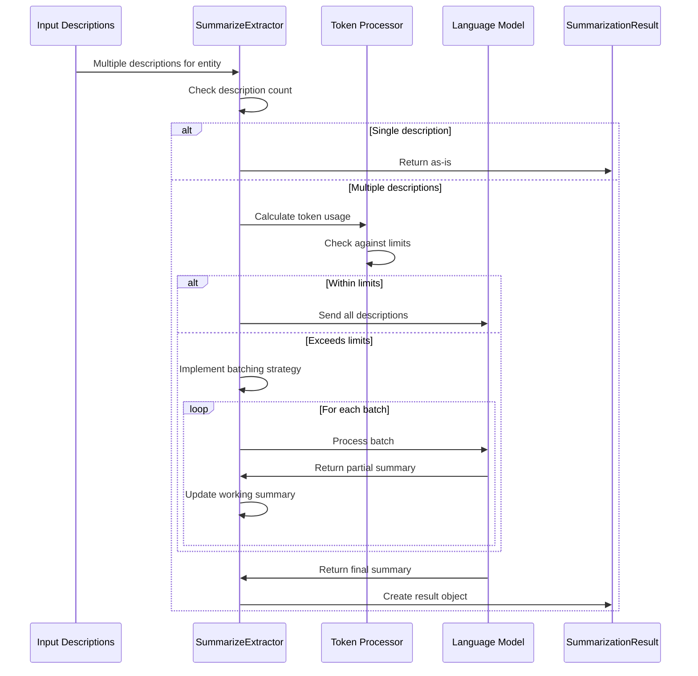
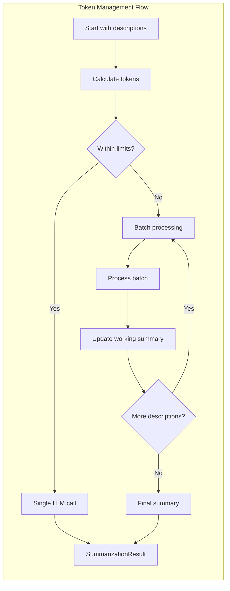
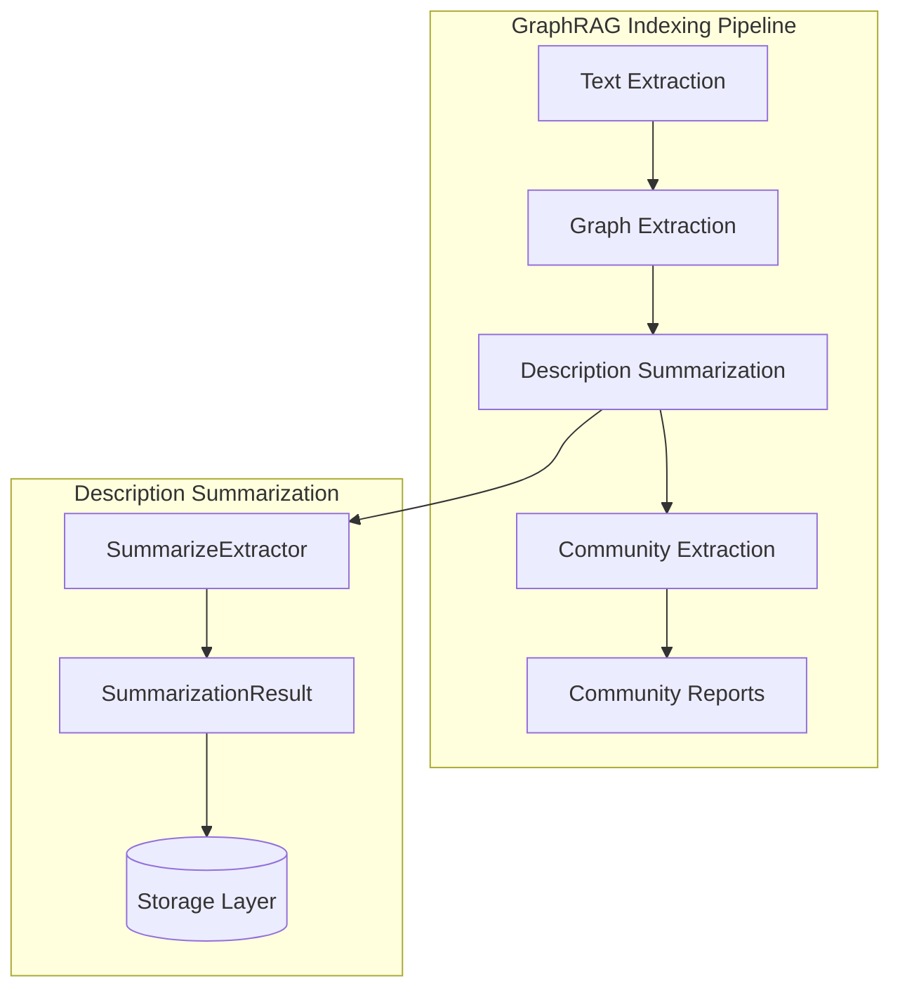

# Description Summarization Module

## Introduction

The description summarization module is a critical component of the GraphRAG indexing pipeline that consolidates multiple entity descriptions into coherent, comprehensive summaries. This module addresses the common scenario where entities accumulate multiple descriptions from different sources or contexts during the graph extraction process, requiring intelligent consolidation to maintain data quality and consistency.

## Purpose and Core Functionality

The primary purpose of the description summarization module is to:

- **Consolidate Multiple Descriptions**: Merge multiple descriptions of the same entity into a single, comprehensive summary
- **Resolve Contradictions**: Handle conflicting information across different descriptions and produce coherent output
- **Optimize Token Usage**: Efficiently manage token limits when processing large description sets
- **Maintain Context**: Preserve entity names and relationships while creating unified descriptions
- **Ensure Quality**: Generate third-person, context-rich descriptions that maintain the essential information from all sources

## Architecture and Components

### Core Components

#### SummarizeExtractor
The main extraction class that orchestrates the description summarization process. It manages the interaction with language models, handles token constraints, and implements the batching strategy for large description sets.

**Key Responsibilities:**
- Process individual entities or entity pairs
- Manage token limits and batching logic
- Coordinate with language models for summarization
- Handle error conditions gracefully

#### SummarizationResult
A data class that encapsulates the results of the summarization process, containing the entity identifier and the generated summary.

**Structure:**
- `id`: Entity identifier (string or tuple of strings)
- `description`: Consolidated description text

### Architecture Overview



## Data Flow and Processing

### Summarization Process Flow



### Token Management Strategy

The module implements sophisticated token management to handle large description sets:

1. **Initial Assessment**: Calculate total tokens in all descriptions plus prompt template
2. **Batch Detection**: If total exceeds limits, implement iterative batching
3. **Progressive Summarization**: Process descriptions in manageable chunks
4. **Memory Management**: Carry forward partial summaries between batches



## Integration with GraphRAG System

### Position in Indexing Pipeline

The description summarization module operates as part of the index operations, specifically handling the consolidation phase after initial entity extraction:



### Dependencies and Interfaces

The module integrates with several key GraphRAG components:

- **[Language Models](language_models.md)**: Utilizes the ChatModel protocol for LLM interactions
- **[Token Management](index_operations.md)**: Leverages token counting utilities for efficient processing
- **[Error Handling](pipeline_infrastructure.md)**: Implements robust error handling through ErrorHandlerFn
- **[Storage](storage.md)**: Persists results through the pipeline storage system

## Key Features and Capabilities

### Intelligent Batching
When description sets exceed token limits, the module automatically implements a batching strategy that:
- Preserves context across batches
- Maintains coherent narrative flow
- Optimizes for both quality and efficiency

### Contradiction Resolution
The summarization prompt is designed to:
- Identify conflicting information across descriptions
- Resolve contradictions through intelligent consolidation
- Maintain factual accuracy while creating unified narratives

### Flexible Entity Support
Supports both single entities and entity pairs:
- Single entity descriptions (string ID)
- Relationship descriptions (tuple of entity IDs)
- Consistent handling across different entity types

## Configuration and Customization

### Key Parameters

- **`max_summary_length`**: Maximum word count for generated summaries
- **`max_input_tokens`**: Token limit for LLM input processing
- **`summarization_prompt`**: Customizable prompt template (defaults to system prompt)
- **`on_error`**: Error handling callback function

### Prompt Template

The default prompt template (`SUMMARIZE_PROMPT`) provides:
- Clear instructions for comprehensive summarization
- Guidelines for contradiction resolution
- Third-person narrative requirements
- Length constraints enforcement

## Error Handling and Resilience

The module implements comprehensive error handling:

- **Input Validation**: Handles empty or malformed description lists
- **Token Overflow**: Gracefully manages token limit exceedances
- **LLM Failures**: Provides fallback mechanisms for model errors
- **Data Consistency**: Ensures result integrity across processing failures

## Performance Considerations

### Optimization Strategies

1. **Early Termination**: Single descriptions bypass LLM processing
2. **Progressive Processing**: Batch processing minimizes memory usage
3. **Token Efficiency**: Smart token counting reduces unnecessary LLM calls
4. **Async Operations**: Non-blocking processing for pipeline efficiency

### Scalability Factors

- **Description Volume**: Linear scaling with number of descriptions
- **Token Complexity**: Processing time correlates with total token count
- **LLM Latency**: Dependent on model response times and batch sizes

## Usage Examples

### Basic Usage
```python
# Initialize extractor
extractor = SummarizeExtractor(
    model_invoker=chat_model,
    max_summary_length=500,
    max_input_tokens=4000
)

# Process descriptions
result = await extractor(
    id="entity_123",
    descriptions=["Description 1", "Description 2", "Description 3"]
)
```

### Batch Processing
The module automatically handles large description sets through intelligent batching, requiring no additional configuration for optimal performance.

## Future Enhancements

Potential improvements to the module include:

- **Multi-language Support**: Enhanced handling of descriptions in different languages
- **Domain-specific Prompts**: Customizable prompts for specialized knowledge domains
- **Quality Scoring**: Automated assessment of summary quality and coherence
- **Incremental Updates**: Support for updating summaries with new descriptions

## Related Documentation

- [Language Models](language_models.md) - ChatModel protocol and implementation details
- [Index Operations](index_operations.md) - Overview of indexing pipeline operations
- [Storage Systems](storage.md) - Data persistence and retrieval mechanisms
- [Pipeline Infrastructure](pipeline_infrastructure.md) - Error handling and workflow management