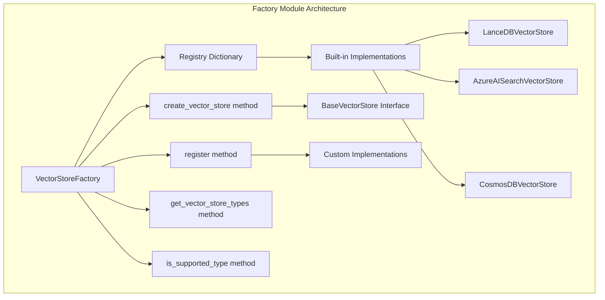
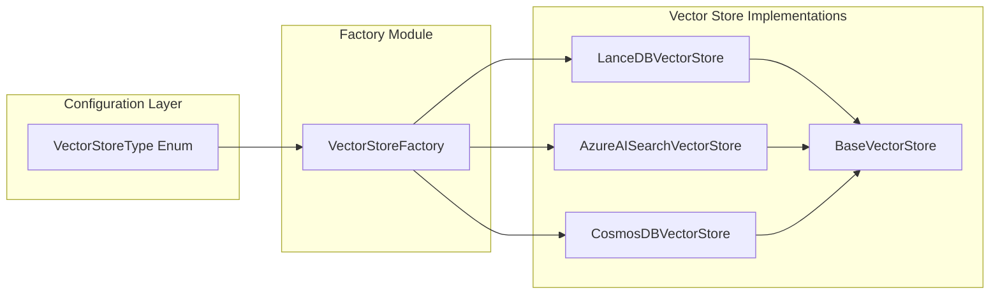
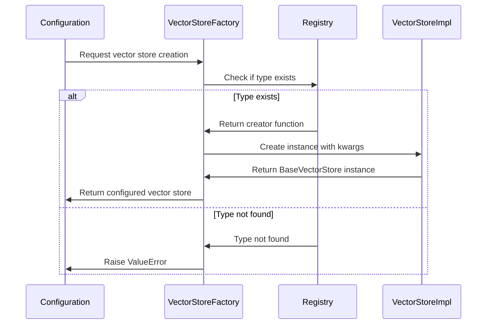
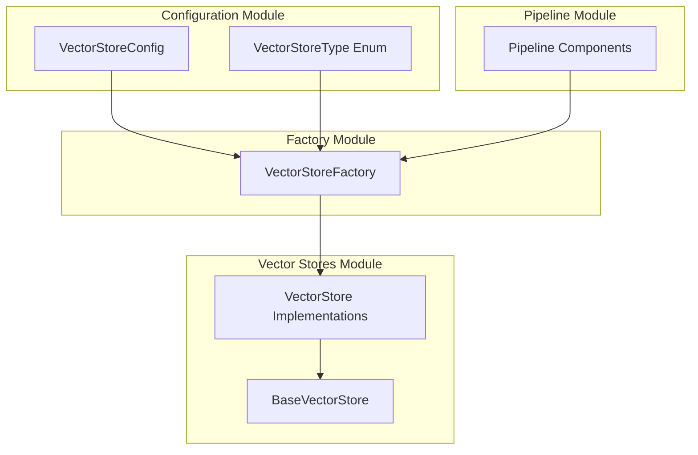

# Factory Module Documentation

## Introduction

The factory module provides a centralized factory pattern implementation for creating vector store instances within the GraphRAG system. It serves as a registry and instantiation mechanism for different vector store implementations, enabling dynamic creation of vector store objects based on configuration requirements.

## Architecture Overview

The factory module implements the Factory design pattern to manage vector store creation, providing a flexible and extensible way to support multiple vector store backends while maintaining a consistent interface.



## Core Components

### VectorStoreFactory

The `VectorStoreFactory` class is the central component that manages vector store creation and registration. It provides a registry-based approach for managing different vector store implementations.

**Key Features:**
- **Registry Management**: Maintains a dictionary of vector store types and their corresponding creators
- **Dynamic Creation**: Instantiates vector stores based on type strings and configuration parameters
- **Extensibility**: Allows registration of custom vector store implementations
- **Type Safety**: Ensures all created instances conform to the `BaseVectorStore` interface

**Class Methods:**
- `register(vector_store_type, creator)`: Registers a new vector store implementation
- `create_vector_store(vector_store_type, kwargs)`: Creates a vector store instance
- `get_vector_store_types()`: Returns list of registered vector store types
- `is_supported_type(vector_store_type)`: Checks if a vector store type is supported

## Dependencies and Integration



### Configuration Integration

The factory integrates with the [configuration](configuration.md) module through the `VectorStoreType` enum, which defines the supported vector store types. This ensures type safety and consistency across the system.

### Vector Store Implementations

The factory supports three built-in vector store implementations:

1. **LanceDBVectorStore**: A vector store implementation using LanceDB
2. **AzureAISearchVectorStore**: Integration with Azure AI Search service
3. **CosmosDBVectorStore**: Vector storage using Azure CosmosDB

Each implementation extends the [BaseVectorStore](vector_stores.md) interface, ensuring consistent behavior across different storage backends.

## Data Flow



## Usage Patterns

### Built-in Vector Store Creation

```python
# Create a LanceDB vector store
vector_store = VectorStoreFactory.create_vector_store(
    vector_store_type="lancedb",
    kwargs={"uri": "./lancedb", "collection_name": "documents"}
)
```

### Custom Vector Store Registration

```python
# Register a custom vector store implementation
VectorStoreFactory.register("custom_store", CustomVectorStore)

# Create instance of custom store
custom_store = VectorStoreFactory.create_vector_store(
    vector_store_type="custom_store",
    kwargs={"config": custom_config}
)
```

## Extension Points

The factory pattern allows for easy extension of the system with new vector store implementations:

1. **Custom Implementations**: Users can register their own vector store classes that implement the `BaseVectorStore` interface
2. **Runtime Registration**: New vector store types can be registered at runtime without modifying the core factory code
3. **Configuration-Driven**: Vector store selection can be driven by configuration files or environment variables

## Error Handling

The factory implements robust error handling:

- **Unknown Type Validation**: Raises `ValueError` when attempting to create an unregistered vector store type
- **Type Safety**: Ensures all registered creators return instances that conform to the `BaseVectorStore` interface
- **Configuration Validation**: Individual vector store implementations handle their own configuration validation

## Relationship to Other Modules



The factory module serves as a bridge between the configuration system and the vector store implementations, enabling the [pipeline infrastructure](pipeline_infrastructure.md) to dynamically instantiate the appropriate vector store based on runtime configuration.

## Best Practices

1. **Registration Order**: Register custom vector stores before attempting to create them
2. **Configuration Validation**: Ensure vector store configurations are validated before passing to the factory
3. **Error Handling**: Always handle `ValueError` exceptions when creating vector stores
4. **Type Checking**: Use `is_supported_type()` to validate vector store types before creation
5. **Resource Management**: Properly manage the lifecycle of created vector store instances

## Summary

The factory module provides a clean, extensible interface for vector store creation within the GraphRAG system. By implementing the factory pattern, it decouples vector store instantiation from the core application logic, enabling easy addition of new vector store backends and configuration-driven deployment strategies. The module's registry-based approach ensures that both built-in and custom vector store implementations can coexist seamlessly within the system.