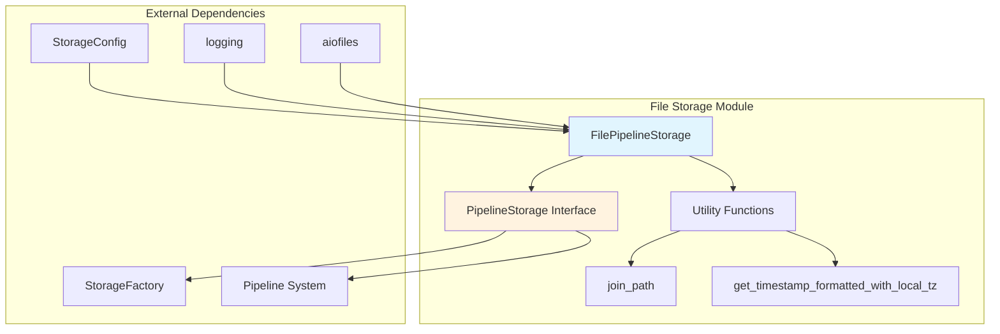
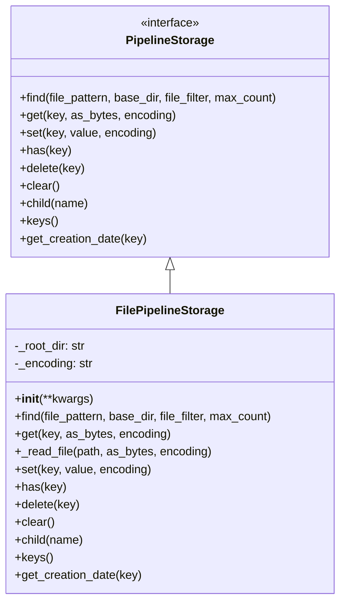
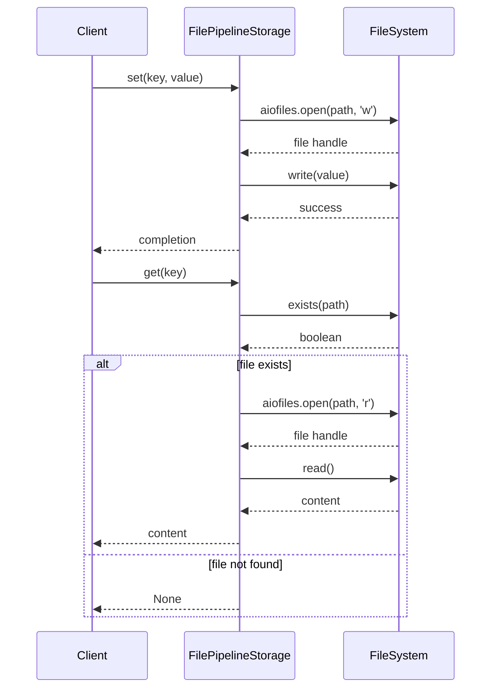
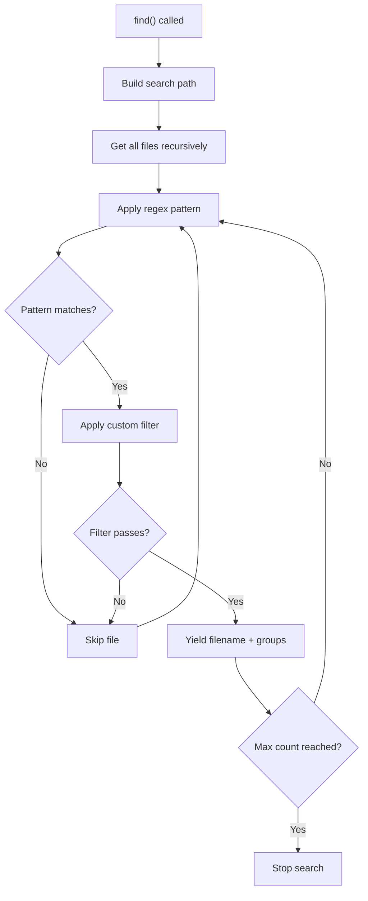
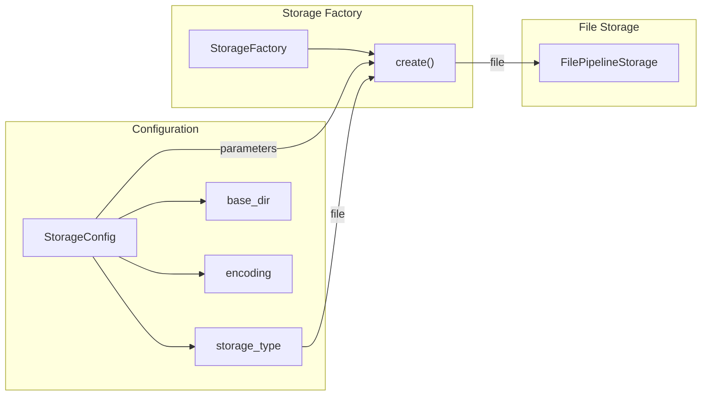

# File Storage Module Documentation

## Introduction

The file_storage module provides a file-based storage implementation for the GraphRAG pipeline system. It implements the `PipelineStorage` interface to offer persistent, file-based data storage capabilities for graph data, documents, and intermediate processing results. This module serves as the default storage backend for GraphRAG operations, providing reliable and efficient file I/O operations with async support.

## Architecture

### Component Overview



### Class Structure



## Core Components

### FilePipelineStorage

The `FilePipelineStorage` class is the primary implementation of file-based storage in the GraphRAG system. It provides a comprehensive set of file operations optimized for pipeline processing workflows.

#### Key Features

- **Async File Operations**: All file I/O operations are asynchronous using `aiofiles`
- **Flexible Encoding**: Configurable text encoding (defaults to UTF-8)
- **Pattern-based Search**: Regex pattern matching for file discovery
- **Hierarchical Storage**: Support for nested directory structures
- **Metadata Management**: File creation timestamp tracking
- **Binary/Text Support**: Handles both binary and text data

#### Configuration

```python
storage = FilePipelineStorage(
    base_dir="/path/to/storage",  # Root directory for storage
    encoding="utf-8"             # Text encoding (default: utf-8)
)
```

## Data Flow

### File Operations Flow



### File Search Flow



## Integration with GraphRAG System

### Storage Factory Integration



### Pipeline Integration

The FilePipelineStorage integrates with the GraphRAG pipeline system through the `PipelineStorage` interface, providing storage capabilities for:

- **Document Processing**: Storing raw documents and text units
- **Graph Data**: Persisting entities, relationships, and communities
- **Intermediate Results**: Caching processing outputs
- **Final Outputs**: Storing indexed graph data

## Usage Examples

### Basic File Operations

```python
# Initialize storage
storage = FilePipelineStorage(base_dir="./data", encoding="utf-8")

# Store text data
await storage.set("documents/doc1.txt", "Document content")

# Retrieve data
content = await storage.get("documents/doc1.txt")

# Check existence
exists = await storage.has("documents/doc1.txt")

# Delete file
await storage.delete("documents/doc1.txt")
```

### Pattern-based Search

```python
import re

# Find all JSON files with specific pattern
pattern = re.compile(r"(?P<name>\w+)_(?P<date>\d{4}-\d{2}-\d{2})\.json")

results = storage.find(
    file_pattern=pattern,
    base_dir="outputs",
    file_filter={"name": "graph"},
    max_count=10
)

for filename, groups in results:
    print(f"Found: {filename}, Groups: {groups}")
```

### Hierarchical Storage

```python
# Create child storage for specific workflow
child_storage = storage.child("workflow_1")
await child_storage.set("config.json", workflow_config)

# Access parent storage
parent_content = await storage.get("workflow_1/config.json")
```

## Error Handling

The FilePipelineStorage implements robust error handling:

- **File Not Found**: Returns `None` for non-existent files
- **Permission Errors**: Propagates OS-level permission errors
- **Encoding Issues**: Falls back to configured encoding
- **Path Traversal**: Uses safe path joining to prevent directory traversal

## Performance Considerations

### Optimization Strategies

1. **Async Operations**: All I/O operations are non-blocking
2. **Batch Processing**: Efficient for processing multiple files
3. **Memory Management**: Streams large files instead of loading entirely
4. **Caching**: File existence checks are cached when possible

### Scalability Limits

- **File System Limits**: Subject to OS file system constraints
- **Directory Size**: Performance degrades with very large directories
- **Concurrent Access**: File-level locking depends on OS implementation

## Dependencies

### Internal Dependencies

- **[pipeline_storage.md](pipeline_storage.md)**: Base interface and utilities
- **[storage_factory.md](storage_factory.md)**: Factory pattern implementation

### External Dependencies

- **aiofiles**: Asynchronous file operations
- **pathlib**: Cross-platform path handling
- **shutil**: File system operations

## Configuration Reference

### Storage Configuration

The FilePipelineStorage is configured through the `StorageConfig` model:

```yaml
storage:
  type: file
  base_dir: ./output
  encoding: utf-8
```

### Environment Variables

- `GRAPHRAG_STORAGE_BASE_DIR`: Override base directory
- `GRAPHRAG_STORAGE_ENCODING`: Override text encoding

## Best Practices

1. **Directory Structure**: Organize files in logical hierarchies
2. **Naming Conventions**: Use consistent file naming patterns
3. **Cleanup**: Implement proper cleanup in error scenarios
4. **Monitoring**: Log storage operations for debugging
5. **Backup**: Implement backup strategies for critical data

## Troubleshooting

### Common Issues

1. **Permission Denied**: Check file system permissions
2. **Disk Space**: Monitor available disk space
3. **Path Issues**: Verify base directory exists
4. **Encoding Errors**: Ensure consistent encoding configuration

### Debug Logging

Enable debug logging to trace storage operations:

```python
import logging
logging.getLogger("graphrag.storage.file_pipeline_storage").setLevel(logging.DEBUG)
```