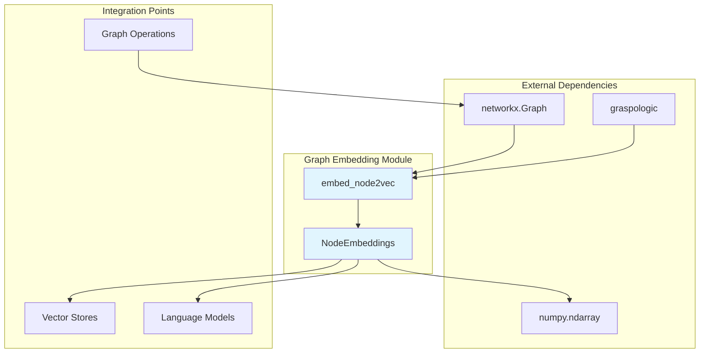
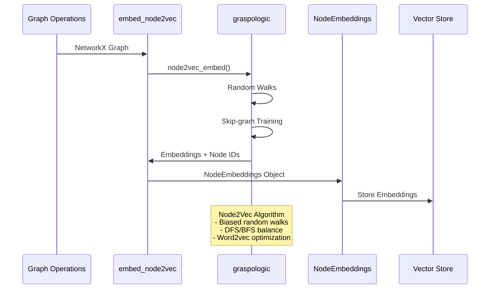
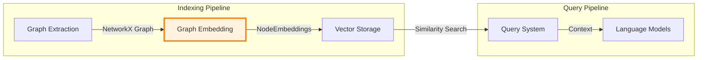

# Graph Embedding Module Documentation

## Introduction

The graph_embedding module is a specialized component within the GraphRAG (Graph Retrieval-Augmented Generation) system that focuses on generating vector representations of graph nodes using the Node2Vec algorithm. This module transforms graph structures into dense, low-dimensional embeddings that capture both local and global graph topology, enabling semantic similarity searches and machine learning operations on graph data.

## Architecture Overview

The graph_embedding module serves as a bridge between the graph structure representation and vector-based operations within the GraphRAG pipeline. It integrates with the broader indexing operations to provide graph-aware embeddings that enhance the system's ability to understand and query complex relationships in the data.



## Core Components

### NodeEmbeddings Data Class

The `NodeEmbeddings` class is the primary data structure that encapsulates the results of graph embedding operations. It provides a clean interface for accessing both the embedded nodes and their corresponding vector representations.

**Key Features:**
- **Type Safety**: Uses Python dataclass for structured data representation
- **Efficient Storage**: Leverages NumPy arrays for high-performance numerical operations
- **Clear Interface**: Separates node identifiers from their embedding vectors

**Component Structure:**
```python
@dataclass
class NodeEmbeddings:
    nodes: list[str]        # List of node identifiers
    embeddings: np.ndarray  # 2D array of shape (num_nodes, dimensions)
```

### embed_node2vec Function

The `embed_node2vec` function is the core algorithmic implementation that generates node embeddings using the Node2Vec algorithm. This function transforms a NetworkX graph into a set of dense vector representations.

**Algorithm Parameters:**
- `dimensions`: The dimensionality of the output embeddings (default: 1536)
- `num_walks`: Number of random walks per node (default: 10)
- `walk_length`: Length of each random walk (default: 40)
- `window_size`: Context window size for Skip-gram (default: 2)
- `iterations`: Number of training iterations (default: 3)
- `random_seed`: Seed for reproducible results (default: 86)

**Implementation Details:**
- Uses the `graspologic` library for efficient Node2Vec implementation
- Supports both directed and undirected graphs
- Returns embeddings ordered by node appearance in the graph

## Data Flow Architecture



## Integration with GraphRAG System

The graph_embedding module integrates seamlessly with other components of the GraphRAG system:

### Upstream Dependencies
- **[Graph Extraction](graph_extraction.md)**: Provides the NetworkX graphs that serve as input for embedding generation
- **[Data Models](data_models.md)**: Uses entity and relationship data to construct meaningful graph structures

### Downstream Consumers
- **[Vector Stores](vector_stores.md)**: Stores generated embeddings for efficient similarity search
- **[Query System](query_system.md)**: Utilizes embeddings for semantic graph queries
- **[Language Models](language_models.md)**: May use embeddings as additional context for generation tasks



## Configuration and Performance

### Default Parameters
The module comes with carefully tuned default parameters optimized for knowledge graph embeddings:
- **1536 dimensions**: Matches common embedding model dimensions for compatibility
- **10 walks per node**: Provides good coverage while maintaining efficiency
- **40 walk length**: Captures local and semi-global graph structure
- **Window size 2**: Balances local context with computational efficiency

### Performance Considerations
- **Lazy Loading**: Graspologic import is deferred to reduce initial package load time
- **Memory Efficiency**: Uses NumPy arrays for compact representation
- **Scalability**: Algorithm complexity scales with graph size and embedding dimensions

## Usage Patterns

### Basic Embedding Generation
```python
import networkx as nx
from graphrag.index.operations.embed_graph import embed_node2vec

# Create or obtain a graph
graph = nx.karate_club_graph()

# Generate embeddings
embeddings = embed_node2vec(
    graph=graph,
    dimensions=128,
    num_walks=10,
    walk_length=40
)

# Access results
node_ids = embeddings.nodes
embedding_matrix = embeddings.embeddings
```

### Integration with Pipeline
The module is designed to work within the GraphRAG indexing pipeline, automatically processing extracted graphs and storing results for downstream operations.

## Error Handling and Edge Cases

### Graph Requirements
- Supports both `nx.Graph` and `nx.DiGraph` types
- Handles disconnected components gracefully
- Works with graphs of varying sizes and densities

### Reproducibility
- Fixed random seed ensures consistent results across runs
- Parameter validation prevents common configuration errors

## Future Enhancements

### Potential Extensions
- **Multiple Algorithms**: Support for additional embedding methods (DeepWalk, LINE, etc.)
- **Dynamic Embeddings**: Support for temporal graph embeddings
- **Multi-scale Embeddings**: Hierarchical embedding generation at different granularities
- **GPU Acceleration**: Integration with GPU-accelerated embedding libraries

### Integration Opportunities
- **Hybrid Embeddings**: Combine graph structure with node attributes
- **Adaptive Parameters**: Dynamic parameter tuning based on graph characteristics
- **Incremental Updates**: Support for streaming graph updates

## Related Documentation

- [Graph Extraction Module](graph_extraction.md) - Learn about graph construction
- [Vector Stores Module](vector_stores.md) - Understand embedding storage and retrieval
- [Data Models Module](data_models.md) - Explore the underlying data structures
- [Query System Module](query_system.md) - See how embeddings are used in queries
- [Configuration Module](configuration.md) - Review system-wide configuration options

## References

1. Grover, A., & Leskovec, J. (2016). "node2vec: Scalable Feature Learning for Networks." Proceedings of the 22nd ACM SIGKDD International Conference on Knowledge Discovery and Data Mining.

2. Perozzi, B., Al-Rfou, R., & Skiena, S. (2014). "DeepWalk: Online Learning of Social Representations." Proceedings of the 20th ACM SIGKDD International Conference on Knowledge Discovery and Data Mining.