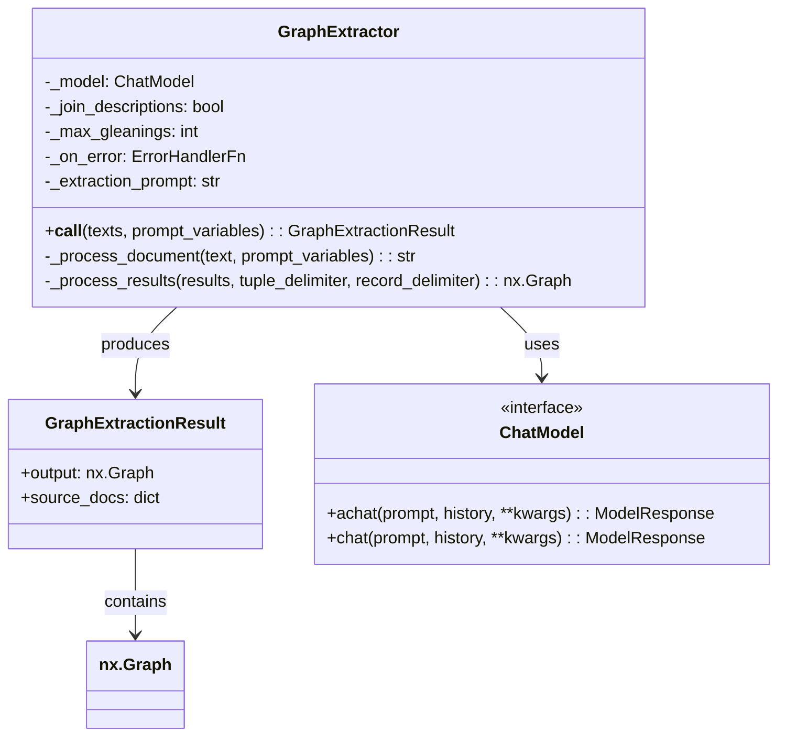
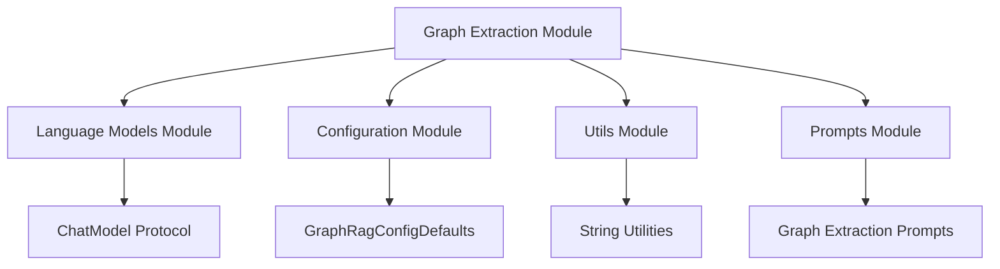
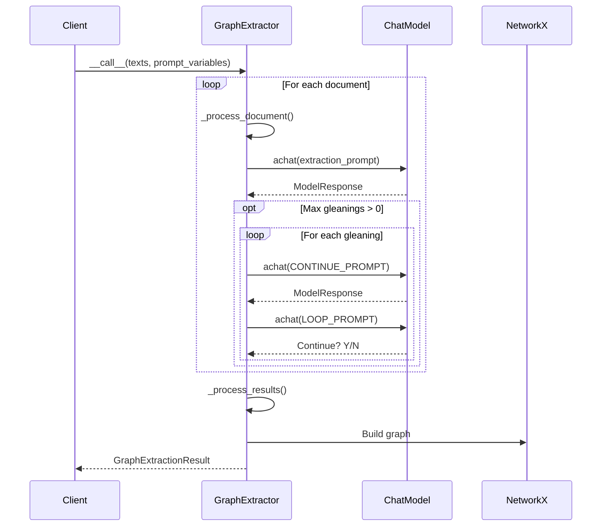
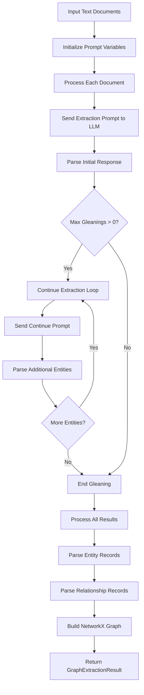
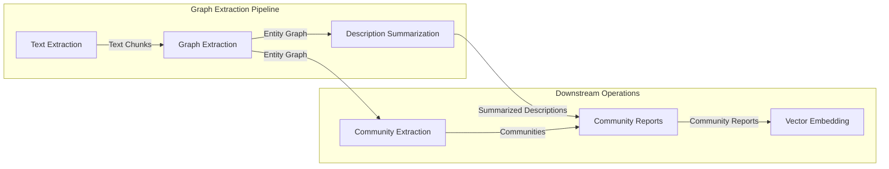

# Graph Extraction Module

## Introduction

The graph_extraction module is a core component of the GraphRAG system responsible for extracting knowledge graphs from unstructured text documents. It uses language models to identify entities and their relationships, creating a network representation of knowledge that serves as the foundation for downstream analysis and querying operations.

## Purpose and Core Functionality

The primary purpose of this module is to transform raw text into structured graph representations by:

- **Entity Recognition**: Identifying and extracting named entities (organizations, people, locations, events) from text
- **Relationship Extraction**: Discovering connections and relationships between identified entities
- **Graph Construction**: Building a NetworkX graph where nodes represent entities and edges represent relationships
- **Multi-pass Extraction**: Using iterative extraction to capture comprehensive entity-relationship information

## Architecture Overview

### Core Components



### Module Dependencies



## Detailed Component Analysis

### GraphExtractor Class

The `GraphExtractor` is the main orchestrator that coordinates the graph extraction process. It manages the interaction with language models and processes their outputs into structured graph data.

#### Key Features:

- **Configurable Extraction**: Supports custom delimiters, entity types, and extraction parameters
- **Multi-pass Processing**: Implements "gleaning" mechanism for iterative extraction
- **Error Handling**: Provides robust error handling with customizable error callbacks
- **Description Management**: Supports both joining and replacing entity descriptions

#### Configuration Parameters:

| Parameter | Purpose | Default |
|-----------|---------|---------|
| `tuple_delimiter` | Separator between entity/relationship attributes | `<\|>` |
| `record_delimiter` | Separator between extraction records | `##` |
| `completion_delimiter` | End-of-extraction marker | `<\|COMPLETE\|>` |
| `entity_types` | Types of entities to extract | `["organization", "person", "geo", "event"]` |
| `max_gleanings` | Number of iterative extraction passes | From config defaults |

### GraphExtractionResult Class

A simple data container that holds the extraction results:

- **output**: NetworkX graph containing extracted entities and relationships
- **source_docs**: Mapping of document indices to original text for traceability

## Data Flow Architecture



## Extraction Process Flow



## Graph Construction Logic

### Entity Processing

When processing entity records, the system:

1. **Normalizes entity names** using `clean_str()` and converts to uppercase
2. **Handles duplicate entities** by either joining descriptions or keeping the longest one
3. **Maintains source tracking** by aggregating source document IDs
4. **Preserves entity types** with fallback to existing types for duplicates

### Relationship Processing

For relationship records, the system:

1. **Creates missing entities** if referenced entities don't exist in the graph
2. **Aggregates edge weights** when duplicate relationships are found
3. **Manages edge descriptions** similar to entity descriptions
4. **Maintains bidirectional relationships** in the undirected graph

## Integration with GraphRAG System



## Error Handling and Resilience

The module implements comprehensive error handling:

- **Document-level Error Isolation**: Failures in one document don't affect others
- **Customizable Error Callbacks**: Allows clients to define custom error handling behavior
- **Graceful Degradation**: Continues processing even when individual documents fail
- **Detailed Error Context**: Provides rich error context including document index and text

## Performance Considerations

### Optimization Strategies:

1. **Batch Processing**: Processes multiple documents in sequence within a single call
2. **Configurable Gleaning**: Allows tuning of extraction iterations based on accuracy needs
3. **Efficient Graph Building**: Uses NetworkX for optimized graph operations
4. **String Processing**: Implements efficient string cleaning and parsing utilities

### Scalability Factors:

- **Language Model Throughput**: Extraction speed depends on LLM response times
- **Graph Size**: Memory usage scales with the number of entities and relationships
- **Document Complexity**: Longer documents require more processing time

## Usage Patterns

### Basic Usage

```python
extractor = GraphExtractor(model_invoker=chat_model)
result = await extractor(texts=["Document text here..."])
graph = result.output
```

### Advanced Configuration

```python
extractor = GraphExtractor(
    model_invoker=chat_model,
    max_gleanings=3,
    join_descriptions=True,
    on_error=custom_error_handler
)
```

## Related Modules

- **[language_models](language_models.md)**: Provides the ChatModel protocol and implementations
- **[configuration](configuration.md)**: Supplies configuration defaults and settings
- **[data_models](data_models.md)**: Defines the entity and relationship data structures
- **[index_operations](index_operations.md)**: Contains related indexing operations

## Future Enhancements

Potential areas for improvement include:

- **Parallel Processing**: Implement concurrent document processing
- **Incremental Updates**: Support for updating existing graphs with new information
- **Quality Metrics**: Add extraction confidence scores and quality assessment
- **Custom Entity Types**: Dynamic entity type discovery and classification