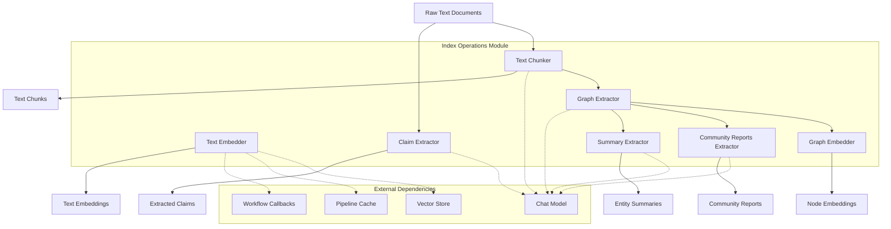
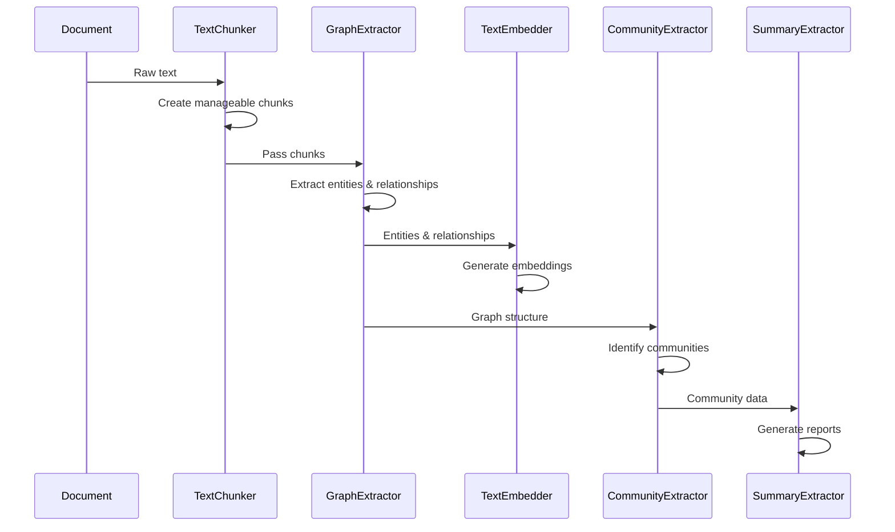

# Index Operations Module

## Overview

The `index_operations` module is a core component of the GraphRAG system responsible for processing and transforming raw text data into structured graph representations. This module implements the fundamental operations that convert unstructured text into knowledge graphs, including entity extraction, relationship identification, text chunking, embedding generation, and community detection.

## Purpose

The primary purpose of the index_operations module is to:
- Extract entities and relationships from text documents
- Generate embeddings for text and graph components
- Create community structures and summaries
- Process and chunk text for optimal analysis
- Extract structured claims and covariates from text

## Architecture

## Core Components

### 1. Graph Extraction Operations

The graph extraction operations are responsible for identifying entities and relationships within text documents.

For detailed documentation, see [Graph Extraction](graph_extraction.md).

#### GraphExtractor
- **Purpose**: Extracts entities and relationships from text using LLM-based extraction
- **Key Features**:
  - Multi-pass extraction with configurable gleaning iterations
  - Entity and relationship identification with descriptions
  - Source document tracking
  - Configurable entity types and delimiters
- **Dependencies**: ChatModel for LLM interactions
- **Output**: NetworkX graph with entities as nodes and relationships as edges

#### GraphExtractionResult
- **Purpose**: Container for graph extraction results
- **Contains**: NetworkX graph and source document mapping

### 2. Text Embedding Operations

Text embedding operations convert text into vector representations for semantic search and analysis.

For detailed documentation, see [Text Embedding](text_embedding.md).

#### TextEmbedStrategyType
- **Purpose**: Defines available text embedding strategies
- **Supported Types**: OpenAI embeddings, mock embeddings
- **Configuration**: Strategy selection and vector store integration

#### embed_text Function
- **Purpose**: Embeds text using specified strategy with optional vector store persistence
- **Features**:
  - Batch processing for large datasets
  - Vector store integration for scalable storage
  - Configurable embedding columns and metadata
- **Dependencies**: PipelineCache, WorkflowCallbacks, VectorStoreFactory

### 3. Graph Embedding Operations

Graph embedding operations create vector representations of graph structures.

For detailed documentation, see [Graph Embedding](graph_embedding.md).

#### NodeEmbeddings
- **Purpose**: Container for node embedding results
- **Contains**: List of node identifiers and corresponding embedding matrix

#### embed_node2vec Function
- **Purpose**: Generates node embeddings using Node2Vec algorithm
- **Configuration**: Dimensions, walk parameters, window size, iterations
- **Dependencies**: Graspologic library for Node2Vec implementation
- **Output**: NodeEmbeddings with configurable dimensionality

### 4. Community Analysis Operations

Community analysis operations identify and summarize communities within the graph.

For detailed documentation, see [Community Analysis](community_analysis.md).

#### CommunityReportsExtractor
- **Purpose**: Generates comprehensive reports for graph communities
- **Features**:
  - Structured report generation with findings
  - Rating system for community importance
  - Configurable report length limits
- **Dependencies**: ChatModel for report generation
- **Output**: Community reports with title, summary, findings, and ratings

### 5. Description Summarization Operations

Description summarization operations consolidate multiple descriptions into concise summaries.

For detailed documentation, see [Description Summarization](description_summarization.md).

#### SummarizeExtractor
- **Purpose**: Summarizes multiple entity descriptions into single coherent descriptions
- **Features**:
  - Token-aware processing to handle large description sets
  - Multi-pass summarization for very long descriptions
  - Configurable input token limits and output length
- **Dependencies**: ChatModel for summarization
- **Output**: Consolidated entity descriptions

### 6. Claim Extraction Operations

Claim extraction operations identify structured claims and covariates from text.

For detailed documentation, see [Claim Extraction](claim_extraction.md).

#### ClaimExtractor
- **Purpose**: Extracts structured claims (subject-predicate-object relationships) from text
- **Features**:
  - Multi-pass extraction with configurable gleaning
  - Entity resolution support
  - Temporal information extraction (start/end dates)
  - Claim status tracking
- **Dependencies**: ChatModel for claim extraction
- **Output**: Structured claims with subjects, objects, types, and metadata

### 7. Text Chunking Operations

Text chunking operations break documents into manageable pieces for processing.

For detailed documentation, see [Text Chunking](text_chunking.md).

#### TextChunk
- **Purpose**: Represents a chunk of text with metadata
- **Contains**: Text content, source document indices, token count
- **Usage**: Input for various extraction and embedding operations

## Data Flow

## Integration Points

The index_operations module integrates with several other system components:

- **[Language Models](language_models.md)**: Uses ChatModel protocol for extraction and generation tasks
- **[Vector Stores](vector_stores.md)**: Persists text embeddings for search operations
- **[Caching](caching.md)**: Leverages PipelineCache for performance optimization
- **[Storage](storage.md)**: Uses storage systems for intermediate results
- **[Configuration](configuration.md)**: Consumes configuration for operation parameters

## Configuration

Operations in this module are configured through:
- Strategy selection (embedding types, extraction methods)
- Parameter tuning (batch sizes, token limits, iteration counts)
- Prompt customization for LLM interactions
- Error handling and recovery mechanisms

## Error Handling

The module implements comprehensive error handling:
- Graceful degradation when LLM operations fail
- Configurable error handlers for custom error processing
- Logging and monitoring through workflow callbacks
- Data validation and sanitization

## Performance Considerations

- **Batch Processing**: Text embedding operations support batch processing for efficiency
- **Caching**: Leverages caching for expensive LLM operations
- **Streaming**: Supports streaming processing for large datasets
- **Memory Management**: Efficient handling of large graphs and embedding matrices

## Usage Examples

The index_operations module is typically used as part of the GraphRAG pipeline, where operations are chained together to transform raw documents into a searchable knowledge graph. Each operation can be used independently or as part of a larger workflow, providing flexibility in how text processing and graph construction are performed.