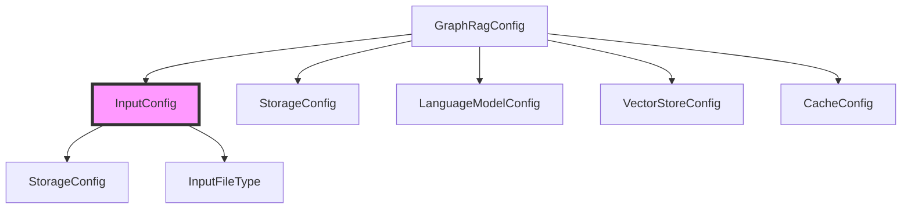
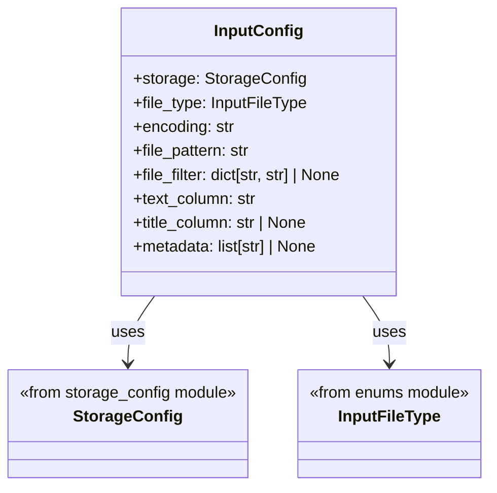
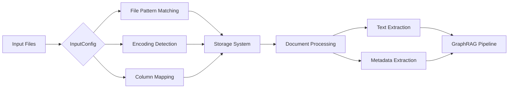
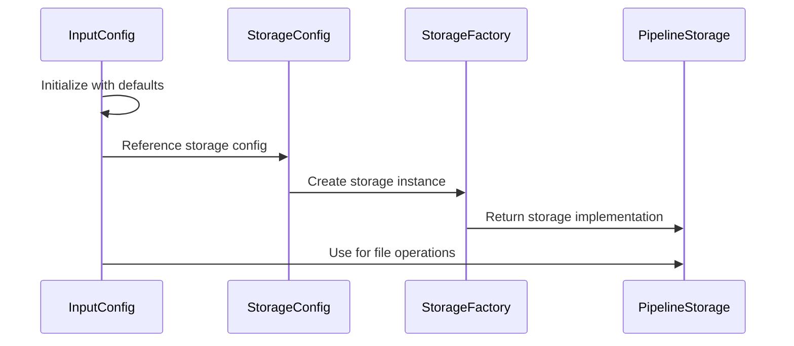

# Input Configuration Module Documentation

## Introduction

The `input_config` module is a critical component of the GraphRAG configuration system that manages how input data is ingested and processed within the GraphRAG pipeline. This module defines the `InputConfig` class, which serves as the central configuration object for specifying how documents and text data should be read, parsed, and prepared for the graph extraction and indexing processes.

As part of the broader configuration system, the input_config module provides the foundational settings that determine the data ingestion behavior of the entire GraphRAG system, making it essential for proper data processing and graph construction.

## Architecture Overview

### Module Position in Configuration Hierarchy

The input_config module is positioned within the configuration layer of GraphRAG, specifically handling input-related settings. It integrates with other configuration modules to form a comprehensive configuration system.



### Core Component Structure



## Component Details

### InputConfig Class

The `InputConfig` class is a Pydantic BaseModel that encapsulates all configuration parameters related to input data processing. It provides a structured way to define how the GraphRAG system should handle incoming documents and text data.

#### Key Configuration Parameters

| Parameter | Type | Description | Default Source |
|-----------|------|-------------|----------------|
| `storage` | StorageConfig | Storage configuration for reading input documents | `graphrag_config_defaults.input.storage` |
| `file_type` | InputFileType | Type of input files to process | `graphrag_config_defaults.input.file_type` |
| `encoding` | str | Character encoding for input files | `defs.graphrag_config_defaults.input.encoding` |
| `file_pattern` | str | Glob pattern for matching input files | `graphrag_config_defaults.input.file_pattern` |
| `file_filter` | dict[str, str] \| None | Optional filters for file selection | `graphrag_config_defaults.input.file_filter` |
| `text_column` | str | Column name containing text content | `graphrag_config_defaults.input.text_column` |
| `title_column` | str \| None | Column name containing document titles | `graphrag_config_defaults.input.title_column` |
| `metadata` | list[str] \| None | List of document attribute columns | `graphrag_config_defaults.input.metadata` |

#### Configuration Validation and Defaults

The InputConfig class leverages Pydantic's validation capabilities to ensure configuration consistency. All parameters have default values sourced from the central configuration defaults system, ensuring consistent behavior across the application.

## Data Flow and Integration

### Input Processing Pipeline



### Integration with Storage System

The InputConfig module works closely with the [storage_config](storage_config.md) module to determine how and where input files are accessed. The storage configuration defines the base directory and storage backend, while InputConfig specifies the file selection criteria and parsing parameters.



## Configuration Usage Patterns

### Basic Configuration

The InputConfig is typically used as part of the main GraphRagConfig, but can be instantiated independently for specific use cases:

```python
from graphrag.config.models.input_config import InputConfig
from graphrag.config.models.storage_config import StorageConfig

# Basic configuration with defaults
config = InputConfig()

# Custom configuration
custom_config = InputConfig(
    file_type=InputFileType.csv,
    text_column="content",
    title_column="document_title",
    metadata=["author", "date", "category"]
)
```

### File Type Support

The InputConfig supports various file types through the InputFileType enumeration, allowing the system to handle different data formats appropriately. The file type determines the parsing strategy and column extraction logic.

### Flexible File Selection

The combination of `file_pattern` and `file_filter` parameters provides flexible file selection capabilities:
- `file_pattern`: Uses glob patterns for basic file matching
- `file_filter`: Provides additional filtering options using key-value pairs

## Dependencies and Relationships

### Internal Dependencies

- **graphrag.config.defaults**: Provides default values for all configuration parameters
- **graphrag.config.enums**: Defines InputFileType and other enumerations
- **graphrag.config.models.storage_config**: Defines storage configuration structure

### External Integration Points

- **Storage System**: Uses [storage_config](storage_config.md) for file access configuration
- **Pipeline Infrastructure**: Consumed by pipeline components for input processing
- **Data Models**: Provides configuration for creating Document and TextUnit objects

## Error Handling and Validation

The InputConfig class inherits Pydantic's robust validation capabilities, ensuring that:
- All field types are validated at instantiation
- Required fields are present
- Enum values are within allowed ranges
- Optional fields are properly handled

## Best Practices

### Configuration Management

1. **Use Defaults**: Leverage the default configuration system for consistent behavior
2. **Override Selectively**: Only override specific parameters that need customization
3. **Validate Early**: Ensure configuration validation happens at application startup
4. **Document Customizations**: Maintain documentation for any non-default configurations

### Performance Considerations

1. **File Pattern Efficiency**: Use specific file patterns to avoid unnecessary file system operations
2. **Metadata Selection**: Only include necessary metadata columns to reduce memory usage
3. **Encoding Consistency**: Ensure consistent encoding across all input files

## Extension Points

The InputConfig module is designed to be extensible. New configuration parameters can be added to support:
- Additional file types
- Custom parsing options
- Advanced filtering mechanisms
- Metadata extraction strategies

## Related Documentation

- [Storage Configuration](storage_config.md) - For storage-related configuration details
- [Configuration Defaults](configuration.md) - For understanding default value system
- [Data Models](data_models.md) - For understanding how input configuration affects data model creation
- [Pipeline Infrastructure](pipeline_infrastructure.md) - For understanding how input configuration is used in the processing pipeline