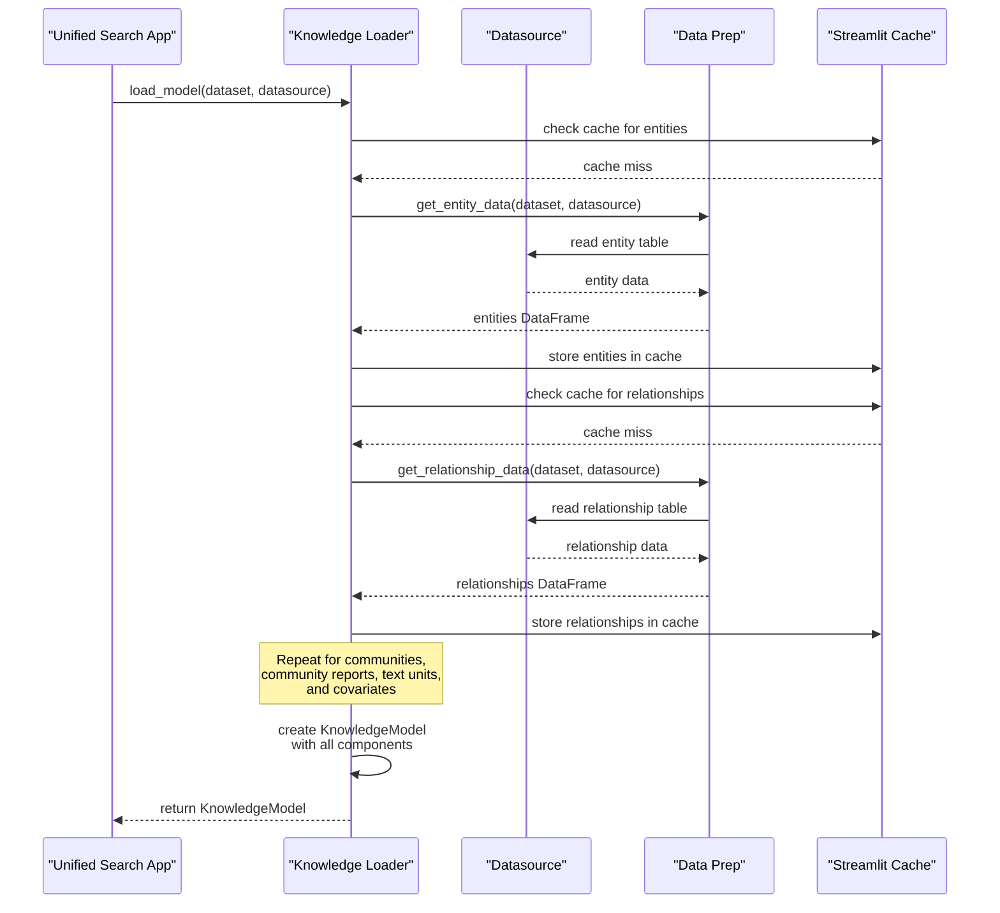
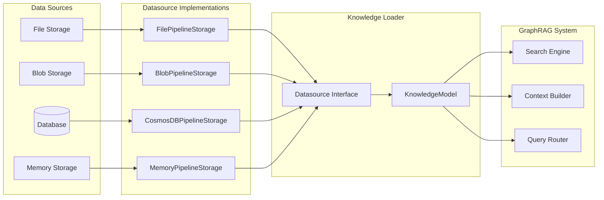
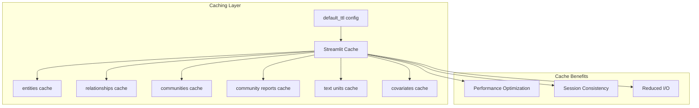

# Knowledge Loader Module Documentation

## Introduction

The knowledge_loader module serves as a critical data access layer in the unified search application, responsible for loading and managing graph-indexed data from various data sources. It provides a unified interface for retrieving knowledge graph components including entities, relationships, communities, community reports, text units, and covariates data that power the GraphRAG (Graph Retrieval-Augmented Generation) system.

## Architecture Overview

The knowledge_loader module is structured around two core components that work together to provide seamless data access:

1. **KnowledgeModel**: A data container that holds all graph-indexed knowledge components
2. **Datasource**: An abstract interface for accessing different data storage backends

```mermaid
graph TB
    subgraph "Knowledge Loader Module"
        KM[KnowledgeModel]
        DS[Datasource Interface]
        LF[Load Functions]
        
        KM --> Entities[entities: pd.DataFrame]
        KM --> Relationships[relationships: pd.DataFrame]
        KM --> CommunityReports[community_reports: pd.DataFrame]
        KM --> Communities[communities: pd.DataFrame]
        KM --> TextUnits[text_units: pd.DataFrame]
        KM --> Covariates[covariates: pd.DataFrame]
        
        LF --> load_entities
        LF --> load_relationships
        LF --> load_community_reports
        LF --> load_communities
        LF --> load_text_units
        LF --> load_covariates
        
        DS --> read[read method]
        DS --> write[write method]
        DS --> read_settings[read_settings method]
        DS --> has_table[has_table method]
    end
    
    subgraph "External Dependencies"
        SC[Streamlit Cache]
        DPP[Data Prep Functions]
        GRC[GraphRagConfig]
    end
    
    LF -.->|"uses"| DS
    LF -.->|"calls"| DPP
    LF -.->|"cached by"| SC
    DS -.->|"returns"| GRC
```



## Core Components

### KnowledgeModel

The `KnowledgeModel` is a dataclass that serves as the central data container for all graph-indexed knowledge components. It aggregates data from multiple GraphRAG indexing operations into a single, coherent model that can be used by search and retrieval operations.

**Attributes:**
- `entities`: DataFrame containing entity information from [graphrag.data_model.entity.Entity](data_models.md#entity)
- `relationships`: DataFrame containing relationship data from [graphrag.data_model.relationship.Relationship](data_models.md#relationship)
- `community_reports`: DataFrame containing community analysis reports from [graphrag.data_model.community_report.CommunityReport](data_models.md#communityreport)
- `communities`: DataFrame containing community structures from [graphrag.data_model.community.Community](data_models.md#community)
- `text_units`: DataFrame containing text chunk information from [graphrag.data_model.text_unit.TextUnit](data_models.md#textunit)
- `covariates`: Optional DataFrame containing covariate/extracted claim data from [graphrag.data_model.covariate.Covariate](data_models.md#covariate)

### Datasource Interface

The `Datasource` abstract class defines the contract for all data source implementations. It provides a standardized way to access graph-indexed data regardless of the underlying storage mechanism.

**Key Methods:**
- `read(table: str, throw_on_missing: bool, columns: list[str] | None) -> pd.DataFrame`: Reads data from a specified table
- `read_settings(file: str) -> GraphRagConfig | None`: Retrieves GraphRAG configuration settings
- `write(table: str, df: pd.DataFrame, mode: WriteMode | None) -> None`: Writes data to a table
- `has_table(table: str) -> bool`: Checks if a table exists in the data source

**Configuration Classes:**
- `VectorIndexConfig`: Configuration for vector index operations
- `DatasetConfig`: Configuration for dataset parameters including community level

## Data Loading Process



## Data Flow Architecture



## Integration with GraphRAG System

The knowledge_loader module serves as the data access layer for the entire GraphRAG system, providing the foundational data needed for various operations:

### Search Operations
- **Local Search**: Uses entities, relationships, and community data for localized graph traversal
- **Global Search**: Leverages community reports and high-level community structures
- **Basic Search**: Utilizes text units for direct text-based retrieval
- **DRIFT Search**: Combines multiple data types for dynamic reasoning

### Context Building
- **Local Context Builder**: Aggregates entity and relationship data for localized context
- **Global Context Builder**: Uses community reports for high-level understanding
- **Conversation History**: Maintains session state using cached knowledge data

## Caching Strategy

The module implements Streamlit's caching mechanism (`@st.cache_data`) with configurable TTL (Time To Live) to optimize performance:



## Configuration and Settings

The module integrates with GraphRAG's configuration system through the `read_settings` method, allowing it to access:

- Storage configuration from [graphrag.config.models.storage_config.StorageConfig](configuration.md#storageconfig)
- Language model settings from [graphrag.config.models.language_model_config.LanguageModelConfig](configuration.md#languagemodelconfig)
- Vector store configuration from [graphrag.config.models.vector_store_config.VectorStoreConfig](configuration.md#vectorstoreconfig)

## Dependencies

The knowledge_loader module depends on several other GraphRAG modules:

- **[data_models](data_models.md)**: Provides the data model definitions for entities, relationships, communities, etc.
- **[configuration](configuration.md)**: Supplies configuration models and settings management
- **[storage](storage.md)**: Offers various storage backend implementations
- **[index_operations](index_operations.md)**: Contains the data preparation functions that populate the knowledge graphs

## Usage Patterns

### Basic Usage
```python
# Initialize datasource
datasource = FilePipelineStorage(root_dir="/path/to/data")

# Load knowledge model
knowledge_model = load_model("my_dataset", datasource)

# Access components
entities_df = knowledge_model.entities
relationships_df = knowledge_model.relationships
```

### Integration with Search
```python
# Use in local search
local_search = LocalSearch(
    entities=knowledge_model.entities,
    relationships=knowledge_model.relationships,
    community_reports=knowledge_model.community_reports
)
```

## Error Handling and Resilience

The module implements several resilience patterns:

- **Graceful Degradation**: Missing covariates are handled by setting the field to `None`
- **Cache Fallback**: Failed cache operations don't break the loading process
- **Optional Data**: Community reports and covariates can be empty without breaking the system

## Performance Considerations

- **Lazy Loading**: Data is only loaded when requested through the specific load functions
- **Memory Management**: Large datasets are managed through pandas DataFrames with efficient memory usage
- **Cache Invalidation**: TTL-based cache invalidation ensures data freshness while maintaining performance
- **Batch Operations**: Multiple related data types can be loaded together for efficiency

## Future Extensibility

The module's architecture supports future enhancements:

- **New Data Types**: Additional graph components can be easily added to KnowledgeModel
- **Storage Backends**: New Datasource implementations can be created for emerging storage technologies
- **Caching Strategies**: Different caching mechanisms can be plugged in beyond Streamlit's built-in caching
- **Data Transformations**: Additional data processing steps can be added to the loading pipeline