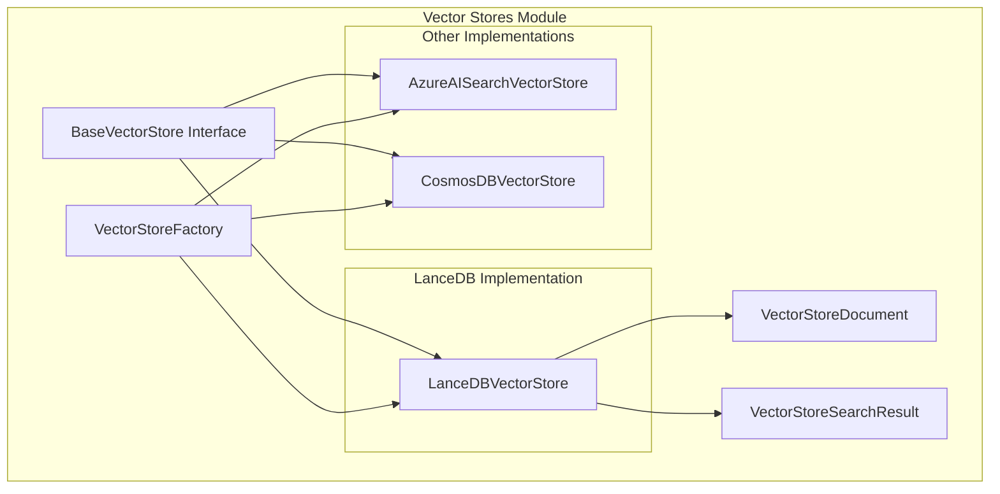
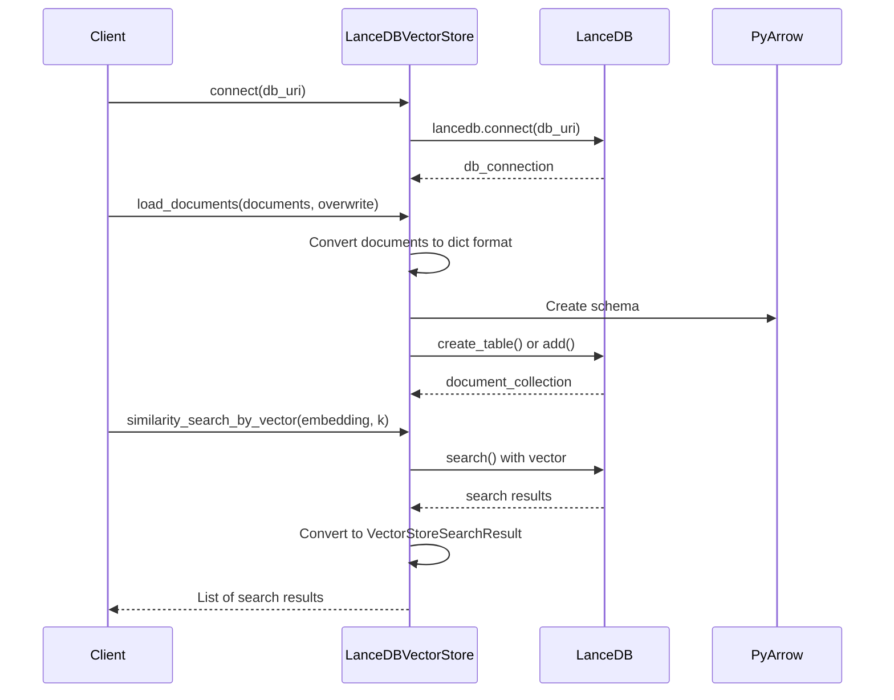
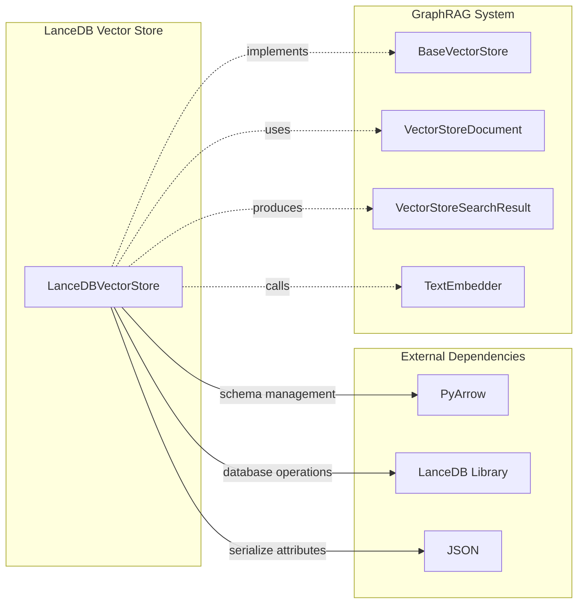
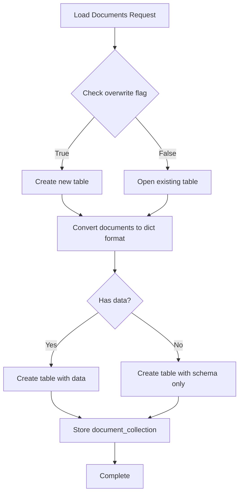
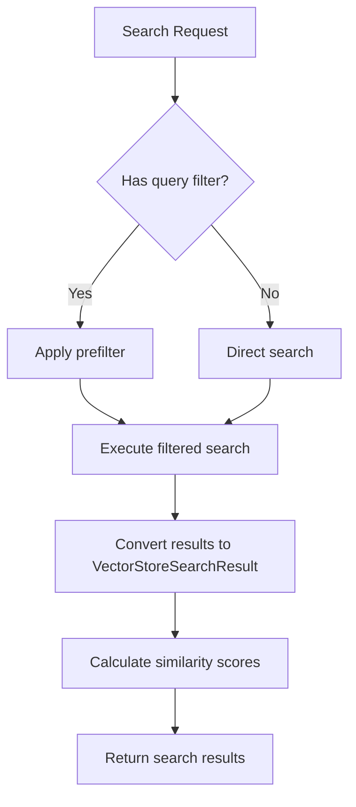

# LanceDB Vector Store Module

## Introduction

The LanceDB module provides a vector storage implementation that integrates LanceDB as the underlying vector database for the GraphRAG system. This module implements the `BaseVectorStore` interface to provide efficient vector similarity search capabilities for graph-based retrieval-augmented generation workflows.

## Architecture Overview

The LanceDB vector store serves as one of several vector storage backends in the GraphRAG system, offering a lightweight, embedded vector database solution that doesn't require external services.



## Core Components

### LanceDBVectorStore

The `LanceDBVectorStore` class is the main implementation that provides vector storage and search capabilities using LanceDB as the backend database.

**Key Features:**
- Embedded vector database (no external services required)
- Efficient vector similarity search
- Support for filtering by document IDs
- Schema-based data management using PyArrow
- Configurable overwrite and append modes

**Dependencies:**
- [BaseVectorStore](base.md) - Abstract base class defining the vector store interface
- [VectorStoreDocument](base.md) - Document model for vector storage
- [VectorStoreSearchResult](base.md) - Search result model
- [TextEmbedder](../data_models/data_models.md) - Interface for text embedding functionality

## Data Flow Architecture



## Component Interactions



## Process Flows

### Document Loading Process



### Vector Search Process



## Key Methods

### Connection Management
- `connect(**kwargs)`: Establishes connection to LanceDB database using the provided URI

### Document Operations
- `load_documents(documents, overwrite=True)`: Loads vector documents into the database with optional overwrite
- `search_by_id(id)`: Retrieves a specific document by its ID

### Search Operations
- `similarity_search_by_vector(query_embedding, k=10)`: Performs vector similarity search
- `similarity_search_by_text(text, text_embedder, k=10)`: Converts text to embedding and performs search
- `filter_by_id(include_ids)`: Sets up ID-based filtering for subsequent searches

## Schema Design

The LanceDB implementation uses a fixed schema with PyArrow:

```python
schema = pa.schema([
    pa.field("id", pa.string()),
    pa.field("text", pa.string()),
    pa.field("vector", pa.list_(pa.float64())),
    pa.field("attributes", pa.string()),  # JSON serialized
])
```

## Integration Points

The LanceDB vector store integrates with the broader GraphRAG system through:

1. **[VectorStoreFactory](factory.md)**: Factory pattern for creating vector store instances
2. **[Configuration System](../configuration/configuration.md)**: Configuration through VectorStoreConfig
3. **[Query System](../query_system/query_system.md)**: Used by search implementations for vector retrieval
4. **[Pipeline Infrastructure](../pipeline_infrastructure/pipeline_infrastructure.md)**: Integrated into indexing and query pipelines

## Performance Considerations

- **Embedded Database**: No network overhead as LanceDB runs in-process
- **Memory Usage**: Entire database loaded in memory for optimal performance
- **Vector Operations**: Leverages LanceDB's optimized vector search algorithms
- **Schema Flexibility**: Fixed schema design ensures consistent performance

## Error Handling

The implementation includes basic error handling for:
- Database connection failures
- Invalid document formats
- Missing vector data (documents without vectors are filtered out)
- Search operations on non-existent collections

## Usage Examples

The LanceDB vector store is typically used through the factory pattern:

```python
# Configuration would specify LanceDB as the vector store type
config = VectorStoreConfig(
    type=VectorStoreType.LANCEDB,
    db_uri="./lancedb_data"
)

# Factory creates the appropriate instance
vector_store = VectorStoreFactory.create_vector_store(config)
```

## Related Documentation

- [Vector Store Base Classes](base.md) - Core interfaces and data models
- [Vector Store Factory](factory.md) - Factory pattern for vector store creation
- [Configuration Module](../configuration/configuration.md) - Vector store configuration
- [Data Model Types](../data_models/data_models.md) - Document and entity models