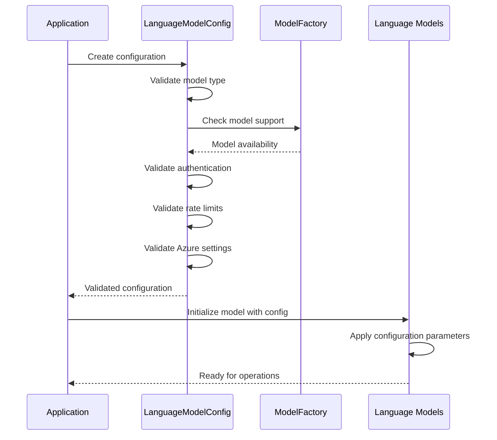
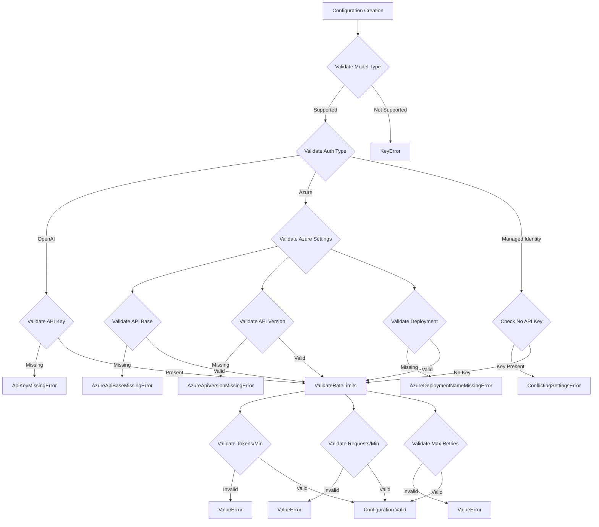

# Language Model Configuration Module

## Introduction

The `language_model_config` module provides comprehensive configuration management for language models within the GraphRAG system. It defines the `LanguageModelConfig` class, which serves as the central configuration structure for all language model interactions, including authentication, model parameters, rate limiting, and provider-specific settings.

This module is essential for configuring how the GraphRAG system interacts with various language model providers such as OpenAI, Azure OpenAI, and other supported models. It handles the complex validation logic required to ensure proper configuration for different authentication methods and model types.

## Architecture Overview

```mermaid
graph TB
    subgraph "Language Model Config Module"
        LMC[LanguageModelConfig]
        
        LMC --> AUTH[Authentication
        Configuration]
        LMC --> MODEL[Model
        Configuration]
        LMC --> RATE[Rate Limiting
        Configuration]
        LMC --> PARAM[Model Parameters
        Configuration]
        LMC --> AZURE[Azure-specific
        Configuration]
        
        AUTH --> API_KEY[API Key]
        AUTH --> AUTH_TYPE[Auth Type]
        AUTH --> AUDIENCE[Audience]
        
        MODEL --> TYPE[Model Type]
        MODEL --> MODEL_NAME[Model Name]
        MODEL --> ENCODING[Encoding Model]
        
        RATE --> TPM[Tokens/Minute]
        RATE --> RPM[Requests/Minute]
        RATE --> CONCURRENT[Concurrent Requests]
        
        PARAM --> TEMP[Temperature]
        PARAM --> MAX_TOKENS[Max Tokens]
        PARAM --> TOP_P[Top P]
        PARAM --> RETRY[Retry Strategy]
        
        AZURE --> API_BASE[API Base]
        AZURE --> API_VERSION[API Version]
        AZURE --> DEPLOYMENT[Deployment Name]
    end
    
    subgraph "Dependencies"
        MF[ModelFactory]
        TIK[tiktoken]
        ENUMS[Config Enums]
        ERRORS[Config Errors]
        DEFAULTS[Config Defaults]
    end
    
    LMC -.-> MF
    LMC -.-> TIK
    LMC -.-> ENUMS
    LMC -.-> ERRORS
    LMC -.-> DEFAULTS
```



## Component Details

### LanguageModelConfig Class

The `LanguageModelConfig` class is a Pydantic BaseModel that encapsulates all configuration parameters for language model interactions. It provides comprehensive validation through model validators and individual field validators to ensure configuration consistency.

#### Key Features:
- **Type Safety**: Uses Pydantic for automatic validation and serialization
- **Comprehensive Validation**: Validates authentication settings, model compatibility, and rate limiting parameters
- **Provider Agnostic**: Supports multiple LLM providers (OpenAI, Azure OpenAI, etc.)
- **Default Values**: Provides sensible defaults from `language_model_defaults`

#### Configuration Categories:

1. **Authentication Configuration**
   - `api_key`: API key for LLM service authentication
   - `auth_type`: Authentication method (API key, Azure Managed Identity)
   - `audience`: Azure resource URI for managed identity

2. **Model Configuration**
   - `type`: Model type (OpenAI Chat, Azure OpenAI Embedding, etc.)
   - `model`: Specific model name (gpt-4, text-embedding-3-small, etc.)
   - `encoding_model`: Token encoding model

3. **Provider-Specific Configuration**
   - `api_base`: Base URL for API endpoints
   - `api_version`: API version for Azure OpenAI
   - `deployment_name`: Azure deployment name
   - `organization`: Organization identifier
   - `proxy`: Proxy configuration

4. **Rate Limiting Configuration**
   - `tokens_per_minute`: Token-based rate limiting
   - `requests_per_minute`: Request-based rate limiting
   - `concurrent_requests`: Maximum concurrent requests

5. **Model Parameters**
   - `temperature`: Sampling temperature
   - `max_tokens`: Maximum tokens to generate
   - `top_p`: Nucleus sampling parameter
   - `frequency_penalty`: Frequency penalty
   - `presence_penalty`: Presence penalty

6. **Retry and Error Handling**
   - `retry_strategy`: Retry strategy configuration
   - `max_retries`: Maximum retry attempts
   - `max_retry_wait`: Maximum wait time between retries
   - `request_timeout`: Request timeout duration

## Data Flow



## Dependencies and Integration

### Internal Dependencies

The module relies on several GraphRAG configuration components:

- **[Config Defaults](defaults.md)**: Provides default values for all configuration parameters
- **[Config Enums](enums.md)**: Defines enumeration types for model types, authentication types, and async modes
- **[Config Errors](errors.md)**: Provides specific exception types for configuration validation errors
- **[Model Factory](../language_models/factory.md)**: Validates model type support and availability

### External Dependencies

- **tiktoken**: Used for automatic encoding model detection based on the selected model
- **pydantic**: Provides data validation and serialization capabilities

## Validation Logic



## Usage Patterns

### Basic Configuration

```python
from graphrag.config.models.language_model_config import LanguageModelConfig
from graphrag.config.enums import ModelType

# Basic OpenAI configuration
config = LanguageModelConfig(
    type=ModelType.OpenAIChat,
    model="gpt-4",
    api_key="your-api-key"
)
```

### Azure OpenAI Configuration

```python
# Azure OpenAI configuration
config = LanguageModelConfig(
    type=ModelType.AzureOpenAIChat,
    model="gpt-4",
    api_base="https://your-resource.openai.azure.com/",
    api_version="2024-02-15-preview",
    deployment_name="your-deployment-name",
    auth_type=AuthType.APIKey,
    api_key="your-api-key"
)
```

### Managed Identity Configuration

```python
# Azure Managed Identity configuration
config = LanguageModelConfig(
    type=ModelType.AzureOpenAIChat,
    model="gpt-4",
    api_base="https://your-resource.openai.azure.com/",
    api_version="2024-02-15-preview",
    deployment_name="your-deployment-name",
    auth_type=AuthType.AzureManagedIdentity,
    audience="https://cognitiveservices.azure.com/"
)
```

## Error Handling

The module provides specific error types for different configuration issues:

- **ApiKeyMissingError**: Raised when API key is required but not provided
- **AzureApiBaseMissingError**: Raised when Azure API base URL is missing
- **AzureApiVersionMissingError**: Raised when Azure API version is missing
- **AzureDeploymentNameMissingError**: Raised when Azure deployment name is missing
- **ConflictingSettingsError**: Raised when conflicting settings are detected (e.g., API key with managed identity)

## Integration with Language Models Module

The configuration module works closely with the [language_models module](../language_models/factory.md) to ensure that configured models are supported and properly initialized. The `ModelFactory` is used to validate model types and provide information about available models.

## Best Practices

1. **Always validate configuration**: Use the built-in Pydantic validation to catch configuration errors early
2. **Use appropriate authentication**: Choose the correct authentication method for your deployment scenario
3. **Set reasonable rate limits**: Configure appropriate rate limiting to avoid API throttling
4. **Handle Azure-specific requirements**: Ensure all required Azure parameters are provided when using Azure OpenAI
5. **Use defaults when appropriate**: Leverage the provided defaults for common configuration parameters

## Related Documentation

- [Configuration Module Overview](configuration.md)
- [Language Models Factory](../language_models/factory.md)
- [Config Defaults](defaults.md)
- [Config Enums](enums.md)
- [Config Errors](errors.md)