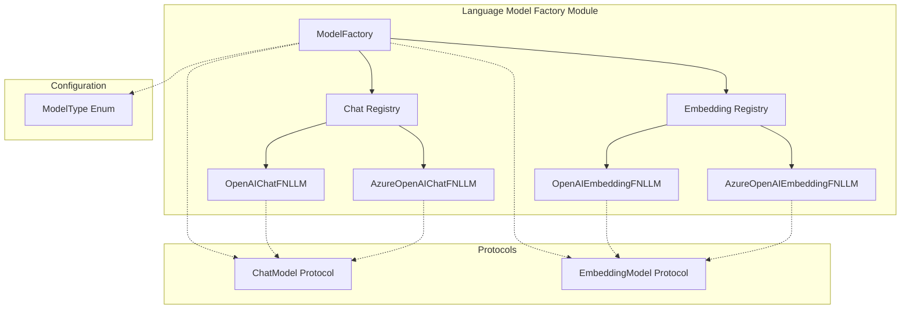
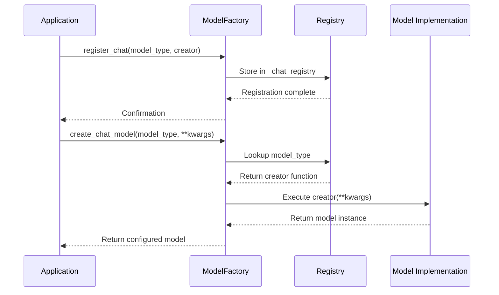
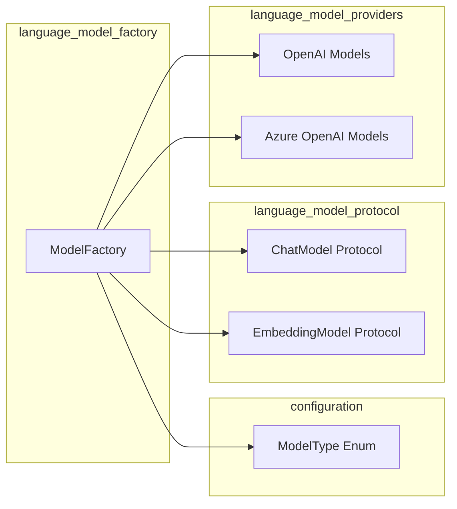

# Language Model Factory Module

## Introduction

The `language_model_factory` module provides a centralized factory pattern implementation for creating and managing language model instances in the GraphRAG system. It serves as the primary entry point for instantiating different types of language models (chat and embedding models) while abstracting away the complexity of model-specific configurations and implementations.

## Core Purpose

The module's main objectives are to:
- Provide a unified interface for creating different types of language models
- Support dynamic registration and discovery of model implementations
- Enable runtime model selection based on configuration
- Maintain a registry of available model types for both chat and embedding models
- Facilitate the integration of new language model providers without modifying existing code

## Architecture

### Component Overview



### Factory Pattern Implementation

The `ModelFactory` class implements a registry-based factory pattern with the following key features:

1. **Static Registries**: Two class-level dictionaries maintain mappings between model types and their corresponding factory functions
2. **Dynamic Registration**: New model implementations can be registered at runtime
3. **Type Safety**: Factory methods return properly typed model instances
4. **Configuration Support**: Models are instantiated with configuration parameters passed as keyword arguments

### Model Registration Process



## Core Components

### ModelFactory

The central factory class that manages model creation and registration:

- **Registry Management**: Maintains separate registries for chat and embedding models
- **Model Creation**: Provides factory methods for instantiating models
- **Discovery**: Offers methods to query available model types
- **Validation**: Checks if specific model types are supported

#### Key Methods

| Method | Purpose | Return Type |
|--------|---------|-------------|
| `register_chat()` | Register a chat model implementation | `None` |
| `register_embedding()` | Register an embedding model implementation | `None` |
| `create_chat_model()` | Create a chat model instance | `ChatModel` |
| `create_embedding_model()` | Create an embedding model instance | `EmbeddingModel` |
| `get_chat_models()` | List registered chat model types | `list[str]` |
| `get_embedding_models()` | List registered embedding model types | `list[str]` |
| `is_supported_chat_model()` | Check if chat model type is supported | `bool` |
| `is_supported_embedding_model()` | Check if embedding model type is supported | `bool` |

### Default Model Implementations

The factory comes pre-configured with support for OpenAI and Azure OpenAI models:

#### Chat Models
- **OpenAI Chat**: `ModelType.OpenAIChat` → `OpenAIChatFNLLM`
- **Azure OpenAI Chat**: `ModelType.AzureOpenAIChat` → `AzureOpenAIChatFNLLM`

#### Embedding Models
- **OpenAI Embedding**: `ModelType.OpenAIEmbedding` → `OpenAIEmbeddingFNLLM`
- **Azure OpenAI Embedding**: `ModelType.AzureOpenAIEmbedding` → `AzureOpenAIEmbeddingFNLLM`

## Dependencies and Integration

### Internal Dependencies

The module relies on several key components from the GraphRAG system:



### External Integration Points

1. **[configuration](configuration.md)**: Uses `ModelType` enum for model type definitions
2. **[language_model_protocol](language_model_protocol.md)**: Implements `ChatModel` and `EmbeddingModel` protocols
3. **[language_model_manager](language_model_manager.md)**: Works with `ModelManager` for instance lifecycle management
4. **[language_model_response](language_model_response.md)**: Models return standardized response types

## Usage Patterns

### Basic Model Creation

```python
from graphrag.language_model.factory import ModelFactory
from graphrag.config.enums import ModelType

# Create a chat model
chat_model = ModelFactory.create_chat_model(
    ModelType.OpenAIChat.value,
    name="my-chat-model",
    config=language_model_config,
    callbacks=callbacks,
    cache=cache
)

# Create an embedding model
embedding_model = ModelFactory.create_embedding_model(
    ModelType.OpenAIEmbedding.value,
    name="my-embedding-model",
    config=language_model_config,
    callbacks=callbacks,
    cache=cache
)
```

### Custom Model Registration

```python
# Register a custom chat model implementation
ModelFactory.register_chat("custom_chat", lambda **kwargs: CustomChatModel(**kwargs))

# Register a custom embedding model implementation
ModelFactory.register_embedding("custom_embedding", lambda **kwargs: CustomEmbeddingModel(**kwargs))

# Use the custom models
custom_chat = ModelFactory.create_chat_model("custom_chat", **config)
custom_embedding = ModelFactory.create_embedding_model("custom_embedding", **config)
```

### Model Discovery

```python
# Get available model types
chat_models = ModelFactory.get_chat_models()
embedding_models = ModelFactory.get_embedding_models()

# Check if a model type is supported
if ModelFactory.is_supported_chat_model("openai_chat"):
    model = ModelFactory.create_chat_model("openai_chat", **config)
```

## Extension Points

### Adding New Model Providers

To add support for a new language model provider:

1. **Implement the Protocol**: Create model classes that implement either `ChatModel` or `EmbeddingModel` protocols
2. **Register with Factory**: Use `ModelFactory.register_chat()` or `ModelFactory.register_embedding()`
3. **Update Configuration**: Add new model types to the `ModelType` enum if needed

### Example: Adding Anthropic Claude Support

```python
# 1. Implement the protocol
class AnthropicChatModel:
    def __init__(self, **kwargs):
        # Initialize Claude client
        pass
    
    def chat(self, prompt: str, **kwargs) -> ModelResponse:
        # Implement chat logic
        pass
    
    async def achat(self, prompt: str, **kwargs) -> ModelResponse:
        # Implement async chat logic
        pass

# 2. Register with factory
ModelFactory.register_chat("anthropic_claude", lambda **kwargs: AnthropicChatModel(**kwargs))

# 3. Use the model
claude_model = ModelFactory.create_chat_model("anthropic_claude", **config)
```

## Error Handling

The factory implements several error handling mechanisms:

1. **Registration Validation**: Prevents duplicate registrations of the same model type
2. **Creation Validation**: Validates that requested model types are registered before creation
3. **Descriptive Error Messages**: Provides clear error messages when model types are not found

```python
try:
    model = ModelFactory.create_chat_model("unsupported_model")
except ValueError as e:
    print(f"Error: {e}")  # "ChatModel implementation 'unsupported_model' is not registered."
```

## Performance Considerations

1. **Lazy Loading**: Models are only instantiated when requested
2. **Registry Caching**: Model creators are stored in class-level registries for fast lookup
3. **Singleton Pattern**: Works with `ModelManager` to prevent duplicate model instances
4. **Thread Safety**: Class-level registries are thread-safe for concurrent access

## Testing and Mocking

The factory supports testing through:

1. **Mock Model Registration**: Register mock implementations for testing
2. **Model Type Validation**: Check model support before creation
3. **Configuration Injection**: Pass test-specific configurations to models

```python
# Register mock models for testing
ModelFactory.register_chat("mock_chat", lambda **kwargs: MockChatModel(**kwargs))
ModelFactory.register_embedding("mock_embedding", lambda **kwargs: MockEmbeddingModel(**kwargs))
```

## Future Enhancements

Potential improvements to the factory pattern:

1. **Plugin System**: Dynamic loading of model providers from external packages
2. **Configuration Validation**: Validate model configurations before instantiation
3. **Health Checks**: Built-in model health checking and failover mechanisms
4. **Metrics Collection**: Factory-level metrics for model creation and usage
5. **Async Factory Methods**: Asynchronous model creation for slow-initializing models