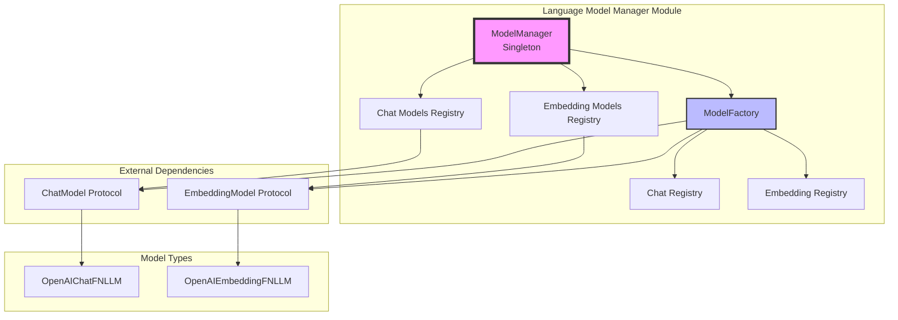
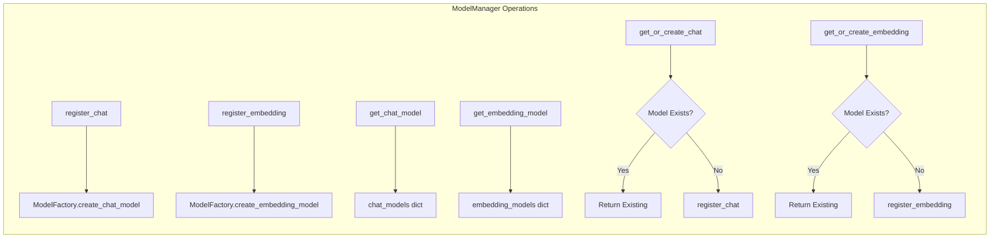
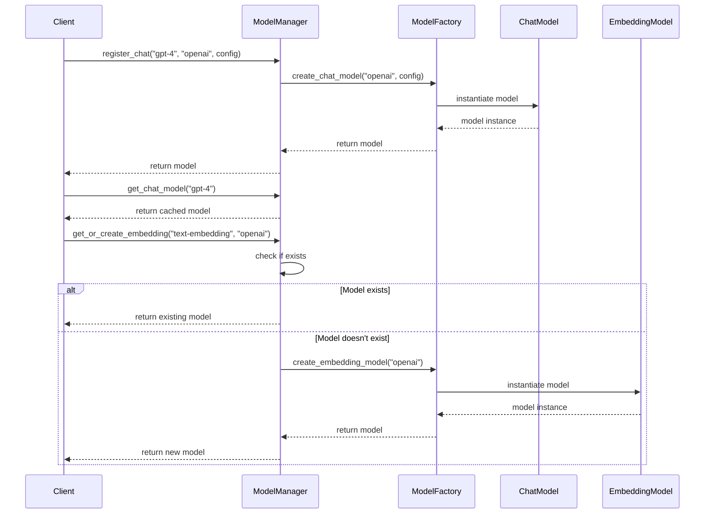
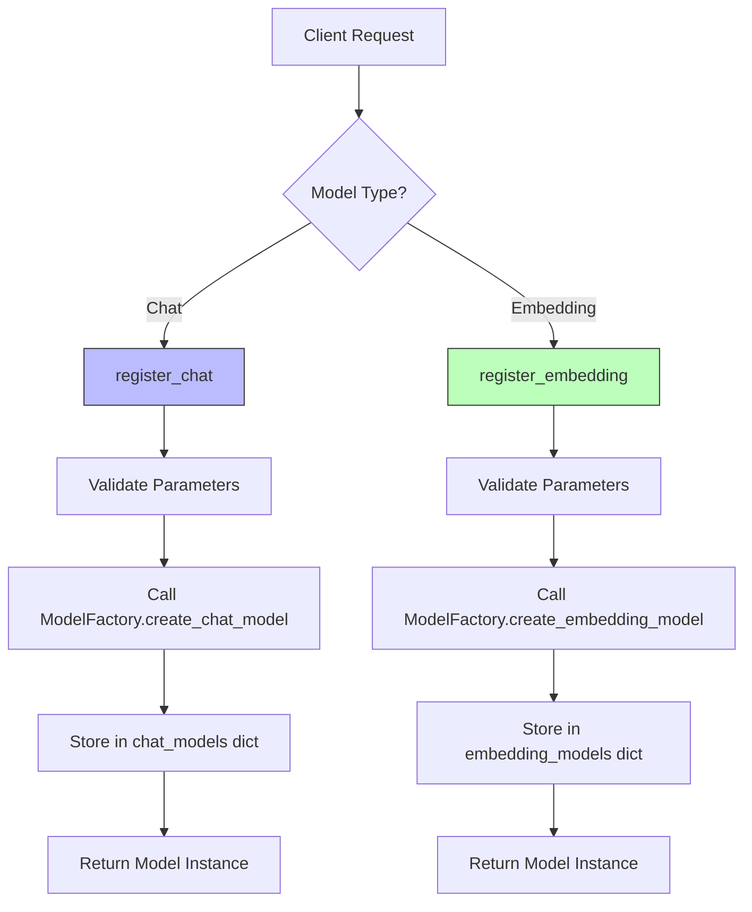
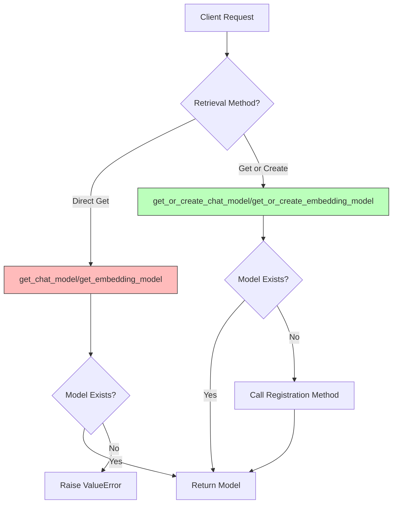
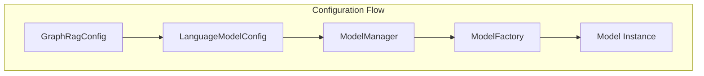

# Language Model Manager Module

## Introduction

The `language_model_manager` module provides a centralized singleton management system for Language Model (LLM) instances in the GraphRAG system. It serves as the primary interface for registering, retrieving, and managing both chat-based and embedding-based language models throughout the application lifecycle.

This module implements the **Singleton pattern** to ensure consistent model management across the entire system, preventing duplicate model instantiations and providing a unified access point for all LLM operations.

## Architecture Overview



## Core Components

### ModelManager Class

The `ModelManager` is the central singleton class that manages all language model instances in the system. It maintains separate registries for chat models and embedding models, providing thread-safe access and lifecycle management.

**Key Responsibilities:**
- Singleton instance management
- Chat model registration and retrieval
- Embedding model registration and retrieval
- Model lifecycle management (create, get, remove)
- Model discovery and listing

## Component Relationships



## Data Flow



## Process Flow

### Model Registration Process



### Model Retrieval Process



## Integration with Other Modules

### Configuration Module Integration

The ModelManager works closely with the [configuration](configuration.md) module to access model configurations:



### Factory Pattern Integration

The ModelManager delegates actual model creation to the [ModelFactory](language_model_factory.md), which maintains registries of available model implementations:

- **Chat Model Registry**: Maps model types to their constructors
- **Embedding Model Registry**: Maps embedding model types to their constructors

## API Reference

### ModelManager Methods

#### Registration Methods
- `register_chat(name: str, model_type: str, **chat_kwargs: Any) -> ChatModel`
- `register_embedding(name: str, model_type: str, **embedding_kwargs: Any) -> EmbeddingModel`

#### Retrieval Methods
- `get_chat_model(name: str) -> ChatModel | None`
- `get_embedding_model(name: str) -> EmbeddingModel | None`
- `get_or_create_chat_model(name: str, model_type: str, **chat_kwargs: Any) -> ChatModel`
- `get_or_create_embedding_model(name: str, model_type: str, **embedding_kwargs: Any) -> EmbeddingModel`

#### Management Methods
- `remove_chat(name: str) -> None`
- `remove_embedding(name: str) -> None`
- `list_chat_models() -> dict[str, ChatModel]`
- `list_embedding_models() -> dict[str, EmbeddingModel]`

#### Singleton Access
- `get_instance() -> ModelManager`

## Usage Patterns

### Basic Model Registration
```python
# Register a chat model
chat_model = ModelManager.get_instance().register_chat(
    "gpt-4", 
    "openai", 
    api_key="your-api-key",
    model="gpt-4"
)

# Register an embedding model
embedding_model = ModelManager.get_instance().register_embedding(
    "text-embedding",
    "openai",
    api_key="your-api-key", 
    model="text-embedding-ada-002"
)
```

### Safe Model Retrieval
```python
# Get or create pattern ensures model availability
model = ModelManager.get_instance().get_or_create_chat_model(
    "gpt-4",
    "openai",
    api_key="your-api-key"
)
```

### Model Discovery
```python
# List all available models
chat_models = ModelManager.get_instance().list_chat_models()
embedding_models = ModelManager.get_instance().list_embedding_models()
```

## Error Handling

The ModelManager implements comprehensive error handling:

- **Model Not Found**: Raises `ValueError` when attempting to retrieve non-existent models
- **Factory Errors**: Propagates errors from ModelFactory for unsupported model types
- **Validation**: Validates model names and types before registration

## Thread Safety

The singleton implementation ensures thread-safe access to model instances across the application. The internal dictionaries are accessed atomically, preventing race conditions in multi-threaded environments.

## Performance Considerations

- **Lazy Initialization**: Models are created only when requested
- **Caching**: All models are cached after creation to avoid redundant instantiation
- **Memory Management**: Models remain in memory until explicitly removed
- **Singleton Overhead**: Minimal overhead due to single instance pattern

## Dependencies

- **[ModelFactory](language_model_factory.md)**: For model instantiation
- **[ChatModel Protocol](language_model_protocol.md)**: For chat model interface
- **[EmbeddingModel Protocol](language_model_protocol.md)**: For embedding model interface
- **[LanguageModelConfig](language_model_config.md)**: For model configuration

## Extension Points

The ModelManager can be extended by:

1. **Adding New Model Types**: Through ModelFactory registration
2. **Custom Model Management**: By extending the ModelManager class
3. **Enhanced Caching**: By implementing custom caching strategies
4. **Monitoring Integration**: By adding metrics and logging hooks

## Best Practices

1. **Use Descriptive Names**: Register models with clear, descriptive names
2. **Configuration Management**: Store model configurations externally
3. **Error Handling**: Always handle model retrieval errors gracefully
4. **Resource Cleanup**: Remove unused models to free resources
5. **Singleton Access**: Always use `get_instance()` for consistent access

## Related Documentation

- [Language Model Factory](language_model_factory.md) - Model creation and registration
- [Language Model Protocol](language_model_protocol.md) - Model interface definitions
- [Language Model Configuration](language_model_config.md) - Model configuration management
- [Configuration Module](configuration.md) - System-wide configuration