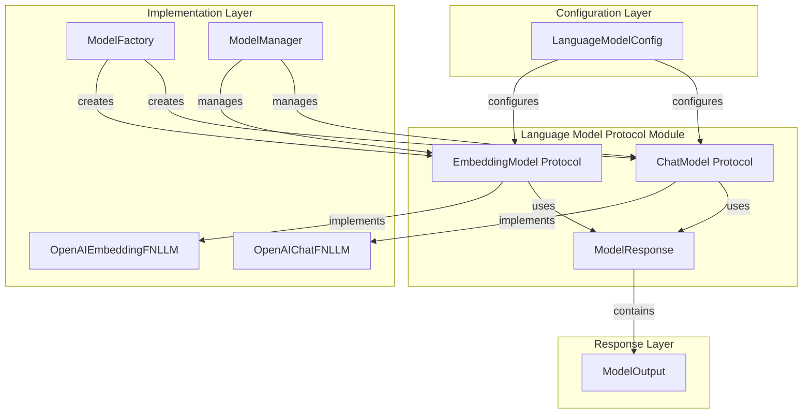
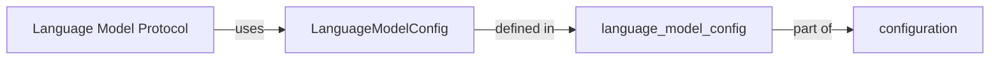
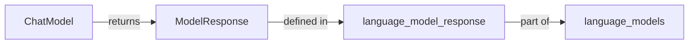
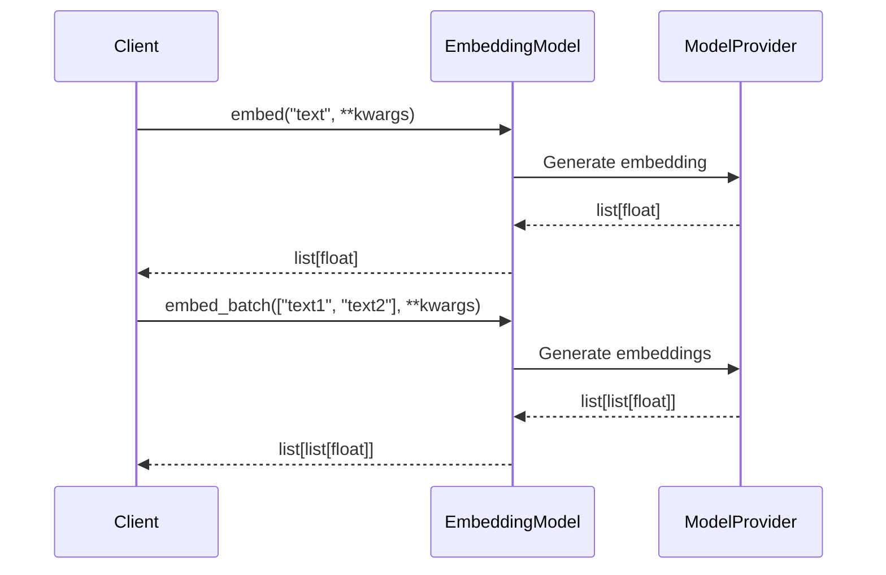
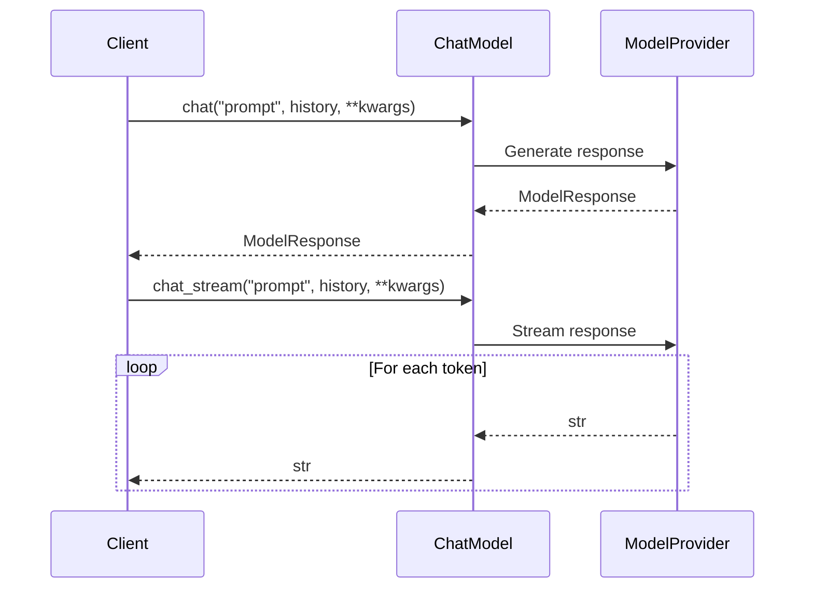
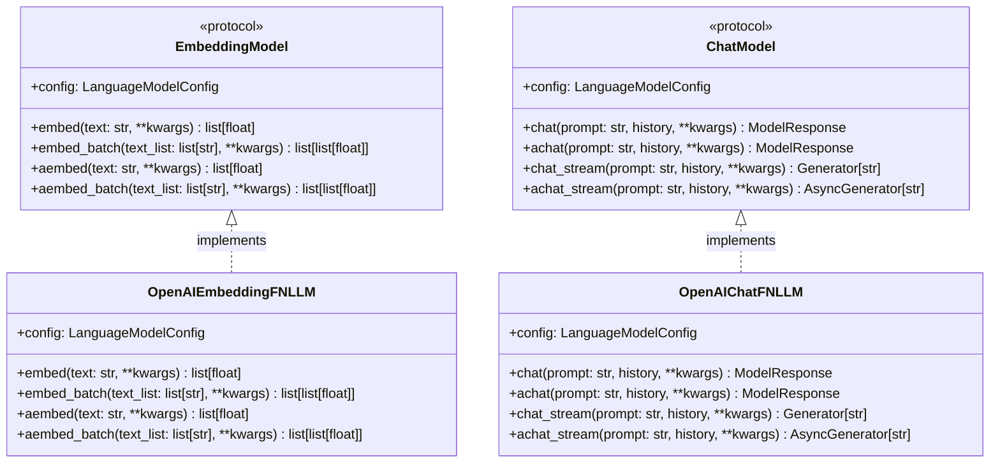

# Language Model Protocol Module

## Introduction

The `language_model_protocol` module defines the core protocols and interfaces for language model integration within the GraphRAG system. It provides standardized abstractions for both chat-based and embedding-based language models, ensuring consistent interaction patterns across different model providers and implementations.

This module serves as the foundation for the [language_models](language_models.md) module, establishing the contract that all language model implementations must follow. By defining these protocols, the system can seamlessly integrate with various language model providers while maintaining a unified interface for the rest of the GraphRAG pipeline.

## Architecture Overview



## Core Components

### EmbeddingModel Protocol

The `EmbeddingModel` protocol defines the interface for embedding-based language models that convert text into numerical vector representations. These embeddings are crucial for semantic search, similarity comparisons, and various downstream tasks in the GraphRAG pipeline.

#### Key Features:
- **Synchronous and Asynchronous Operations**: Provides both `embed()`/`embed_batch()` and `aembed()`/`aembed_batch()` methods
- **Batch Processing**: Supports efficient batch embedding generation for multiple texts
- **Configuration Passthrough**: Maintains reference to the `LanguageModelConfig` used for model instantiation
- **Flexible Parameters**: Accepts additional keyword arguments for model-specific parameters

#### Methods:
- `embed(text: str, **kwargs) -> list[float]`: Generate embedding for single text
- `embed_batch(text_list: list[str], **kwargs) -> list[list[float]]`: Generate embeddings for multiple texts
- `aembed(text: str, **kwargs) -> list[float]`: Asynchronously generate embedding for single text
- `aembed_batch(text_list: list[str], **kwargs) -> list[list[float]]`: Asynchronously generate embeddings for multiple texts

### ChatModel Protocol

The `ChatModel` protocol defines the interface for chat-based language models that generate text responses based on prompts and conversation history. These models power the conversational and generative aspects of the GraphRAG system.

#### Key Features:
- **Synchronous and Asynchronous Operations**: Provides both `chat()` and `achat()` methods
- **Streaming Support**: Includes `chat_stream()` and `achat_stream()` for real-time response generation
- **Conversation History**: Supports maintaining and utilizing conversation context
- **Configuration Passthrough**: Maintains reference to the `LanguageModelConfig` used for model instantiation
- **Flexible Parameters**: Accepts additional keyword arguments for model-specific parameters

#### Methods:
- `chat(prompt: str, history: list | None = None, **kwargs) -> ModelResponse`: Generate response synchronously
- `achat(prompt: str, history: list | None = None, **kwargs) -> ModelResponse`: Generate response asynchronously
- `chat_stream(prompt: str, history: list | None = None, **kwargs) -> Generator[str, None]`: Stream response synchronously
- `achat_stream(prompt: str, history: list | None = None, **kwargs) -> AsyncGenerator[str, None]`: Stream response asynchronously

## Dependencies and Integration

### Configuration Dependency



The protocols depend on `LanguageModelConfig` from the [configuration](configuration.md) module, which provides the necessary configuration parameters for model instantiation and operation.

### Response Integration



The `ChatModel` protocol returns `ModelResponse` objects, which are defined in the [language_model_response](language_model_response.md) module and provide standardized response handling.

## Data Flow

### Embedding Generation Flow



### Chat Generation Flow



## Implementation Patterns

### Protocol Implementation Structure



## Usage Examples

### Embedding Model Usage

```python
# Synchronous embedding generation
embedding = await embedding_model.embed("This is a sample text")
print(f"Embedding dimension: {len(embedding)}")

# Batch embedding generation
texts = ["Text 1", "Text 2", "Text 3"]
embeddings = await embedding_model.aembed_batch(texts)
print(f"Generated {len(embeddings)} embeddings")
```

### Chat Model Usage

```python
# Synchronous chat
response = await chat_model.achat("What is the capital of France?")
print(f"Response: {response.content}")

# Streaming chat
async for token in chat_model.achat_stream("Tell me a story"):
    print(token, end="", flush=True)
```

## Integration with GraphRAG Pipeline

The language model protocols integrate with various components of the GraphRAG system:

### Index Operations
- **Text Embedding**: Used in [index_operations](index_operations.md) for embedding text chunks and entities
- **Graph Extraction**: Powers the [GraphExtractor](index_operations.md) for understanding and extracting relationships
- **Community Summarization**: Enables [CommunityReportsExtractor](index_operations.md) to generate community summaries

### Query System
- **Context Building**: Supports [LocalContextBuilder](query_system.md) and [GlobalContextBuilder](query_system.md) in understanding queries
- **Search Operations**: Powers [LocalSearch](query_system.md), [GlobalSearch](query_system.md), and [DRIFTSearch](query_system.md) for query processing

### Vector Stores
- **Embedding Storage**: Works with [BaseVectorStore](vector_stores.md) implementations to store and retrieve embeddings
- **Similarity Search**: Enables semantic search capabilities across the vector store implementations

## Error Handling and Best Practices

### Protocol Compliance
- All implementations must maintain the exact method signatures defined in the protocols
- Configuration objects should be properly initialized and accessible
- Error handling should be consistent across synchronous and asynchronous methods

### Performance Considerations
- Batch operations should be preferred for multiple embeddings to reduce API calls
- Streaming methods should yield results as they become available
- Asynchronous methods should properly handle concurrent requests

### Extensibility
- New model providers can be integrated by implementing these protocols
- Additional parameters can be passed through **kwargs for provider-specific features
- The protocol design allows for future extensions without breaking existing implementations

## Related Documentation

- [language_models](language_models.md) - Complete language model implementation module
- [language_model_config](language_model_config.md) - Configuration models for language models
- [language_model_response](language_model_response.md) - Response handling and output models
- [configuration](configuration.md) - Overall system configuration
- [index_operations](index_operations.md) - Indexing operations that use language models
- [query_system](query_system.md) - Query processing that leverages language models
- [vector_stores](vector_stores.md) - Vector storage systems for embeddings