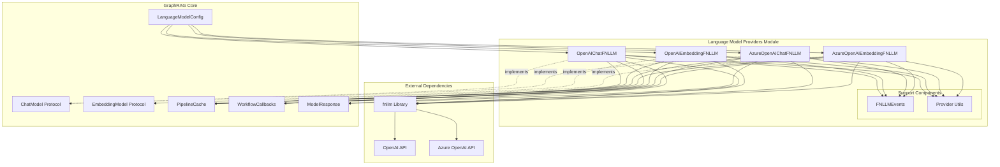
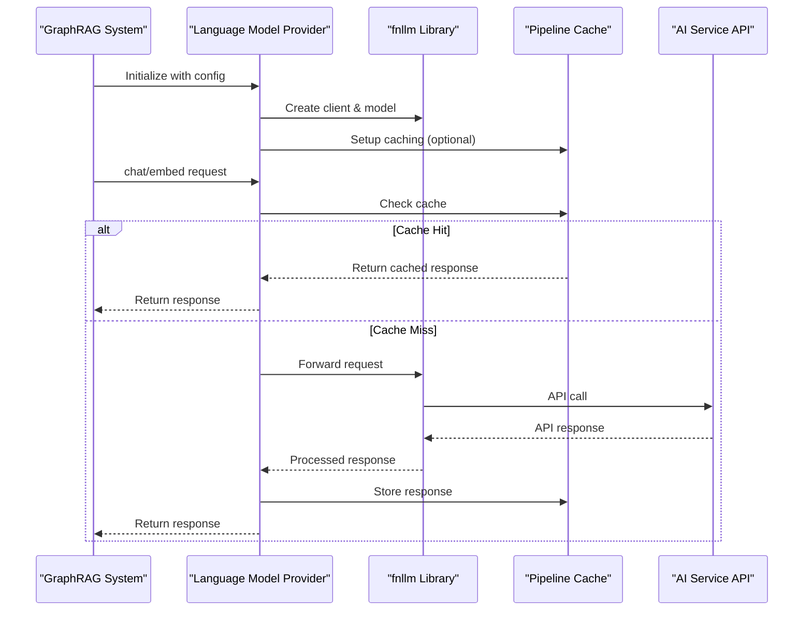
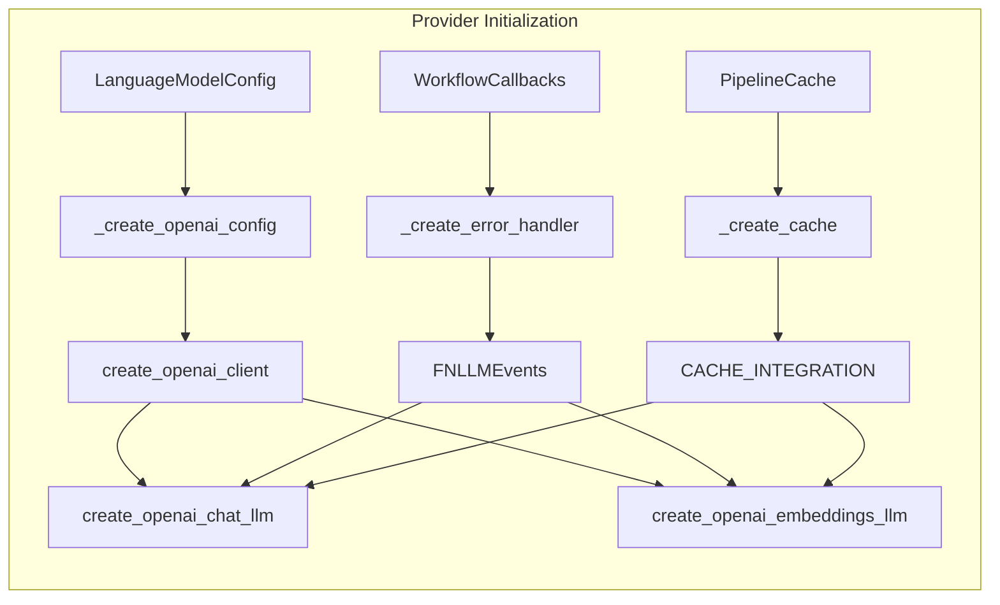
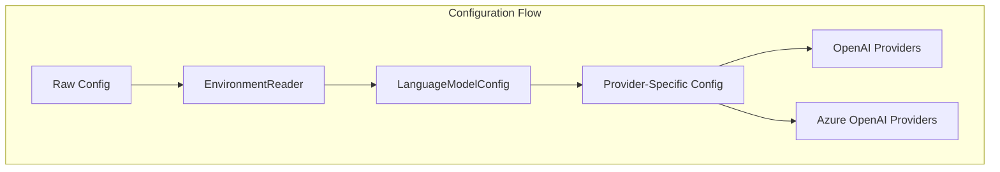
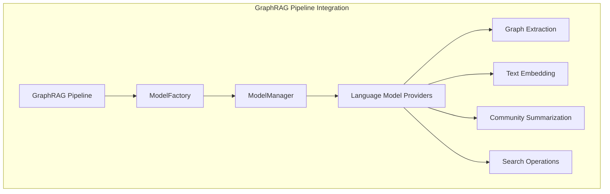

# Language Model Providers Module

## Introduction

The `language_model_providers` module serves as the bridge between GraphRAG's language model abstraction layer and external AI service providers. It implements concrete language model providers that interface with various AI services (primarily OpenAI and Azure OpenAI) through the fnllm library, providing both chat and embedding capabilities for the GraphRAG system.

This module is a critical component of the [language_models](language_models.md) system, responsible for translating GraphRAG's standardized language model protocols into provider-specific API calls while handling authentication, caching, error management, and response processing.

## Architecture Overview



## Core Components

### OpenAIChatFNLLM

The `OpenAIChatFNLLM` class provides a chat model implementation for OpenAI's GPT models using the fnllm library. It handles both synchronous and asynchronous chat operations with support for conversation history, streaming, and tool calls.

**Key Features:**
- Async and sync chat interfaces (`achat`, `chat`)
- Streaming support (`achat_stream`, `chat_stream`)
- Conversation history management
- Tool call support
- Response caching integration
- Error handling and metrics collection

**Dependencies:**
- [LanguageModelConfig](language_model_config.md): Configuration for model parameters
- [PipelineCache](caching.md): Optional caching for responses
- [WorkflowCallbacks](callbacks.md): Optional callback handling for events
- [ModelResponse](language_model_response.md): Standardized response format

### OpenAIEmbeddingFNLLM

The `OpenAIEmbeddingFNLLM` class provides embedding model functionality for OpenAI's embedding models. It converts text into vector representations used throughout the GraphRAG system for semantic search and similarity operations.

**Key Features:**
- Single text embedding (`aembed`, `embed`)
- Batch text embedding (`aembed_batch`, `embed_batch`)
- Async and sync interfaces
- Response caching
- Error handling for missing embeddings

**Dependencies:**
- [LanguageModelConfig](language_model_config.md): Model configuration
- [PipelineCache](caching.md): Optional response caching
- [WorkflowCallbacks](callbacks.md): Event callback handling

### AzureOpenAIChatFNLLM

The `AzureOpenAIChatFNLLM` class provides Azure OpenAI Service integration for chat models. It offers identical functionality to `OpenAIChatFNLLM` but routes requests through Azure's enterprise-grade infrastructure.

**Key Features:**
- Azure-specific authentication and configuration
- Enterprise security and compliance
- Same interface as OpenAI variant for seamless switching
- Azure region and resource management

### AzureOpenAIEmbeddingFNLLM

The `AzureOpenAIEmbeddingFNLLM` class provides Azure OpenAI Service integration for embedding models, offering the same embedding capabilities as the standard OpenAI version with Azure's enterprise features.

## Data Flow Architecture



## Component Interactions



## Configuration and Setup

The providers integrate with GraphRAG's configuration system through the [LanguageModelConfig](language_model_config.md) model, which provides:

- Model selection and parameters
- API endpoint configuration
- Authentication credentials
- Rate limiting settings
- Retry policies
- Cache configuration



## Error Handling and Monitoring

The providers implement comprehensive error handling through:

1. **FNLLMEvents**: Event handling system for monitoring model interactions
2. **Error Handlers**: Custom error handling for different failure scenarios
3. **Metrics Collection**: Performance and usage metrics
4. **Retry Logic**: Automatic retry for transient failures
5. **Callback Integration**: Integration with GraphRAG's callback system for observability

## Caching Strategy

The providers support optional caching through the [PipelineCache](caching.md) system:

- **Request Caching**: Cache identical requests to reduce API calls
- **Response Storage**: Store successful responses for reuse
- **Cache Invalidation**: Smart cache management based on configuration
- **Performance Optimization**: Reduce latency and API costs

## Integration with GraphRAG Pipeline

The language model providers are integrated into GraphRAG's processing pipeline through the [ModelFactory](language_model_factory.md) and [ModelManager](language_model_manager.md):



## Usage Patterns

### Chat Model Usage
```python
# Initialize provider
provider = OpenAIChatFNLLM(
    name="gpt-4",
    config=language_model_config,
    callbacks=workflow_callbacks,
    cache=pipeline_cache
)

# Synchronous chat
response = provider.chat("What is the main topic of this document?")

# Asynchronous chat
response = await provider.achat("Summarize the key points")

# Streaming chat
async for chunk in provider.achat_stream("Generate a detailed analysis"):
    process_chunk(chunk)
```

### Embedding Model Usage
```python
# Initialize provider
provider = OpenAIEmbeddingFNLLM(
    name="text-embedding-3-small",
    config=language_model_config,
    callbacks=workflow_callbacks,
    cache=pipeline_cache
)

# Single text embedding
embedding = provider.embed("This is a sample text")

# Batch embedding
embeddings = provider.embed_batch(["text1", "text2", "text3"])
```

## Security and Compliance

The providers implement several security measures:

- **Credential Management**: Secure handling of API keys and tokens
- **Azure Integration**: Enterprise-grade security through Azure Active Directory
- **Data Privacy**: Optional data anonymization and filtering
- **Audit Logging**: Comprehensive logging for compliance requirements
- **Rate Limiting**: Protection against abuse and cost control

## Performance Considerations

- **Connection Pooling**: Efficient HTTP connection management
- **Async Support**: Full async/await support for concurrent operations
- **Batch Processing**: Optimized batch operations for embeddings
- **Caching**: Intelligent caching to reduce API calls
- **Streaming**: Real-time response streaming for better user experience

## Related Modules

- [language_models](language_models.md): Parent module containing protocols and management
- [language_model_config](language_model_config.md): Configuration models for language models
- [language_model_response](language_model_response.md): Response handling and formatting
- [caching](caching.md): Caching infrastructure for responses
- [callbacks](callbacks.md): Event handling and monitoring system