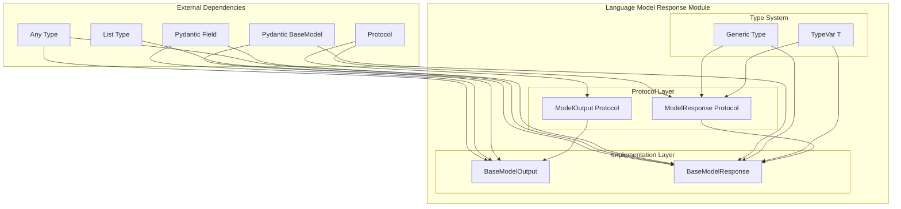
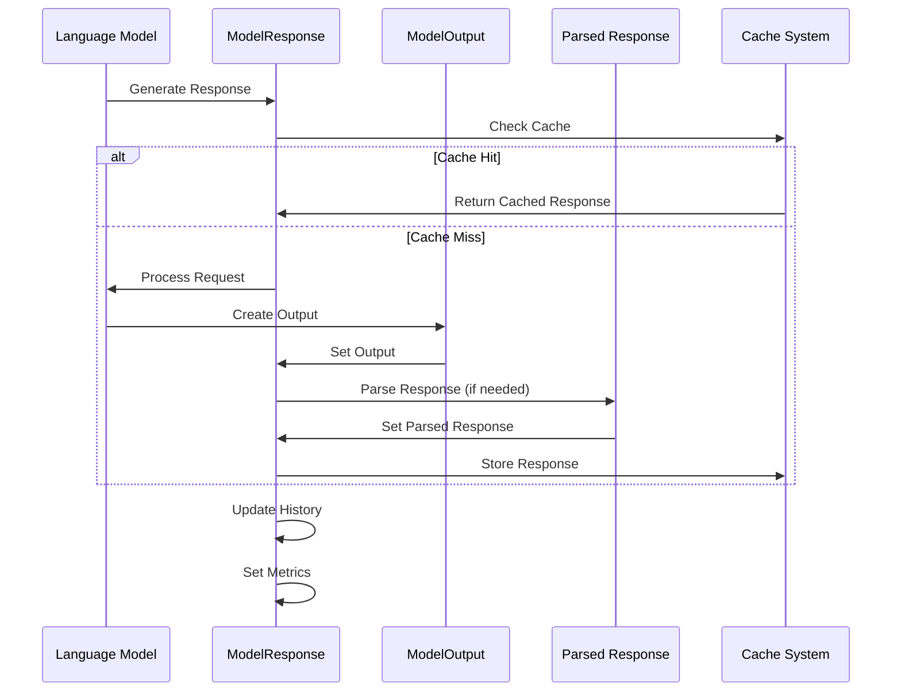
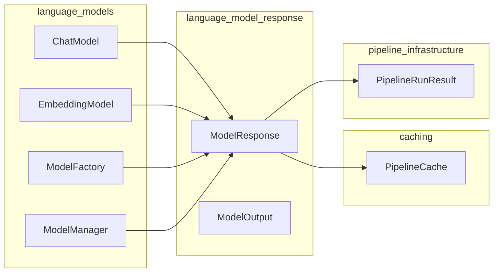

# Language Model Response Module

## Introduction

The `language_model_response` module provides the foundational protocols and base implementations for handling responses from language models in the GraphRAG system. This module defines the contract for how language model outputs are structured, parsed, and managed throughout the pipeline, ensuring consistent handling of LLM responses across different providers and use cases.

## Architecture Overview

The module implements a protocol-based design that separates the interface definition from concrete implementations, allowing for flexibility in supporting various LLM providers while maintaining a consistent API.



## Core Components

### ModelOutput Protocol

The `ModelOutput` protocol defines the contract for the output object within a model response. It ensures that all language model outputs provide:

- **Content**: The textual content of the output as a string
- **Full Response**: The complete JSON response from the model provider (optional)

This protocol allows different LLM providers to implement their specific output handling while maintaining a consistent interface for the rest of the system.

### ModelResponse Protocol

The `ModelResponse` protocol is a generic protocol that defines the complete structure of a language model response. It includes:

- **Output**: A `ModelOutput` instance containing the raw response
- **Parsed Response**: An optional parsed response of generic type `T`
- **History**: A list maintaining the conversation history

The generic type `T` allows for type-safe parsing of responses into specific data models, enabling strong typing throughout the pipeline.

### BaseModelOutput

A concrete implementation of the `ModelOutput` protocol using Pydantic's `BaseModel`. It provides:

- `content`: The textual content of the output
- `full_response`: The complete JSON response from the LLM provider (optional)

This class serves as the standard implementation for most use cases while allowing extension for provider-specific needs.

### BaseModelResponse

A comprehensive implementation of the `ModelResponse` protocol that extends the basic requirements with additional features:

- `output`: A `BaseModelOutput` instance
- `parsed_response`: Optional parsed response of type `T`
- `history`: Conversation history tracking
- `tool_calls`: List of tool calls required by the model
- `metrics`: Request/response metrics for monitoring
- `cache_hit`: Boolean indicating if the response was served from cache

## Data Flow



## Component Interactions

The language_model_response module interacts with several other system components:



## Integration with Language Models Module

The `language_model_response` module is tightly integrated with the broader [language_models](language_models.md) module:

- **ChatModel and EmbeddingModel protocols** use `ModelResponse` as their return type
- **ModelFactory** creates instances that produce `ModelResponse` objects
- **ModelManager** orchestrates the creation and management of responses

## Usage Patterns

### Basic Response Handling

```python
# Protocol-based usage
def process_response(response: ModelResponse[MyModel]) -> MyModel:
    if response.parsed_response:
        return response.parsed_response
    # Handle unparsed response
    return parse_response(response.output.content)
```

### Provider Implementation

```python
class MyLLMResponse(BaseModelResponse[MyModel]):
    """Custom implementation for specific LLM provider"""
    
    def __init__(self, raw_response: dict):
        output = BaseModelOutput(
            content=raw_response["text"],
            full_response=raw_response
        )
        super().__init__(output=output)
        self.parsed_response = self._parse_response(raw_response)
```

## Key Features

### Type Safety
The generic design allows for compile-time type checking of parsed responses, reducing runtime errors and improving developer experience.

### Flexibility
Protocol-based design enables easy integration of new LLM providers without modifying existing code.

### Extensibility
The base implementations can be extended to add provider-specific functionality while maintaining compatibility.

### Caching Support
Built-in cache hit tracking enables efficient caching strategies and performance monitoring.

### Tool Integration
Support for tool calls allows models to request external tool execution as part of the response flow.

## Error Handling

The module design includes several mechanisms for robust error handling:

- Optional parsed responses allow graceful handling of parsing failures
- Full response preservation enables debugging and fallback strategies
- Type-safe parsing reduces runtime errors

## Performance Considerations

- **Memory Efficiency**: Optional fields minimize memory usage for unused features
- **Caching Integration**: Built-in cache hit tracking supports efficient caching strategies
- **Protocol Overhead**: Protocol-based design has minimal runtime overhead

## Future Considerations

The modular design supports future enhancements such as:

- Streaming response support
- Multi-modal response handling
- Advanced parsing strategies
- Enhanced metrics and monitoring

## Related Documentation

- [Language Models Module](language_models.md) - For broader language model integration
- [Caching Module](caching.md) - For response caching strategies
- [Configuration Module](configuration.md) - For response configuration options