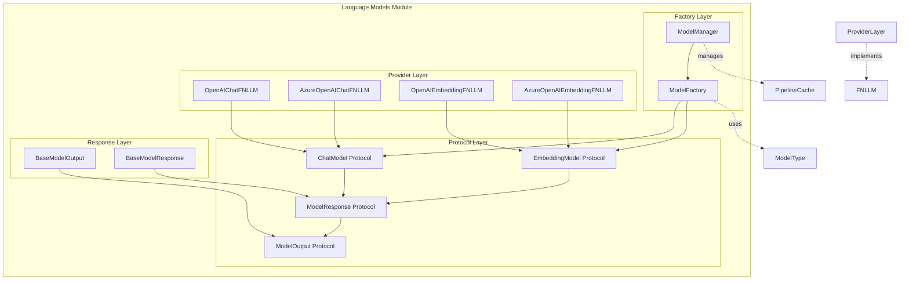
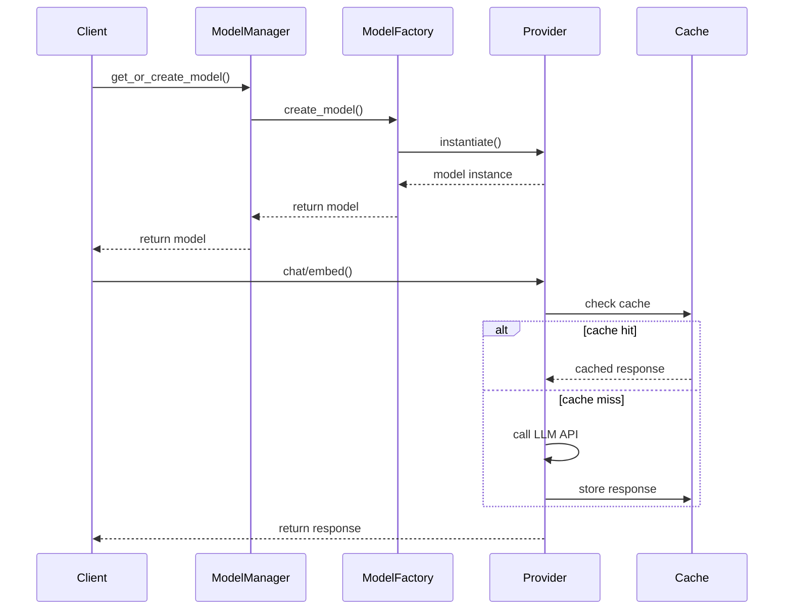

# Language Models Module

## Overview

The `language_models` module is a core component of the GraphRAG system that provides a unified interface for interacting with various language models. It abstracts the complexity of different LLM providers and offers both synchronous and asynchronous operations for chat-based and embedding-based models.

## Purpose

This module serves as the central hub for:
- **Model Abstraction**: Providing a consistent interface for different LLM providers (OpenAI, Azure OpenAI)
- **Model Management**: Singleton pattern for managing model instances across the application
- **Factory Pattern**: Dynamic creation of model instances based on configuration
- **Protocol Definitions**: Standardized interfaces for chat and embedding models
- **Response Handling**: Unified response format for all model interactions

## Architecture



## Core Components

### 1. Protocol Layer
The protocol layer defines the contracts that all language model implementations must follow:

- **[ChatModel Protocol](language_model_protocol.md)**: Defines the interface for chat-based language models
- **[EmbeddingModel Protocol](language_model_protocol.md)**: Defines the interface for embedding-based language models
- **[ModelResponse Protocol](language_model_response.md)**: Standardizes response format across all models
- **[ModelOutput Protocol](language_model_response.md)**: Defines the structure of model output

### 2. Factory Layer
The factory layer provides dynamic model creation and management:

- **[ModelFactory](language_model_factory.md)**: Factory pattern for creating model instances
- **[ModelManager](language_model_manager.md)**: Singleton manager for model lifecycle

### 3. Provider Layer
The provider layer contains concrete implementations of language models:

- **[OpenAI Providers](language_model_providers.md)**: OpenAI and Azure OpenAI implementations
- **FNLLM Integration**: Uses the fnllm library for provider communication

### 4. Response Layer
The response layer provides standardized response handling:

- **[BaseModelOutput](language_model_response.md)**: Base implementation of model output
- **[BaseModelResponse](language_model_response.md)**: Base implementation of model response

## Key Features

### Unified Interface
All language models, regardless of provider, implement the same protocols, ensuring consistent behavior across the system.

### Async/Sync Support
The module provides both asynchronous and synchronous methods for all operations, allowing flexibility in implementation.

### Streaming Support
Chat models support streaming responses for real-time interaction capabilities.

### Caching Integration
Built-in support for caching model responses to improve performance and reduce costs.

### Error Handling
Comprehensive error handling with customizable error handlers for different scenarios.

## Usage Patterns

### Model Registration
```python
# Register a chat model
ModelFactory.register_chat("openai", lambda **kwargs: OpenAIChatFNLLM(**kwargs))

# Register an embedding model
ModelFactory.register_embedding("openai", lambda **kwargs: OpenAIEmbeddingFNLLM(**kwargs))
```

### Model Creation
```python
# Create a model instance
chat_model = ModelFactory.create_chat_model("openai", config=config)
embedding_model = ModelFactory.create_embedding_model("openai", config=config)
```

### Model Management
```python
# Get singleton manager instance
manager = ModelManager.get_instance()

# Register and retrieve models
manager.register_chat("my_chat", "openai", config=config)
chat_model = manager.get_chat_model("my_chat")
```

## Integration with Other Modules

### Configuration Module
The language models module integrates with the [configuration module](configuration.md) to load model settings and parameters.

### Caching Module
Models can utilize the [caching module](caching.md) to cache responses and improve performance.

### Callbacks Module
Integration with the [callbacks module](callbacks.md) for monitoring and error handling.

## Dependencies

### External Dependencies
- **fnllm**: Provides the underlying LLM client implementations
- **OpenAI**: For OpenAI and Azure OpenAI model support

### Internal Dependencies
- **Configuration**: For model configuration management
- **Caching**: For response caching
- **Callbacks**: For error handling and monitoring

## Sub-modules Documentation

For detailed information about specific sub-modules, refer to:

- [Language Model Protocol](language_model_protocol.md) - Protocol definitions
- [Language Model Factory](language_model_factory.md) - Factory pattern implementation
- [Language Model Manager](language_model_manager.md) - Singleton manager
- [Language Model Providers](language_model_providers.md) - Provider implementations
- [Language Model Response](language_model_response.md) - Response handling

## Data Flow



## Best Practices

1. **Use ModelManager**: Always use the ModelManager singleton for model lifecycle management
2. **Handle Errors**: Implement proper error handling for model operations
3. **Use Caching**: Enable caching for frequently used models to improve performance
4. **Monitor Usage**: Use callbacks to monitor model usage and performance
5. **Async Operations**: Prefer async operations for better performance in concurrent scenarios

## Future Considerations

- Support for additional LLM providers
- Enhanced streaming capabilities
- Advanced caching strategies
- Model performance monitoring
- Cost optimization features