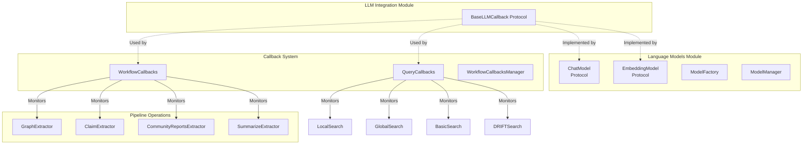
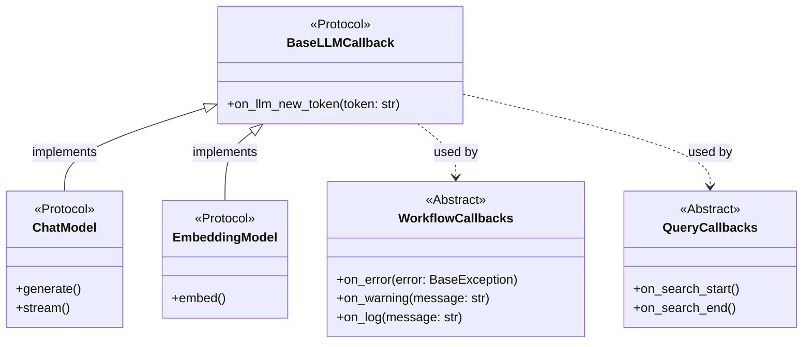
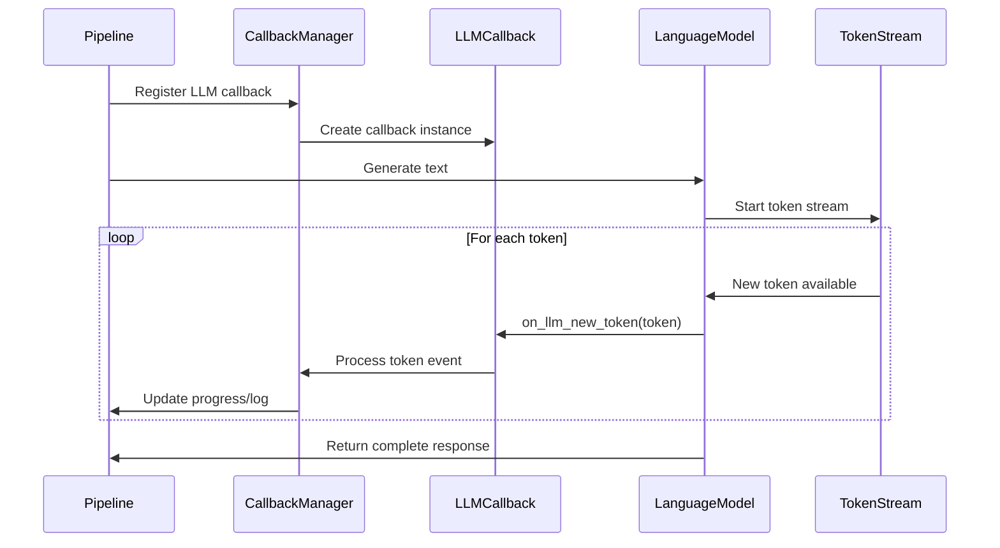

# LLM Integration Module

## Introduction

The LLM Integration module provides the foundational callback protocol for monitoring and handling Language Model (LLM) interactions within the GraphRAG system. This module defines the contract for implementing custom callback handlers that can track LLM token generation and other LLM-related events during the knowledge graph construction and querying processes.

## Architecture Overview

The LLM Integration module serves as a lightweight protocol definition layer that enables extensible monitoring of LLM operations throughout the GraphRAG pipeline. It provides a clean separation between LLM operations and their monitoring/handling logic.



## Core Components

### BaseLLMCallback Protocol

The `BaseLLMCallback` protocol defines the interface for implementing LLM callback handlers. This protocol enables real-time monitoring of LLM token generation and can be extended to support additional LLM events in the future.



## Integration Points

### Language Model Integration

The LLM Integration module connects with the [language_models](language_models.md) module to provide callback capabilities for both chat and embedding models:

- **ChatModel Protocol**: Implements `BaseLLMCallback` to handle token streaming during text generation
- **EmbeddingModel Protocol**: Implements `BaseLLMCallback` for monitoring embedding operations
- **ModelFactory**: Creates model instances with callback support
- **ModelManager**: Manages model lifecycle and callback registration

### Workflow Monitoring

The module integrates with the [callbacks](callbacks.md) system to provide comprehensive workflow monitoring:

- **WorkflowCallbacks**: Incorporates LLM callbacks into the broader workflow monitoring framework
- **QueryCallbacks**: Enables LLM monitoring during search operations
- **WorkflowCallbacksManager**: Coordinates multiple callback types including LLM callbacks

### Pipeline Operations

LLM callbacks are utilized throughout the [index_operations](index_operations.md) pipeline:

- **GraphExtractor**: Monitors LLM calls during graph extraction from text
- **ClaimExtractor**: Tracks LLM operations in covariate extraction
- **CommunityReportsExtractor**: Monitors LLM usage in community summarization
- **SummarizeExtractor**: Tracks LLM calls in description summarization

## Data Flow



## Usage Patterns

### Basic Implementation

The `BaseLLMCallback` protocol can be implemented to create custom LLM monitoring handlers:

```python
class TokenCounter(BaseLLMCallback):
    def __init__(self):
        self.token_count = 0
        self.tokens = []
    
    def on_llm_new_token(self, token: str):
        self.token_count += 1
        self.tokens.append(token)
        print(f"Token {self.token_count}: {token}")
```

### Integration with Language Models

Language model implementations use the callback protocol to notify about token generation:

```python
class MyChatModel(ChatModel):
    def __init__(self, callback: BaseLLMCallback):
        self.callback = callback
    
    def generate_stream(self, prompt: str):
        for token in self._generate_tokens(prompt):
            self.callback.on_llm_new_token(token)
            yield token
```

## Dependencies

The LLM Integration module has minimal dependencies by design:

- **typing.Protocol**: For defining the callback interface
- **callbacks module**: For integration with the broader callback system
- **language_models module**: For implementation by language model protocols

## Extension Points

The `BaseLLMCallback` protocol can be extended to support additional LLM events:

- **on_llm_start()**: Called when an LLM operation begins
- **on_llm_end()**: Called when an LLM operation completes
- **on_llm_error()**: Called when an LLM operation fails
- **on_llm_retry()**: Called when an LLM operation is retried

## Best Practices

1. **Performance**: Callback implementations should be lightweight to avoid impacting LLM performance
2. **Error Handling**: Callbacks should handle errors gracefully without disrupting LLM operations
3. **State Management**: Maintain minimal state in callbacks to reduce memory overhead
4. **Thread Safety**: Ensure callback implementations are thread-safe for concurrent LLM operations

## Related Documentation

- [Language Models](language_models.md) - Core language model protocols and implementations
- [Callbacks](callbacks.md) - Broader callback system for workflow and query monitoring
- [Index Operations](index_operations.md) - Pipeline operations that utilize LLM callbacks
- [Query System](query_system.md) - Search operations that monitor LLM usage