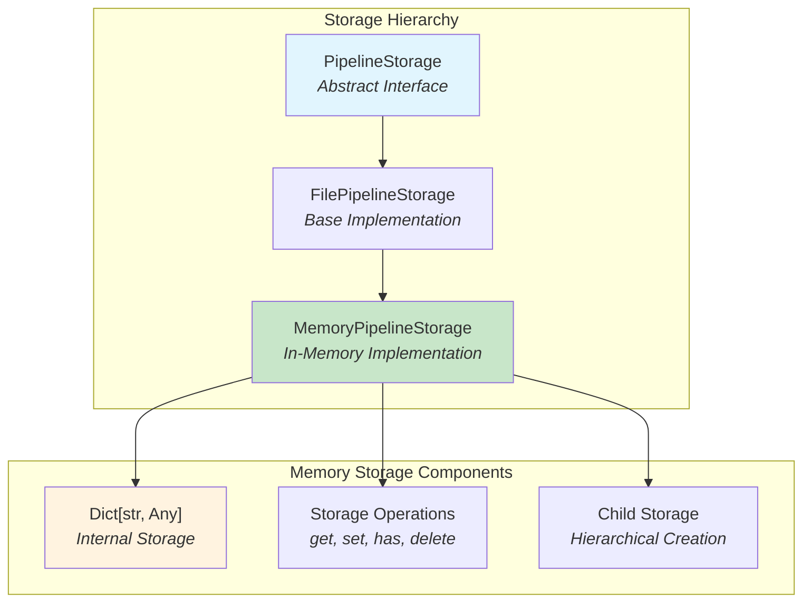
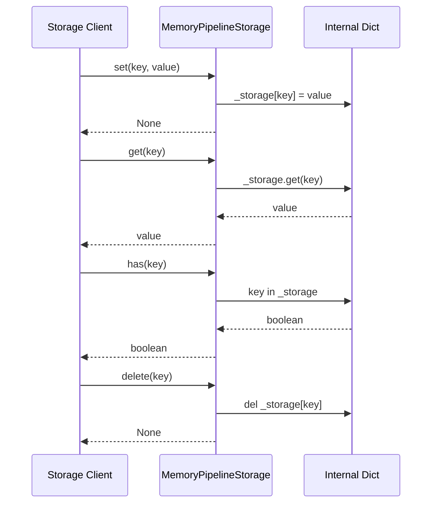
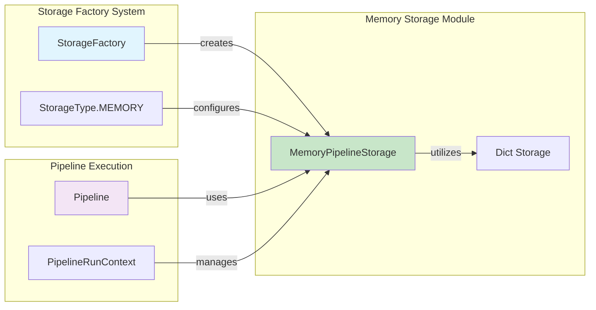
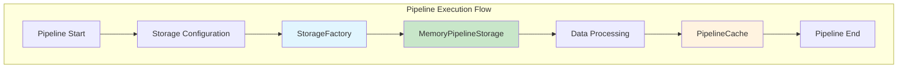

# Memory Storage Module Documentation

## Introduction

The memory storage module provides an in-memory implementation of the pipeline storage interface for the GraphRAG system. This module offers a lightweight, high-performance storage solution that keeps all data in RAM during pipeline execution, making it ideal for testing, development, and scenarios where data persistence is not required.

## Architecture Overview

The memory storage module implements a hierarchical storage pattern where `MemoryPipelineStorage` extends `FilePipelineStorage` to provide in-memory storage capabilities while maintaining compatibility with the broader storage interface.



## Core Components

### MemoryPipelineStorage

The `MemoryPipelineStorage` class is the primary component of this module, providing a complete in-memory implementation of the pipeline storage interface.

**Key Characteristics:**
- **Storage Type**: In-memory dictionary-based storage
- **Persistence**: Non-persistent (data lost on process termination)
- **Performance**: High-speed read/write operations
- **Use Case**: Development, testing, and temporary data processing

**Core Methods:**
- `get(key, as_bytes=None, encoding=None)`: Retrieve values from memory
- `set(key, value, encoding=None)`: Store values in memory
- `has(key)`: Check key existence
- `delete(key)`: Remove specific keys
- `clear()`: Clear all stored data
- `child(name)`: Create hierarchical storage instances
- `keys()`: List all stored keys

## Data Flow Architecture



## Component Interactions

The memory storage module integrates with the broader GraphRAG storage system through the following relationships:



## Storage Configuration

The memory storage module is configured through the [storage configuration system](storage_config.md), which defines storage types and their parameters. Memory storage is typically configured with:

- **Storage Type**: `StorageType.MEMORY`
- **Base Path**: Not applicable (in-memory)
- **Connection String**: Not required
- **Container Name**: Not applicable

## Usage Patterns

### 1. Development and Testing
```python
# Ideal for unit tests and development
storage = MemoryPipelineStorage()
await storage.set("test_key", test_data)
result = await storage.get("test_key")
```

### 2. Temporary Data Processing
```python
# Use for intermediate processing steps
temp_storage = MemoryPipelineStorage()
# Process data without disk I/O overhead
```

### 3. Hierarchical Storage
```python
# Create child storage instances
child_storage = parent_storage.child("subdirectory")
# Maintains isolation while sharing memory space
```

## Performance Characteristics

- **Read Operations**: O(1) average case
- **Write Operations**: O(1) average case
- **Memory Usage**: Proportional to stored data size
- **Scalability**: Limited by available system memory
- **Concurrency**: Thread-safe for individual operations

## Integration with Pipeline System

The memory storage module integrates seamlessly with the [pipeline infrastructure](pipeline_infrastructure.md) and [caching system](caching.md):



## Error Handling

The memory storage module handles errors gracefully:

- **Key Not Found**: Returns `None` for `get()` operations
- **Key Existence**: `has()` method provides safe key checking
- **Memory Constraints**: Subject to system memory limitations
- **Type Safety**: Maintains type information for stored values

## Best Practices

1. **Use Cases**: Ideal for development, testing, and temporary data processing
2. **Memory Management**: Monitor memory usage for large datasets
3. **Data Persistence**: Not suitable for production data requiring persistence
4. **Performance**: Leverage for high-speed operations without I/O overhead
5. **Cleanup**: Use `clear()` method to free memory when storage is no longer needed

## Related Modules

- [Storage Configuration](storage_config.md) - Configuration models for storage systems
- [Storage Factory](storage_factory.md) - Factory pattern for storage creation
- [Pipeline Infrastructure](pipeline_infrastructure.md) - Pipeline execution framework
- [File Storage](file_storage.md) - File-based storage implementation
- [Blob Storage](blob_storage.md) - Cloud blob storage implementation

## Dependencies

The memory storage module depends on:
- `graphrag.storage.file_pipeline_storage.FilePipelineStorage` - Base implementation
- `graphrag.storage.pipeline_storage.PipelineStorage` - Interface definition
- Standard Python typing and dictionary operations