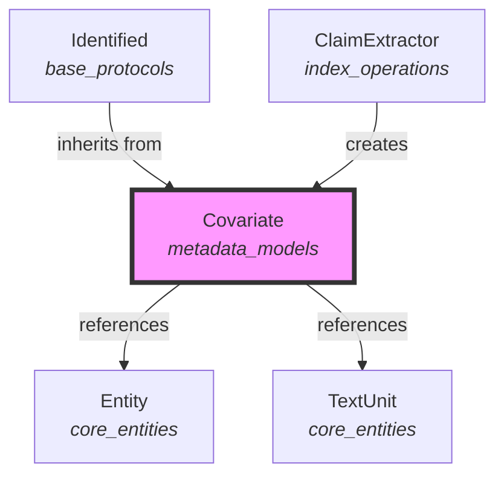
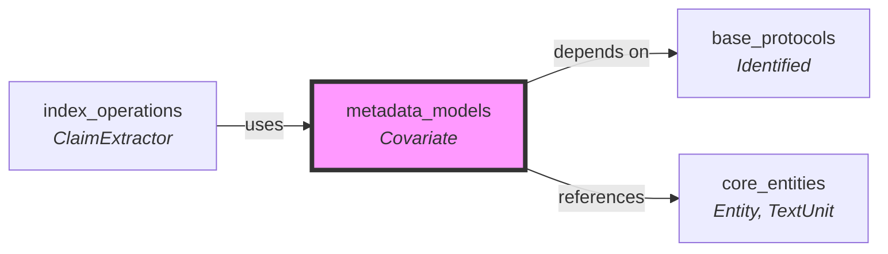
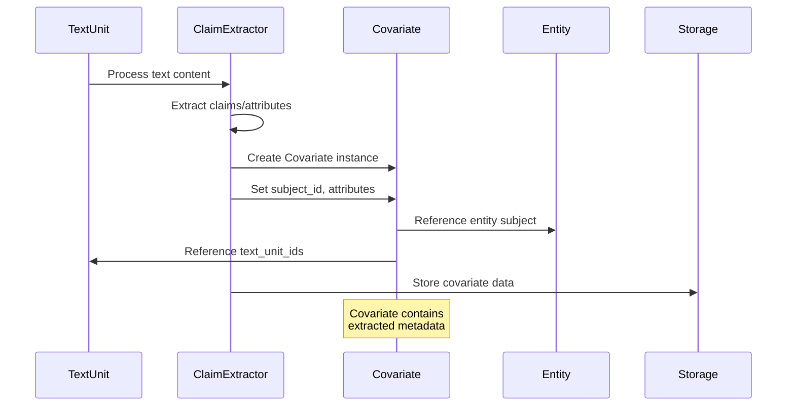
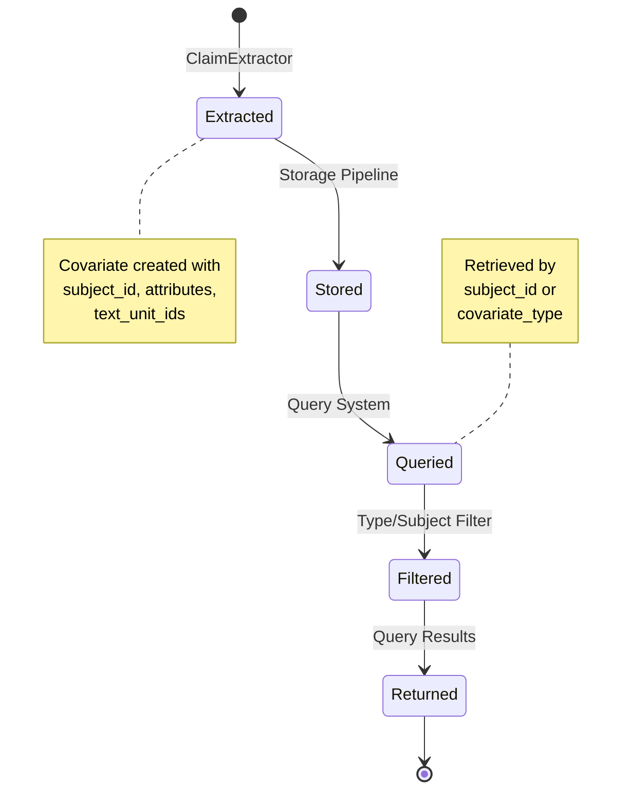

# Metadata Models Module Documentation

## Introduction

The metadata_models module provides the foundational data structure for managing covariates in the GraphRAG system. Covariates represent metadata associated with subjects (primarily entities) and serve as a flexible mechanism for storing additional contextual information, claims, or attributes that enhance the knowledge graph's richness and query capabilities.

## Module Overview

The metadata_models module is centered around the `Covariate` class, which implements a flexible metadata storage system that can be attached to various subjects within the knowledge graph. This module sits within the data_models hierarchy and provides essential functionality for capturing and managing contextual information that doesn't fit neatly into the core entity-relationship model.

## Core Component

### Covariate Class

The `Covariate` class is the primary component of this module, inheriting from [`Identified`](base_protocols.md) to provide unique identification capabilities. It serves as a container for metadata associated with subjects in the knowledge graph.

#### Key Features

- **Flexible Subject Association**: Covariates can be attached to different subject types (primarily entities)
- **Type-based Categorization**: Support for different covariate types (e.g., claims, attributes)
- **Text Unit Linking**: Optional association with source text units for provenance tracking
- **Attribute Storage**: Dynamic attribute dictionary for flexible metadata storage
- **Factory Method**: Convenient `from_dict()` method for deserialization

#### Attributes

| Attribute | Type | Description |
|-----------|------|-------------|
| `subject_id` | str | The ID of the subject this covariate is associated with |
| `subject_type` | str | The type of subject (default: "entity") |
| `covariate_type` | str | The type of covariate (default: "claim") |
| `text_unit_ids` | list[str] \| None | Optional list of text unit IDs where this covariate appears |
| `attributes` | dict[str, Any] \| None | Optional dictionary of additional attributes |

## Architecture

### Component Structure



### Module Dependencies



## Data Flow

### Covariate Creation and Usage Flow



## Integration with Other Modules

### Relationship to Core Entities

The Covariate class serves as a metadata extension mechanism for entities and other subjects in the knowledge graph:

- **Subject Association**: Covariates are linked to subjects (primarily entities) via the `subject_id` field
- **Provenance Tracking**: Optional `text_unit_ids` field links covariates back to source text units
- **Type Flexibility**: The `covariate_type` field allows for different kinds of metadata (claims, attributes, etc.)

### Usage in Index Operations

The [`ClaimExtractor`](index_operations.md) component in the index_operations module is the primary consumer of the Covariate class:

- **Claim Extraction**: Processes text units to extract claims about entities
- **Covariate Creation**: Creates Covariate instances to store extracted claims
- **Attribute Population**: Fills the attributes dictionary with claim details

### Storage and Retrieval

Covariates are stored alongside other data model components and can be:

- **Serialized/Deserialized**: Using the `from_dict()` factory method
- **Queried**: Through the subject_id for entity-specific metadata
- **Filtered**: By covariate_type for specific kinds of metadata

## Process Flow

### Covariate Lifecycle



## Usage Examples

### Creating a Covariate

```python
from graphrag.data_model.covariate import Covariate

# Create a claim covariate for an entity
covariate = Covariate(
    id="covariate_001",
    subject_id="entity_123",
    subject_type="entity",
    covariate_type="claim",
    text_unit_ids=["text_unit_001", "text_unit_002"],
    attributes={
        "claim_text": "Company X was founded in 2020",
        "confidence": 0.9,
        "source": "annual_report_2023.pdf"
    }
)
```

### Deserializing from Dictionary

```python
covariate_data = {
    "id": "covariate_002",
    "human_readable_id": "claim_002",
    "subject_id": "entity_456",
    "covariate_type": "attribute",
    "text_unit_ids": ["text_unit_003"],
    "attributes": {"key": "value"}
}

covariate = Covariate.from_dict(covariate_data)
```

## Design Considerations

### Flexibility vs. Structure

The Covariate class balances flexibility with structure:

- **Flexible Attributes**: The `attributes` dictionary allows for arbitrary metadata
- **Typed Fields**: Core fields like `subject_id` and `covariate_type` provide structure
- **Optional Fields**: `text_unit_ids` and `attributes` are optional for minimal use cases

### Extensibility

The design supports extensibility through:

- **Inheritance**: Inherits from `Identified` for ID management
- **Type System**: `covariate_type` field enables different covariate categories
- **Factory Method**: `from_dict()` supports custom key mappings

### Performance Considerations

- **Lightweight**: Minimal overhead with dataclass implementation
- **Optional Fields**: Avoids storing null data unnecessarily
- **Efficient Serialization**: Dictionary-based structure enables efficient JSON serialization

## Related Documentation

- [Base Protocols](base_protocols.md) - For `Identified` base class documentation
- [Core Entities](core_entities.md) - For entity and text unit relationships
- [Index Operations](index_operations.md) - For claim extraction processes
- [Community Models](community_models.md) - For community-level metadata
- [Data Models Overview](data_models.md) - For overall data model architecture