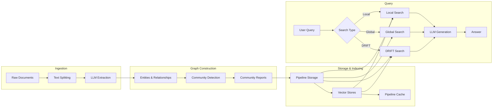
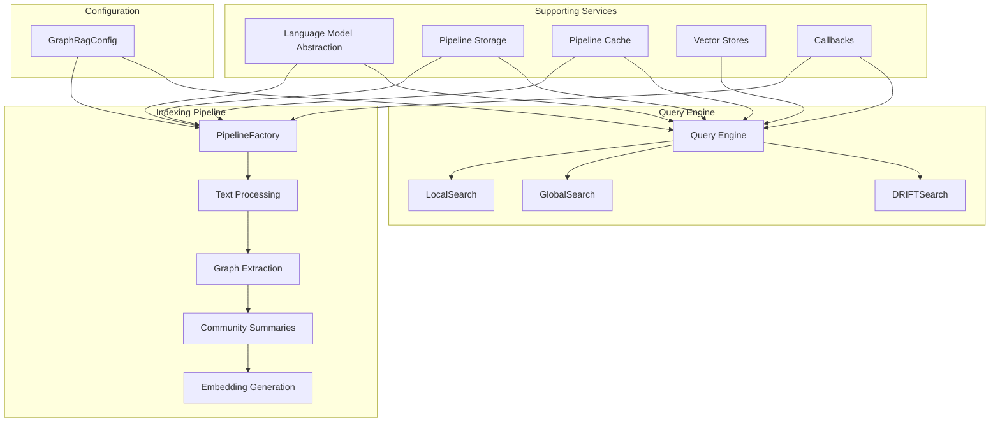

# Microsoft GraphRAG Repository Overview

## Purpose

GraphRAG (Graph-based Retrieval-Augmented Generation) is a modular, end-to-end system that transforms unstructured text documents into a structured, searchable knowledge graph. By combining large-language-model (LLM) extraction, community detection, and vector search, GraphRAG enables both local (entity-centric) and global (community-level) question-answering over large document corpora.

## End-to-End Architecture

## Core Modules

| Module | Path | Responsibility |
|--------|------|----------------|
| **Configuration** | `graphrag/config/` | Centralized, type-safe config for models, storage, cache, vector stores, and search modes |
| **Core Data Model** | `graphrag/data_model/` | Domain objects: `Document` → `TextUnit` → `Entity`/`Relationship` → `Community` → `CommunityReport` |
| **Language Model Abstraction** | `graphrag/language_model/` | Provider-agnostic interface (OpenAI, Azure OpenAI) for chat & embedding models |
| **Pipeline Storage** | `graphrag/storage/` | Pluggable backends: file-system, Azure Blob, CosmosDB, memory |
| **Pipeline Caching** | `graphrag/cache/` | Hierarchical caching of intermediate results (JSON, memory, no-op) |
| **Vector Stores** | `graphrag/vector_stores/` | Unified ANN search over LanceDB, Azure AI Search, CosmosDB |
| **Indexing Pipeline** | `graphrag/index/` | Workflow orchestration: text-split → extract → community → embed |
| **Query Engine** | `graphrag/query/` | Local, global & DRIFT search strategies with context builders |
| **Callbacks** | `graphrag/callbacks/` | Real-time progress, token usage and lifecycle events |

## Quick Start Flow

1. **Configure**: Populate `GraphRagConfig` with LLM credentials, storage paths, vector-store URI.
2. **Index**: Run `PipelineFactory.create_pipeline(...)` → workflows store graphs & embeddings.
3. **Query**: Instantiate `LocalSearch` / `GlobalSearch` / `DRIFTSearch` with same config → ask questions.

## Key Design Principles

- **Modular**: Each module is swappable (e.g., bring your own LLM, vector DB, or storage).
- **Type-safe**: Pydantic models enforce schema from config to data to queries.
- **Async-first**: All I/O (storage, LLM, vector search) is `async` for concurrency.
- **Observable**: Rich callback system for progress, tokens, errors.
- **Cloud-ready**: Native Azure integrations (Blob, CosmosDB, Azure AI Search, Azure OpenAI).

## Documentation Index

- [Configuration](Configuration.md) – complete config reference & validation rules  
- [Core Data Model](Core%20Data%20Model.md) – graph schema and serialization details  
- [Indexing Pipeline](Indexing%20Pipeline.md) – workflow descriptions and extension points  
- [Query Engine](Query%20Engine.md) – search algorithms and context-building strategies  
- [Language Model Abstraction](Language%20Model%20Abstraction.md) – adding new LLM providers  
- [Vector Stores](Vector%20Stores.md) – backend-specific tuning and auth guides  
- [Pipeline Storage & Caching](Pipeline%20Storage.md) – choosing and configuring storage layers  
- [Callbacks](Callbacks.md) – monitoring, logging, and custom telemetry