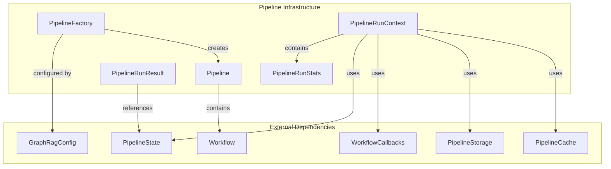

# Pipeline Infrastructure Module

## Overview

The `pipeline_infrastructure` module serves as the core orchestration layer for the GraphRAG indexing system. It provides the foundational components for defining, managing, and executing multi-stage data processing pipelines that transform raw documents into a knowledge graph structure.

## Purpose

This module enables:
- **Pipeline Definition**: Declarative specification of data processing workflows
- **Context Management**: Runtime state and resource management during pipeline execution
- **Result Tracking**: Comprehensive monitoring and statistics collection
- **Factory Pattern**: Dynamic pipeline creation based on configuration and indexing methods

## Architecture



## Core Components

### 1. Pipeline ([`pipeline.py`](graphrag/index/typing/pipeline.py))

The `Pipeline` class is the central orchestration component that encapsulates a sequence of workflows. It provides:

- **Workflow Management**: Stores and manages a list of named workflows
- **Execution Control**: Iterates through workflows in defined order
- **Dynamic Modification**: Allows runtime removal of workflows by name

**Key Methods**:
- `run()`: Generator that yields workflows for execution
- `names()`: Returns workflow names for monitoring
- `remove()`: Dynamically removes workflows from pipeline

For detailed typing specifications, see [typing.md](typing.md).

### 2. PipelineRunContext ([`context.py`](graphrag/index/typing/context.py))

The `PipelineRunContext` dataclass provides comprehensive runtime context for pipeline execution, including:

- **Storage Management**: Separate storage for input, output, and previous run data
- **Caching**: Integration with pipeline cache for LLM response optimization
- **Monitoring**: Callback system for workflow progress tracking
- **State Management**: Arbitrary state bag for runtime data and experimental features

**Storage Types**:
- `input_storage`: Source documents and initial data
- `output_storage`: Persistent results from pipeline operations
- `previous_storage`: Data from previous runs (for update operations)

### 3. PipelineRunResult ([`pipeline_run_result.py`](graphrag/index/typing/pipeline_run_result.py))

Captures the outcome of individual workflow executions:

- **Workflow Identification**: Name of the executed workflow
- **Result Data**: Arbitrary workflow output (primarily for logging)
- **State Snapshot**: Current pipeline state at execution time
- **Error Handling**: Collection of exceptions that occurred during execution

### 4. PipelineRunStats ([`stats.py`](graphrag/index/typing/stats.py))

Comprehensive statistics tracking for pipeline performance analysis:

- **Performance Metrics**: Total runtime and input load time
- **Document Processing**: Document counts and update statistics
- **Workflow Profiling**: Per-workflow execution times and metrics

### 5. PipelineFactory ([`workflows/factory.py`](graphrag/index/workflows/factory.py))

Implements the factory pattern for dynamic pipeline creation:

- **Workflow Registration**: Centralized registry for custom workflows
- **Pipeline Templates**: Pre-defined workflow sequences for different indexing methods
- **Configuration-Driven**: Creates pipelines based on GraphRagConfig settings

**Indexing Methods**:
- **Standard**: Full processing with graph extraction and community detection
- **Fast**: Accelerated processing using NLP-based graph extraction
- **StandardUpdate**: Incremental updates for existing graphs
- **FastUpdate**: Fast incremental updates

For detailed factory implementation details, see [workflows.md](workflows.md).

## Workflow Sequences

### Standard Pipeline
```
load_input_documents → create_base_text_units → create_final_documents → 
extract_graph → finalize_graph → extract_covariates → create_communities → 
create_final_text_units → create_community_reports → generate_text_embeddings
```

### Fast Pipeline
```
load_input_documents → create_base_text_units → create_final_documents → 
extract_graph_nlp → prune_graph → finalize_graph → create_communities → 
create_final_text_units → create_community_reports_text → generate_text_embeddings
```

### Update Pipeline
```
load_update_documents → [standard workflows] → update_final_documents → 
update_entities_relationships → update_text_units → update_covariates → 
update_communities → update_community_reports → update_text_embeddings → update_clean_state
```

## Integration Points

The pipeline infrastructure integrates with multiple system components:

- **[Configuration Module](configuration.md)**: Receives indexing method and workflow configuration
- **[Storage Module](storage.md)**: Manages data persistence across pipeline stages
- **[Caching Module](caching.md)**: Optimizes LLM operations through response caching
- **[Callbacks Module](callbacks.md)**: Provides execution monitoring and progress reporting
- **[Data Models](data_models.md)**: Operates on structured data entities

## Usage Patterns

### Pipeline Creation
```python
# Factory-based creation
pipeline = PipelineFactory.create_pipeline(
    config=graph_rag_config,
    method=IndexingMethod.Standard
)
```

### Context Setup
```python
context = PipelineRunContext(
    stats=PipelineRunStats(),
    input_storage=input_storage,
    output_storage=output_storage,
    previous_storage=previous_storage,
    cache=cache,
    callbacks=callbacks,
    state=PipelineState()
)
```

### Execution Flow
```python
for workflow_name, workflow_func in pipeline.run():
    try:
        result = workflow_func(context)
        run_result = PipelineRunResult(
            workflow=workflow_name,
            result=result,
            state=context.state,
            errors=None
        )
    except Exception as e:
        run_result = PipelineRunResult(
            workflow=workflow_name,
            result=None,
            state=context.state,
            errors=[e]
        )
```

## Error Handling

The pipeline infrastructure provides robust error handling through:

- **Exception Collection**: Captures and aggregates errors across workflow executions
- **State Preservation**: Maintains pipeline state even when individual workflows fail
- **Callback Integration**: Notifies monitoring systems of errors and progress
- **Graceful Degradation**: Allows partial pipeline completion with error reporting

## Performance Considerations

- **Lazy Evaluation**: Generator-based workflow execution for memory efficiency
- **Caching Integration**: Reduces redundant LLM operations
- **Statistics Collection**: Comprehensive performance monitoring
- **Storage Optimization**: Separate storage areas for different data lifecycle stages

## Extensibility

The factory pattern enables easy extension through:

- **Custom Workflow Registration**: Add new processing steps
- **Pipeline Template Creation**: Define new indexing methods
- **Configuration Integration**: Dynamic pipeline composition based on settings
- **Plugin Architecture**: External workflow registration and management