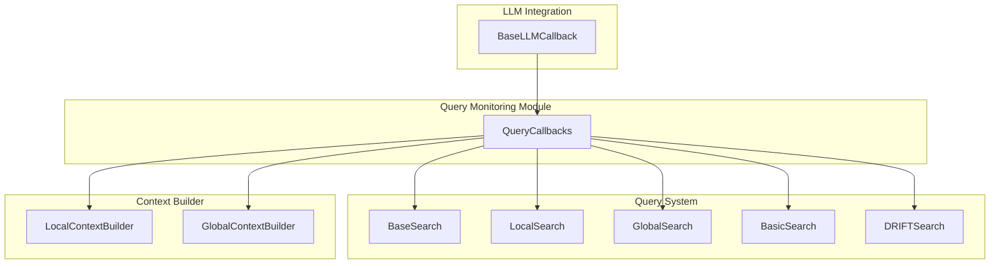
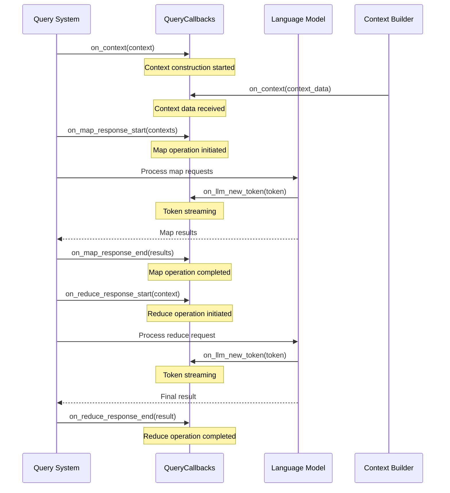
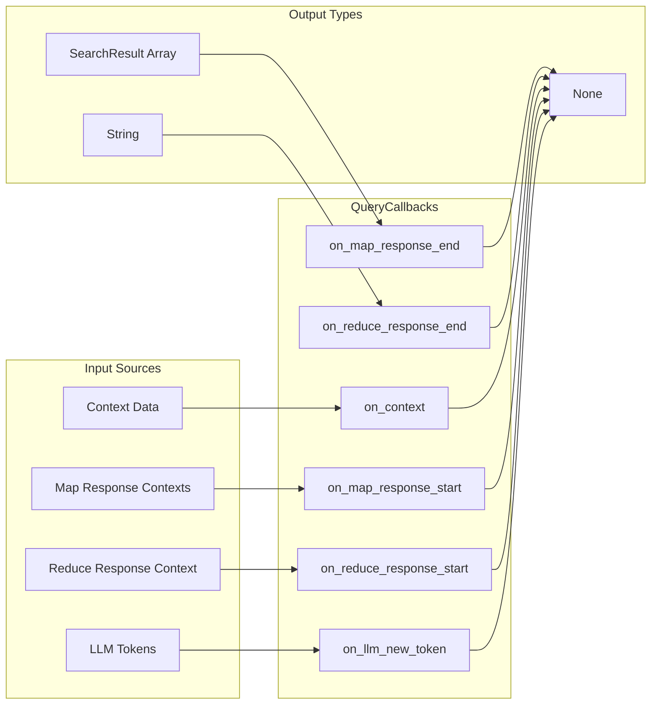
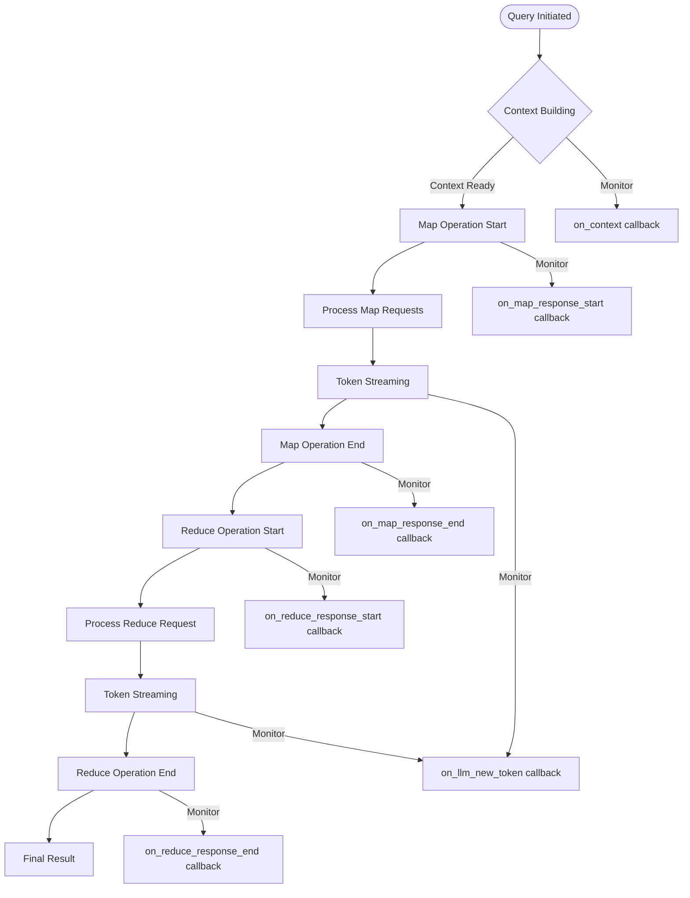

# Query Monitoring Module

## Introduction

The query_monitoring module provides a callback-based monitoring system for tracking and observing query execution within the GraphRAG system. It serves as the primary mechanism for monitoring query operations, context building, and language model interactions during the search and retrieval process.

## Architecture Overview

The query_monitoring module implements the `QueryCallbacks` class, which extends `BaseLLMCallback` to provide comprehensive monitoring capabilities for query execution workflows. This module acts as a bridge between the query system and the broader callback infrastructure, enabling real-time observation and logging of query operations.



## Core Components

### QueryCallbacks

The `QueryCallbacks` class is the central component of the query monitoring module. It provides a comprehensive set of callback methods that allow external observers to track the progress and results of query operations.

**Key Features:**
- **Context Monitoring**: Track when context data is constructed during query execution
- **Map-Reduce Operation Tracking**: Monitor the start and end of map and reduce operations
- **LLM Token Streaming**: Handle real-time token generation events
- **Search Result Processing**: Capture and process search results from various search operations

**Inheritance Hierarchy:**
```
BaseLLMCallback (from [llm_integration](llm_integration.md))
    └── QueryCallbacks
```

## Component Interactions



## Data Flow



## Integration Points

### Query System Integration
The QueryCallbacks class integrates with all search types in the [query_system](query_system.md) module:
- **LocalSearch**: Monitors local graph-based search operations
- **GlobalSearch**: Tracks global community-based search operations  
- **BasicSearch**: Observes basic retrieval operations
- **DRIFTSearch**: Monitors DRIFT (Dynamic Reasoning over Information Flow and Topology) search operations

### Context Builder Integration
Works closely with context builders from the [query_system](query_system.md) module:
- **LocalContextBuilder**: Monitors local context construction
- **GlobalContextBuilder**: Tracks global context building processes

### LLM Integration
Extends the [llm_integration](llm_integration.md) module's BaseLLMCallback to inherit token streaming capabilities, ensuring consistent LLM monitoring across the system.

## Process Flow



## Usage Patterns

### Basic Monitoring
The QueryCallbacks class provides a base implementation that can be extended to create custom monitoring solutions. Each callback method is designed to be overridden based on specific monitoring requirements.

### Integration with Workflow Management
While QueryCallbacks focuses on query-specific monitoring, it integrates with the broader [workflow_management](workflow_management.md) system through the shared callback infrastructure, enabling comprehensive system-wide observability.

### Real-time Monitoring
The token streaming capabilities (`on_llm_new_token`) enable real-time monitoring of LLM interactions, which is crucial for user experience optimization and performance analysis.

## Dependencies

- **[llm_integration](llm_integration.md)**: Provides BaseLLMCallback for LLM monitoring capabilities
- **[query_system](query_system.md)**: Supplies SearchResult type and search operation context
- **[workflow_management](workflow_management.md)**: Integrates with broader callback management system

## Extension Points

The QueryCallbacks class is designed for extension, allowing developers to:
- Override specific callback methods for custom monitoring logic
- Add new callback methods for additional monitoring points
- Integrate with external monitoring systems and logging frameworks
- Implement performance metrics collection and analysis

## Best Practices

1. **Minimal Overhead**: Callback implementations should be lightweight to avoid impacting query performance
2. **Error Handling**: Callback methods should handle errors gracefully to prevent query failures
3. **State Management**: Maintain minimal state within callback implementations to ensure thread safety
4. **Logging Integration**: Use appropriate logging levels and structured logging for monitoring data
5. **Metrics Collection**: Consider implementing metrics collection for performance analysis and optimization