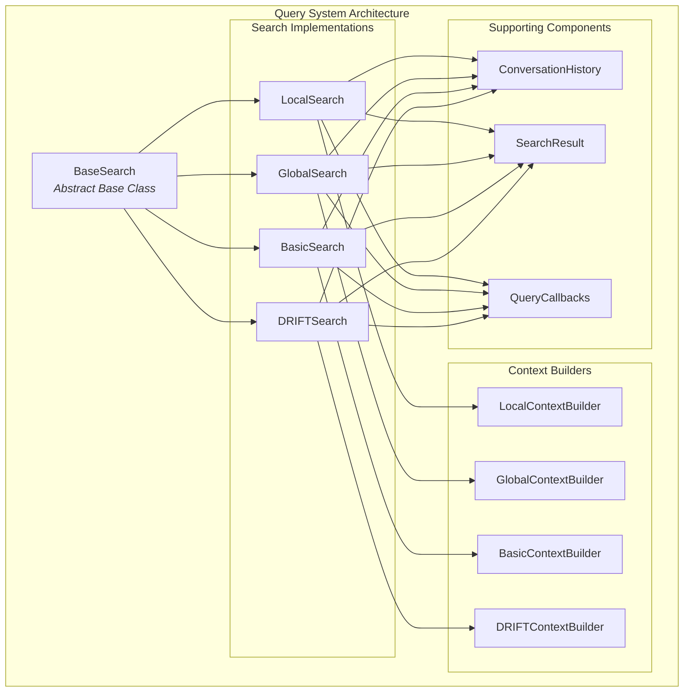
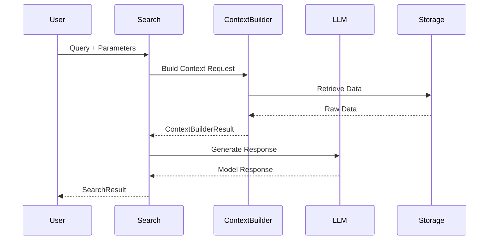

# Query System Module Documentation

## Overview

The Query System module is the core search and retrieval component of the GraphRAG system. It provides multiple search strategies for querying knowledge graphs and retrieving relevant information from indexed data. The module implements a sophisticated multi-modal search architecture that supports local, global, basic, and DRIFT search methodologies.

## Purpose

The Query System serves as the primary interface for users to interact with the knowledge graph, offering:
- **Multi-strategy search capabilities** tailored to different query types and use cases
- **Context-aware retrieval** that considers conversation history and query semantics
- **Scalable search operations** with support for both synchronous and streaming responses
- **Comprehensive result formatting** with detailed metadata and usage statistics

## Architecture



## Core Components

### BaseSearch Abstract Class
The foundation for all search implementations, providing:
- **Generic interface** for different search strategies
- **Common functionality** for model management and context building
- **Abstract methods** for search and stream_search operations
- **Token management** and usage tracking

### Search Implementations

#### 1. LocalSearch
- **Purpose**: Entity-centric search focusing on specific nodes and their immediate relationships
- **Use Case**: Detailed queries about specific entities, relationships, or local graph structures
- **Context**: Uses LocalContextBuilder to gather entity-specific information
- **Features**: Supports conversation history and streaming responses

#### 2. GlobalSearch
- **Purpose**: Community-level search across the entire knowledge graph
- **Use Case**: Broad queries requiring synthesis of information across multiple communities
- **Architecture**: Implements Map-Reduce pattern with parallel processing
- **Features**: Community report analysis and knowledge synthesis

#### 3. BasicSearch
- **Purpose**: Traditional RAG-style search on raw text chunks
- **Use Case**: Simple semantic search without graph structure
- **Context**: Uses BasicContextBuilder for vector similarity search
- **Features**: Direct text retrieval and ranking

#### 4. DRIFTSearch
- **Purpose**: Dynamic, iterative search with follow-up queries
- **Use Case**: Complex queries requiring multi-step investigation
- **Architecture**: Uses query state management and iterative refinement
- **Features**: Automatic query expansion and result aggregation

### Context Builders

#### ContextBuilderResult
Data structure containing:
- **context_chunks**: Processed text data for LLM consumption
- **context_records**: Structured data (DataFrames) for analysis
- **Usage statistics**: Token counts and LLM call metrics

#### ConversationHistory
Manages conversational context with:
- **Turn-based storage** of user queries and assistant responses
- **Token-aware truncation** for context window management
- **QA pair extraction** for conversation analysis
- **Context formatting** for system prompts

### SearchResult
Comprehensive result structure including:
- **Response content** (text, JSON, or structured data)
- **Context data** and text used for generation
- **Performance metrics** (completion time, token usage)
- **Detailed breakdowns** of LLM calls by category

## Data Flow



## Integration Points

### Dependencies
- **[language_models](language_models.md)**: ChatModel and EmbeddingModel interfaces
- **[data_models](data_models.md)**: Entity, Relationship, Community data structures
- **[vector_stores](vector_stores.md)**: Vector similarity search capabilities
- **[storage](storage.md)**: Data persistence and retrieval
- **[callbacks](callbacks.md)**: Event handling and monitoring

### Configuration
The module integrates with the main GraphRAG configuration system, supporting:
- **Model parameters** for different LLM providers
- **Context building strategies** and token limits
- **Search-specific settings** for each implementation
- **Streaming and batch processing** options

## Usage Patterns

### Synchronous Search
```python
result = await search.search(
    query="What are the key relationships between entities?",
    conversation_history=history
)
```

### Streaming Search
```python
async for chunk in search.stream_search(
    query="Tell me about the community structure",
    conversation_history=history
):
    print(chunk)
```

### Multi-strategy Search
The system supports combining different search strategies based on query characteristics and user preferences.

## Performance Considerations

- **Token Management**: All searches include comprehensive token usage tracking
- **Async Operations**: Full async/await support for concurrent processing
- **Streaming Support**: Real-time response generation for better UX
- **Context Optimization**: Intelligent context building to maximize relevance
- **Error Handling**: Graceful degradation with detailed error reporting

## Sub-modules Documentation

For detailed information about specific sub-modules, refer to:
- [structured_search.md](structured_search.md) - Core search implementations including LocalSearch, GlobalSearch, BasicSearch, and DRIFTSearch
- [context_builder.md](context_builder.md) - Context building strategies and conversation history management