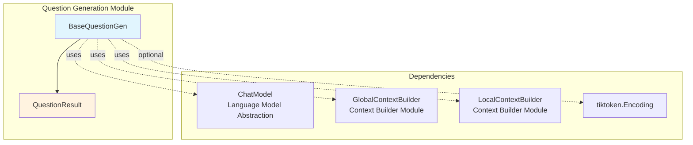
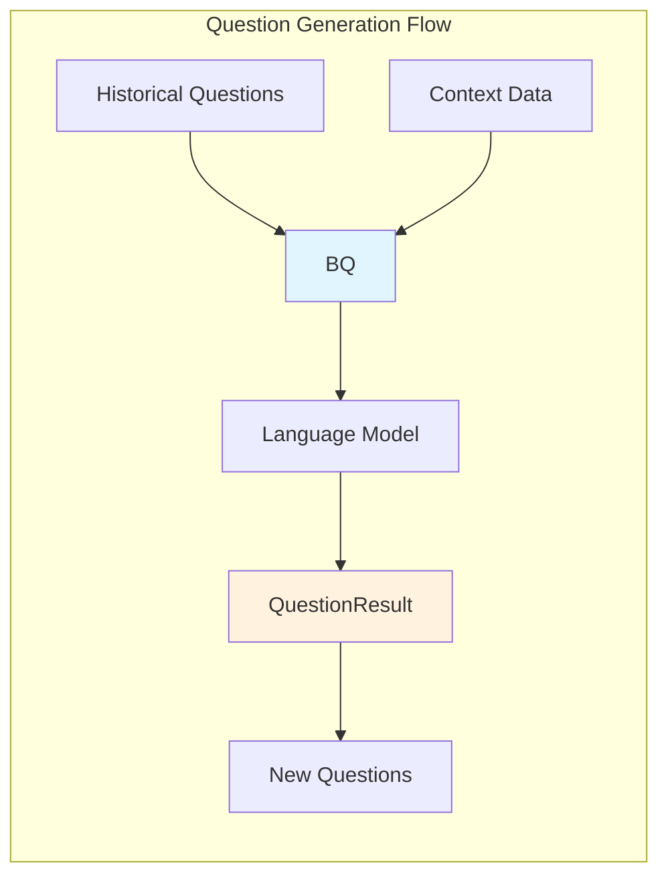
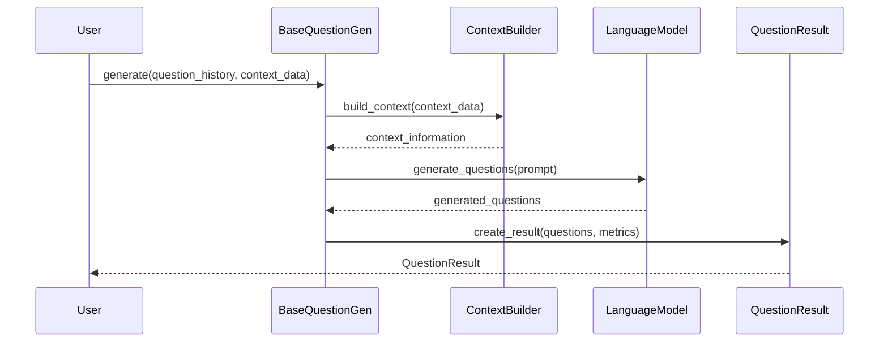

# Question Generation Module Documentation

## Introduction

The question_gen module is a core component of the GraphRAG query system, responsible for generating relevant questions based on previously asked questions and the most recent context data. This module provides the foundation for intelligent question suggestion and generation capabilities within the GraphRAG framework.

## Module Overview

The question_gen module implements a base abstraction for question generation that can be extended to support various question generation strategies. It integrates with the broader GraphRAG ecosystem through dependencies on language models, context builders, and the structured search infrastructure.

## Core Architecture

### BaseQuestionGen Class

The `BaseQuestionGen` class serves as the abstract foundation for all question generation implementations in the GraphRAG system. It provides a standardized interface for generating questions based on historical question data and contextual information.

#### Key Responsibilities:
- Abstract interface for question generation strategies
- Integration with language models via the ChatModel protocol
- Context-aware question generation using GlobalContextBuilder or LocalContextBuilder
- Token encoding support for efficient text processing
- Asynchronous question generation capabilities

#### Constructor Parameters:
- `model`: ChatModel instance for language model interactions
- `context_builder`: Either GlobalContextBuilder or LocalContextBuilder for context retrieval
- `token_encoder`: Optional tiktoken.Encoding for token management
- `model_params`: Optional dictionary of model-specific parameters
- `context_builder_params`: Optional dictionary of context builder parameters

### QuestionResult Data Structure

The `QuestionResult` dataclass encapsulates the results of question generation operations:

- `response`: List of generated questions as strings
- `context_data`: String or dictionary containing the context data used for generation
- `completion_time`: Float representing the time taken for completion
- `llm_calls`: Integer count of language model calls made
- `prompt_tokens`: Integer count of tokens used in prompts

## Architecture Diagram



## Component Relationships



## Integration with GraphRAG System

The question_gen module integrates with several other GraphRAG modules:

### Language Model Integration
- **Dependency**: [Language Model Abstraction](language_model_abstraction.md)
- **Usage**: Utilizes ChatModel protocol for generating questions
- **Integration**: All question generation operations are performed through the language model interface

### Context Building Integration
- **Dependency**: [Query Engine - Context Builder](query_engine.md)
- **Usage**: Leverages GlobalContextBuilder and LocalContextBuilder for context retrieval
- **Integration**: Context builders provide relevant information for question generation based on the graph structure

### Query Engine Integration
- **Dependency**: [Query Engine](query_engine.md)
- **Usage**: Part of the broader query engine ecosystem
- **Integration**: Question generation supports the structured search capabilities of the system

## Data Flow



## Implementation Details

### Abstract Methods

The BaseQuestionGen class defines two abstract methods that must be implemented by concrete subclasses:

1. **`generate()`**: Synchronous question generation
   - Parameters: question_history, context_data, question_count, **kwargs
   - Returns: QuestionResult

2. **`agenerate()`**: Asynchronous question generation
   - Parameters: question_history, context_data, question_count, **kwargs
   - Returns: QuestionResult

### Token Management

The module supports optional token encoding through tiktoken, enabling:
- Efficient token counting for cost management
- Context length optimization
- Prompt token usage tracking

## Usage Patterns

### Basic Usage
```python
# Initialize with required components
question_gen = ConcreteQuestionGen(
    model=chat_model,
    context_builder=context_builder,
    token_encoder=token_encoder
)

# Generate questions
result = await question_gen.agenerate(
    question_history=["What is X?", "How does Y work?"],
    context_data="relevant_context",
    question_count=5
)
```

### Context-Aware Generation
The module supports both global and local context building strategies:
- **Global Context**: Uses GlobalContextBuilder for system-wide context
- **Local Context**: Uses LocalContextBuilder for localized, specific context

## Extension Points

The BaseQuestionGen abstraction allows for various implementation strategies:

1. **Template-based Generation**: Using predefined question templates
2. **ML-based Generation**: Using trained models for question generation
3. **Rule-based Generation**: Using linguistic rules and patterns
4. **Hybrid Approaches**: Combining multiple strategies

## Performance Considerations

- **Asynchronous Operations**: The agenerate() method enables non-blocking question generation
- **Token Optimization**: Optional token encoder helps manage context limits
- **Context Efficiency**: Context builders optimize the amount of relevant information provided
- **Caching Potential**: Integration with [Pipeline Caching](pipeline_caching.md) for performance optimization

## Error Handling

While not explicitly shown in the base class, implementations should consider:
- Language model failure scenarios
- Context building errors
- Token limit exceeded conditions
- Invalid input validation

## Future Enhancements

Potential areas for extension include:
- Multi-language question generation support
- Question quality scoring mechanisms
- User preference learning
- Domain-specific question generation strategies
- Integration with conversation history for better context awareness

## Related Documentation

- [Query Engine](query_engine.md) - For context builder and search integration
- [Language Model Abstraction](language_model_abstraction.md) - For ChatModel protocol details
- [Configuration](configuration.md) - For model and system configuration options
- [Pipeline Caching](pipeline_caching.md) - For performance optimization strategies