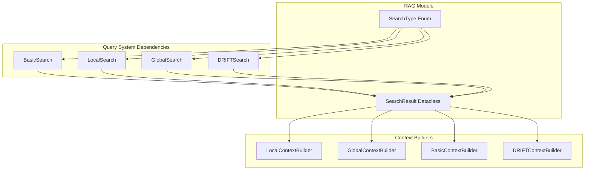
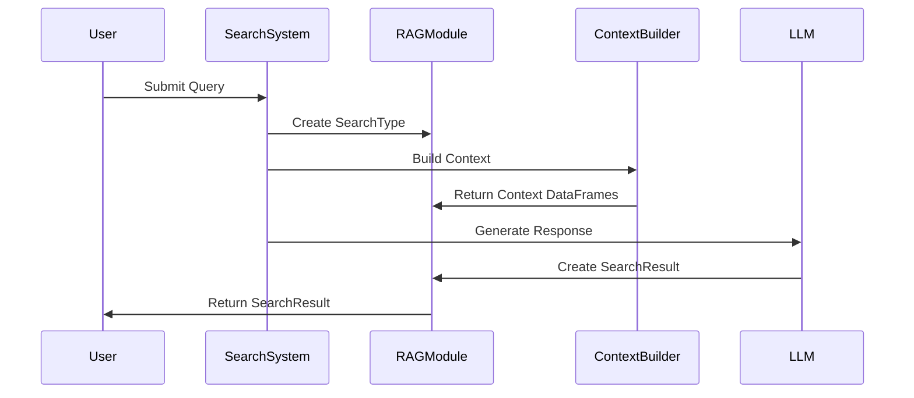

# RAG Module Documentation

## Introduction

The RAG (Retrieval-Augmented Generation) module is a core component of the unified-search-app that provides the typing definitions and data structures for different search algorithms. This module serves as the foundation for implementing various search strategies including basic, local, global, and drift search methods within the GraphRAG system.

## Module Overview

The RAG module defines the fundamental data types and enumerations that enable the unified search application to perform different types of searches across knowledge graphs. It provides a standardized interface for representing search results and search types, ensuring consistency across the various search implementations.

## Core Components

### SearchType Enum

The `SearchType` enumeration defines the different search strategies available in the system:

- **Basic**: Simple keyword-based search approach
- **Local**: Community-based local search focusing on specific graph neighborhoods
- **Global**: Global search across the entire knowledge graph
- **Drift**: Dynamic search that adapts based on conversation context

### SearchResult Dataclass

The `SearchResult` dataclass encapsulates the results from any search operation:

- **search_type**: The type of search that was performed (SearchType enum)
- **response**: The textual response generated from the search
- **context**: A dictionary containing pandas DataFrames with contextual information used to generate the response

## Architecture



## Data Flow



## Component Interactions

The RAG module interacts with several key components of the GraphRAG system:

### Query System Integration
The RAG module provides the typing foundation for the [query_system](query_system.md) module. Each search implementation (BasicSearch, LocalSearch, GlobalSearch, DRIFTSearch) uses the SearchType enum to identify itself and returns results in the standardized SearchResult format.

### Context Builder Integration
The SearchResult's context field is populated by various context builders from the [query_system](query_system.md) module:
- LocalContextBuilder provides community and entity data
- GlobalContextBuilder supplies global community reports
- BasicContextBuilder offers simple entity-relationship data
- DRIFTContextBuilder delivers dynamic context based on conversation history

### Knowledge Model Integration
The RAG module works with the [knowledge_loader](knowledge_loader.md) module's KnowledgeModel to ensure that search results are properly formatted and contain relevant contextual information from the loaded knowledge sources.

## Search Type Details

### Basic Search
Basic search performs simple keyword matching and entity lookup. It uses the SearchType.Basic enumeration value and typically returns straightforward entity and relationship information.

### Local Search
Local search focuses on specific communities within the knowledge graph. It leverages community detection algorithms and provides localized context around entities of interest.

### Global Search
Global search operates across the entire knowledge graph, utilizing community reports and global summaries to provide comprehensive answers that span multiple communities.

### DRIFT Search
DRIFT (Dynamic Reasoning over Information Flow and Topics) search adapts its approach based on conversation history and context, providing more nuanced and contextually relevant results.

## Usage Patterns

```python
# Example usage of RAG module components
from unified_search_app.app.rag.typing import SearchType, SearchResult
import pandas as pd

# Define search type
search_type = SearchType.Local

# Create search result with context
context_data = {
    'entities': pd.DataFrame([{'name': 'Entity1', 'type': 'Organization'}]),
    'relationships': pd.DataFrame([{'source': 'Entity1', 'target': 'Entity2', 'type': 'partnership'}])
}

result = SearchResult(
    search_type=search_type,
    response="Found relevant partnerships in the local community.",
    context=context_data
)
```

## Dependencies

The RAG module has minimal external dependencies:
- **pandas**: Used for structured data representation in the context field
- **dataclasses**: Provides the @dataclass decorator for SearchResult
- **enum**: Enables the SearchType enumeration

## Integration Points

### With Query System
The RAG module serves as the typing foundation for all search implementations in the [query_system](query_system.md). Each search class returns a SearchResult instance, ensuring consistency across different search strategies.

### With Knowledge Loader
The [knowledge_loader](knowledge_loader.md) module uses SearchResult to format and return search results to the application layer, maintaining a consistent interface between data loading and search operations.

### With Session Management
The SearchResult can be stored in session variables managed by the [unified_search_app](unified_search_app.md) module, allowing for conversation history and context persistence across multiple queries.

## Extensibility

The RAG module is designed for extensibility:
- New search types can be added to the SearchType enum
- The SearchResult dataclass can be extended with additional fields
- Context structure can be modified to support new data types

## Best Practices

1. **Consistent Context Structure**: Maintain consistent DataFrame schemas within the context dictionary for each search type
2. **Type Safety**: Always use the SearchType enum instead of string literals
3. **Context Documentation**: Document the expected structure of context DataFrames for each search type
4. **Error Handling**: Implement proper error handling when working with context DataFrames

## Future Considerations

- Potential addition of metadata fields to SearchResult for performance metrics
- Support for streaming results in future implementations
- Integration with additional vector store types as they become available
- Enhanced context serialization for cross-session persistence