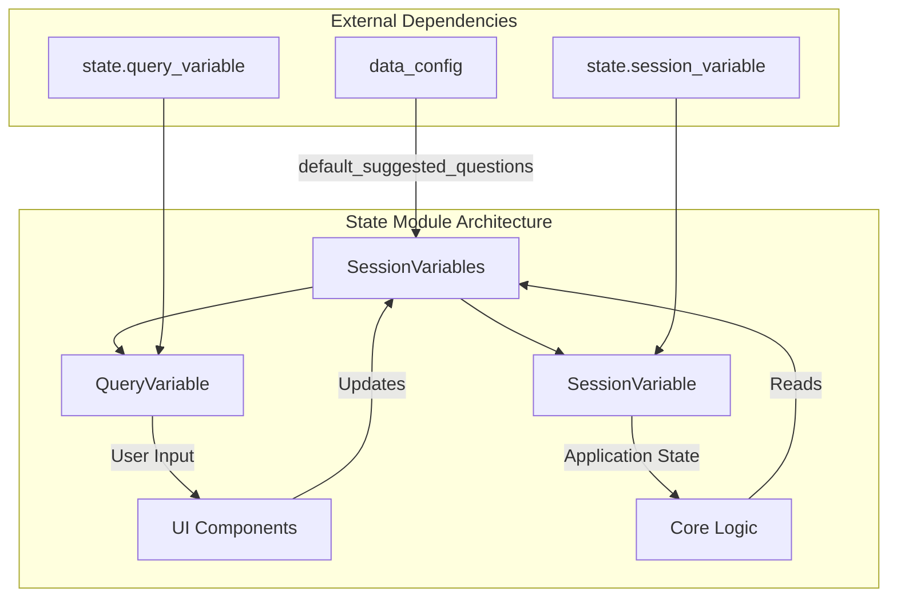
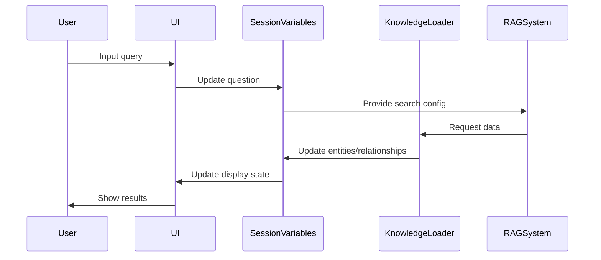

# State Module Documentation

## Introduction

The state module serves as the central state management system for the unified search application. It provides a structured way to manage and persist application state across different components and user interactions. The module implements a session-based variable management system that tracks user queries, search preferences, data sources, and various UI states throughout the application's lifecycle.

## Architecture Overview

The state module implements a hierarchical state management pattern with specialized variable types for different use cases. It acts as the single source of truth for the application's runtime state, coordinating between the knowledge loading system, RAG (Retrieval-Augmented Generation) operations, and the user interface.

## Core Components

### SessionVariables Class

The `SessionVariables` class is the main orchestrator that defines and manages all session variables used throughout the application. It provides a centralized location for accessing and modifying application state.

**Key Responsibilities:**
- Initialize and manage all session variables
- Provide type-safe access to application state
- Coordinate between different application components
- Maintain consistency across the application lifecycle

**Core Variables:**

#### Data Management Variables
- `dataset`: Current active dataset (QueryVariable)
- `datasets`: Available datasets list (SessionVariable)
- `dataset_config`: Configuration for the current dataset (SessionVariable)
- `datasource`: Data source information (SessionVariable)
- `graphrag_config`: GraphRAG configuration settings (SessionVariable)

#### Search and Query Variables
- `question`: User's current search query (QueryVariable)
- `suggested_questions`: Pre-defined question suggestions (SessionVariable)
- `question_in_progress`: Currently processing question (SessionVariable)
- `selected_question`: User-selected question (SessionVariable)
- `generated_questions`: AI-generated questions (SessionVariable)

#### Search Configuration Variables
- `include_global_search`: Enable global search functionality (QueryVariable)
- `include_local_search`: Enable local search functionality (QueryVariable)
- `include_drift_search`: Enable DRIFT search functionality (QueryVariable)
- `include_basic_rag`: Enable basic RAG functionality (QueryVariable)

#### Data Model Variables
- `entities`: Extracted entities from documents (SessionVariable)
- `relationships`: Relationships between entities (SessionVariable)
- `covariates`: Additional metadata and claims (SessionVariable)
- `communities`: Community structures in the graph (SessionVariable)
- `community_reports`: Summarized community information (SessionVariable)
- `text_units`: Processed text chunks (SessionVariable)

#### UI State Variables
- `selected_report`: Currently selected community report (SessionVariable)
- `graph_community_level`: Community hierarchy level (SessionVariable)
- `show_text_input`: Text input visibility flag (SessionVariable)

## Data Flow Architecture

## Component Interactions

### Integration with Knowledge Loader
The state module works closely with the [knowledge_loader](knowledge_loader.md) module to manage data sources and dataset configurations. The `dataset`, `datasets`, and `datasource` variables coordinate the loading and selection of knowledge bases.

### Integration with RAG System
The state module provides configuration and data to the [rag](rag.md) module through search preference variables (`include_global_search`, `include_local_search`, etc.) and maintains search results in the data model variables.

### Integration with Data Models
The state module stores instances of data model objects from the [data_models](data_models.md) module, including entities, relationships, communities, and text units, providing a bridge between the raw data and the application's user interface.

## Variable Types

### QueryVariable
Specialized variable type for user input that requires validation and processing. Used for search queries and configuration options that directly affect search behavior.

### SessionVariable
General-purpose variable type for maintaining application state that persists throughout the user session. Used for data storage, UI state, and configuration settings.

## State Management Patterns

### Initialization Pattern
All variables are initialized in the constructor with appropriate default values, ensuring the application starts in a consistent state.

### Update Pattern
Variables are updated through direct assignment, with the application components responsible for maintaining consistency and triggering appropriate re-renders or processing.

### Access Pattern
Components access state variables directly through the SessionVariables instance, promoting loose coupling between components.

## Configuration Integration

The state module integrates with the GraphRAG configuration system through the `graphrag_config` variable, which stores the active configuration for the indexing and search operations. This configuration is typically loaded from the [configuration](configuration.md) module and determines how the application processes and searches through the knowledge graph.

## Error Handling and Validation

While the state module itself doesn't implement extensive validation, it relies on the specialized variable types (`QueryVariable` and `SessionVariable`) to ensure data integrity. The `QueryVariable` type particularly provides validation for user inputs before they are processed by the search system.

## Performance Considerations

The state module is designed to be lightweight and efficient, storing references to data rather than large datasets directly. The actual data processing and storage are handled by the underlying systems (knowledge loader, RAG system), with the state module serving as a coordination layer.

## Extension Points

The modular design of the SessionVariables class allows for easy extension:
- New variable types can be added by extending the base variable classes
- Additional state variables can be introduced without affecting existing functionality
- New search modes can be added by extending the search configuration variables

## Dependencies

### Internal Dependencies
- `data_config`: Provides default suggested questions and configuration constants
- `state.query_variable`: Implements the QueryVariable class for validated user inputs
- `state.session_variable`: Implements the SessionVariable class for general state management

### External Module Dependencies
- [data_models](data_models.md): Provides the data structures stored in state variables
- [knowledge_loader](knowledge_loader.md): Coordinates data loading and dataset management
- [rag](rag.md): Consumes search configuration and provides search results
- [configuration](configuration.md): Supplies GraphRAG configuration settings

This state management approach ensures that the unified search application maintains consistency across all components while providing a flexible foundation for future enhancements and feature additions.