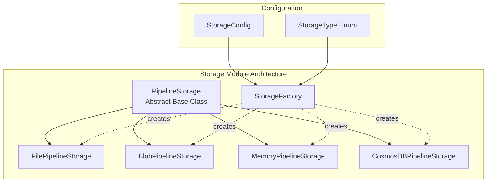
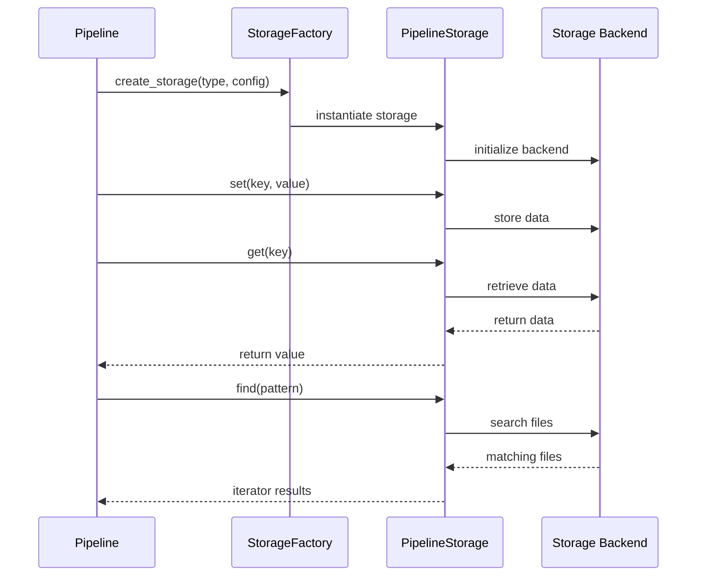

# Storage Module Documentation

## Overview

The storage module provides a flexible and extensible storage abstraction layer for the GraphRAG pipeline. It offers multiple storage backends to accommodate different deployment scenarios, from local file systems to cloud-based storage solutions. The module follows a factory pattern design that allows for easy registration and creation of different storage implementations while maintaining a consistent interface.

## Architecture

The storage module is built around the `PipelineStorage` abstract base class, which defines the contract for all storage implementations. The module uses a factory pattern (`StorageFactory`) to create and manage different storage types dynamically.



## Core Components

### PipelineStorage Abstract Base Class
The `PipelineStorage` class defines the interface that all storage implementations must follow. It provides methods for:
- File operations: `get()`, `set()`, `has()`, `delete()`, `clear()`
- File discovery: `find()` with regex pattern matching
- Storage hierarchy: `child()` for creating nested storage instances
- Metadata operations: `keys()`, `get_creation_date()`

### StorageFactory
The `StorageFactory` implements a registry pattern for storage implementations. It allows:
- Registration of built-in storage types (file, blob, memory, CosmosDB)
- Dynamic registration of custom storage implementations
- Centralized storage creation and management

### Storage Implementations

#### FilePipelineStorage
Local file system storage implementation. See [File Storage Documentation](file_storage.md) for detailed information about:
- File-based data persistence
- Async I/O operations
- Directory structure management
- Pattern-based file discovery

#### BlobPipelineStorage
Azure Blob Storage implementation. See [Blob Storage Documentation](blob_storage.md) for detailed information about:
- Cloud-based blob storage
- Azure authentication methods
- Scalable data storage
- Container management

#### MemoryPipelineStorage
In-memory storage implementation. See [Memory Storage Documentation](memory_storage.md) for detailed information about:
- In-memory data storage
- Development and testing use cases
- Performance optimization
- Temporary data handling

#### CosmosDBPipelineStorage
Azure CosmosDB implementation. See [CosmosDB Storage Documentation](cosmosdb_storage.md) for detailed information about:
- NoSQL document storage
- Complex query support
- Parquet file handling
- Scalable graph data storage

#### StorageFactory
Factory pattern implementation. See [Storage Factory Documentation](storage_factory.md) for detailed information about:
- Storage creation and management
- Custom storage registration
- Factory pattern implementation
- Storage type registry

## Data Flow



## Configuration Integration

The storage module integrates with the [configuration module](configuration.md) through:
- `StorageConfig` model for storage configuration
- `StorageType` enum for supported storage types
- Environment-based configuration loading

## Usage Patterns

### Basic Storage Operations
```python
# Create storage instance
storage = StorageFactory.create_storage("file", {"base_dir": "./data"})

# Store data
await storage.set("key", "value")

# Retrieve data
value = await storage.get("key")

# Check existence
exists = await storage.has("key")
```

### File Discovery
```python
# Find files matching pattern
import re
pattern = re.compile(r"entity_(?P<id>\\d+)\\.json")
for filename, match in storage.find(pattern):
    entity_id = match.group("id")
    # Process file
```

### Hierarchical Storage
```python
# Create child storage
child_storage = storage.child("subdirectory")
# Operations on child storage are isolated
```

## Error Handling

The storage module implements comprehensive error handling:
- Validation of storage configuration parameters
- Graceful handling of missing files/keys
- Logging of storage operations and errors
- Exception propagation for critical errors

## Performance Considerations

- **FilePipelineStorage**: Optimized for local file operations with async I/O
- **BlobPipelineStorage**: Designed for scalability with Azure's global infrastructure
- **MemoryPipelineStorage**: Fastest access for development and testing
- **CosmosDBPipelineStorage**: Optimized for complex queries and large datasets

## Security

- Support for Azure managed identity authentication
- Secure credential handling for cloud storage
- Configurable access controls through Azure RBAC
- Encryption at rest and in transit for cloud storage

## Extensibility

The factory pattern allows for easy extension:
1. Implement the `PipelineStorage` interface
2. Register with `StorageFactory.register()`
3. Use through the standard factory interface

## Dependencies

- **configuration**: For storage configuration management
- **Azure SDKs**: For blob and CosmosDB storage
- **aiofiles**: For async file operations
- **pandas**: For data frame operations in CosmosDB

## Related Documentation

- [Configuration Module](configuration.md) - Storage configuration options
- [Pipeline Infrastructure](pipeline_infrastructure.md) - How storage integrates with pipelines
- [Data Models](data_models.md) - Data structures stored by this module