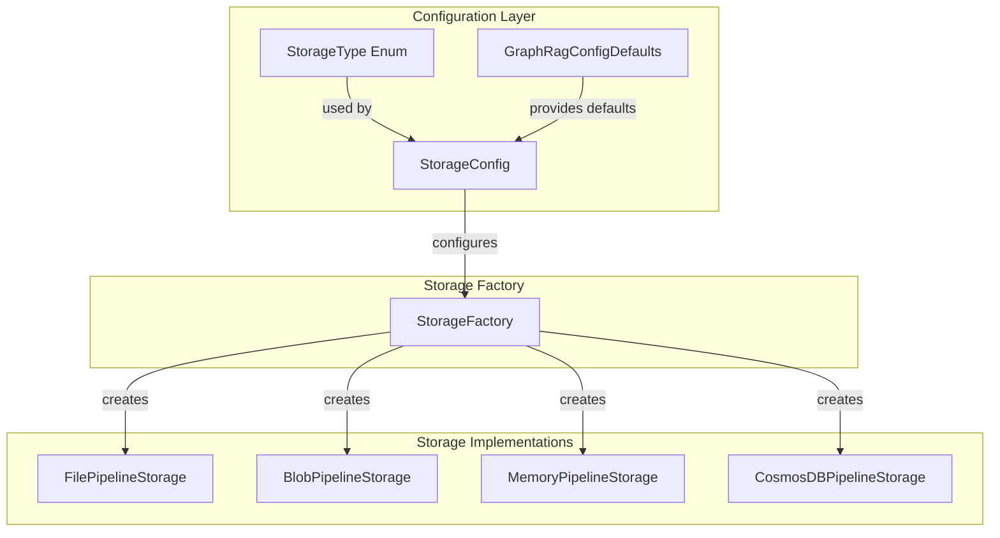
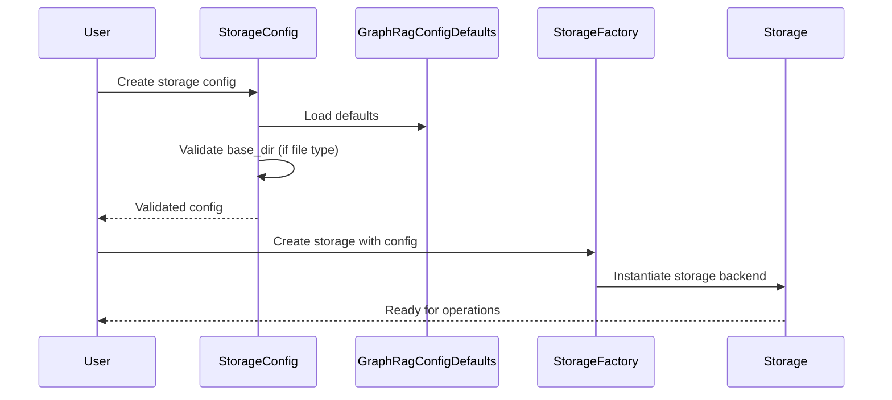
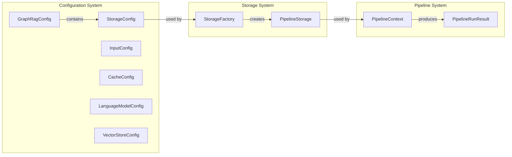
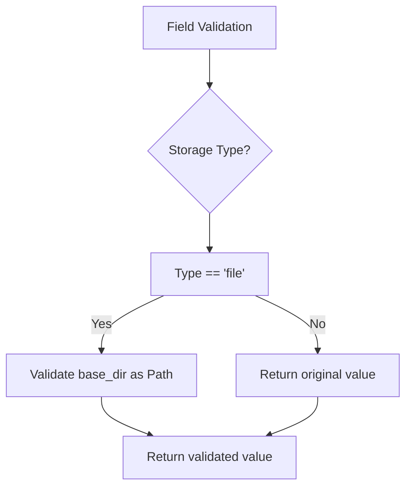
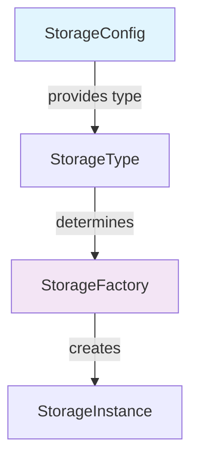

# Storage Configuration Module

## Introduction

The `storage_config` module defines the configuration model for storage backends in the GraphRAG system. It provides a centralized way to configure different storage types including local file systems, cloud storage (Azure Blob Storage), and CosmosDB, enabling flexible data persistence strategies across the entire pipeline.

## Architecture Overview

The StorageConfig module serves as the configuration layer for the storage infrastructure, bridging the gap between user configuration and the actual storage implementations. It validates storage settings and provides type-safe configuration for various storage backends.



## Core Components

### StorageConfig

The `StorageConfig` class is a Pydantic model that encapsulates all storage-related configuration parameters. It provides validation and type safety for storage settings across different backends.

**Key Features:**
- Multi-backend support (file, blob, memory, CosmosDB)
- Path validation for local storage
- Connection string management for cloud storage
- Container and account URL configuration

**Configuration Fields:**

| Field | Type | Description | Default |
|-------|------|-------------|---------|
| `type` | `StorageType \| str` | Storage backend type | `file` |
| `base_dir` | `str` | Base directory for output | `./output` |
| `connection_string` | `str \| None` | Azure storage connection string | `None` |
| `container_name` | `str \| None` | Blob container name | `None` |
| `storage_account_blob_url` | `str \| None` | Azure blob storage account URL | `None` |
| `cosmosdb_account_url` | `str \| None` | CosmosDB account URL | `None` |

## Data Flow



## Component Interactions

The StorageConfig module interacts with several key components in the GraphRAG system:



## Validation Logic

The StorageConfig implements specific validation logic for local file storage:



## Storage Type Support

The module supports multiple storage backends through the `StorageType` enum:

- **File Storage**: Local filesystem storage with path validation
- **Blob Storage**: Azure Blob Storage for cloud-based persistence
- **Memory Storage**: In-memory storage for testing and development
- **CosmosDB**: Microsoft's distributed database service

## Integration with Storage Factory

The StorageConfig works in conjunction with the [StorageFactory](storage.md) to instantiate the appropriate storage backend:



## Usage Patterns

### Basic File Storage Configuration

```python
config = StorageConfig(
    type="file",
    base_dir="./my_output"
)
```

### Azure Blob Storage Configuration

```python
config = StorageConfig(
    type="blob",
    connection_string="DefaultEndpointsProtocol=...",
    container_name="graphrag-data"
)
```

### CosmosDB Configuration

```python
config = StorageConfig(
    type="cosmosdb",
    cosmosdb_account_url="https://myaccount.documents.azure.com:443/"
)
```

## Dependencies

The StorageConfig module depends on:

- **[GraphRagConfigDefaults](configuration.md)**: Provides default values for all configuration fields
- **[StorageType](configuration.md)**: Enum defining supported storage backends
- **Pydantic**: For data validation and serialization
- **pathlib**: For path validation on local file systems

## Related Modules

- [Storage Module](storage.md) - Storage implementations and factory
- [Configuration Module](configuration.md) - Main configuration system
- [Cache Config](cache_config.md) - Cache configuration model
- [Pipeline Infrastructure](pipeline_infrastructure.md) - Uses storage for persistence

## Best Practices

1. **Path Validation**: Always use the built-in path validation for file storage to ensure cross-platform compatibility
2. **Connection Security**: Store connection strings securely and never commit them to version control
3. **Container Naming**: Use consistent naming conventions for blob containers
4. **Default Usage**: Leverage the provided defaults from `GraphRagConfigDefaults` for standard configurations

## Error Handling

The StorageConfig module provides validation errors for:
- Invalid file paths (non-existent directories)
- Missing required fields for specific storage types
- Invalid connection strings or URLs

These validations ensure that storage configurations are valid before being used by the storage factory, preventing runtime errors during pipeline execution.