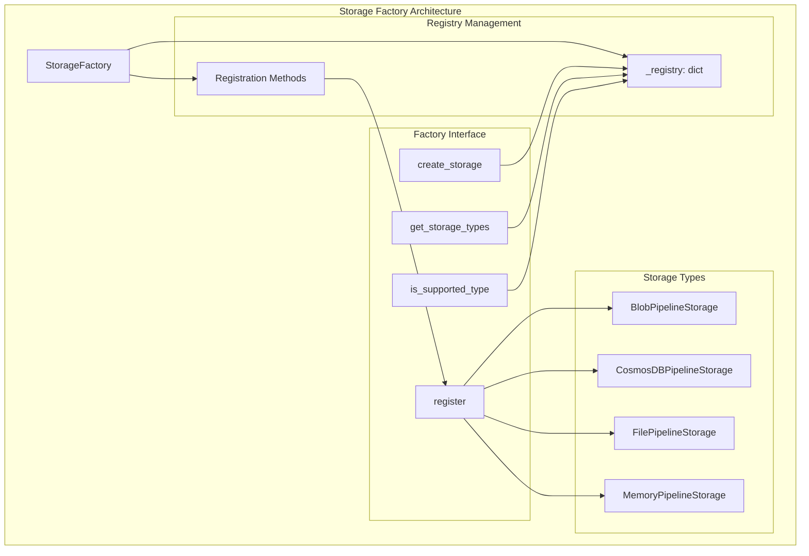
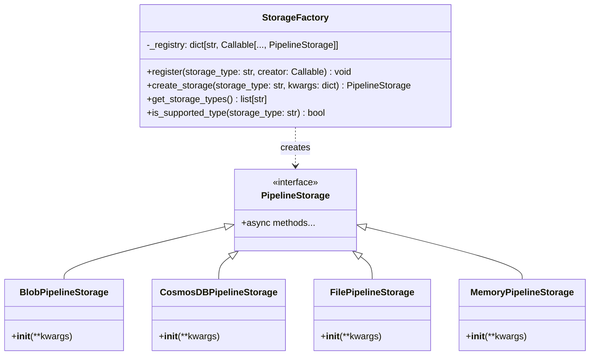
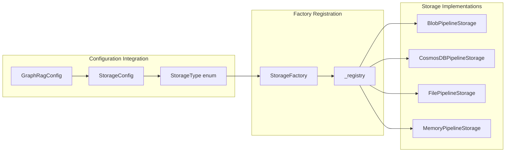
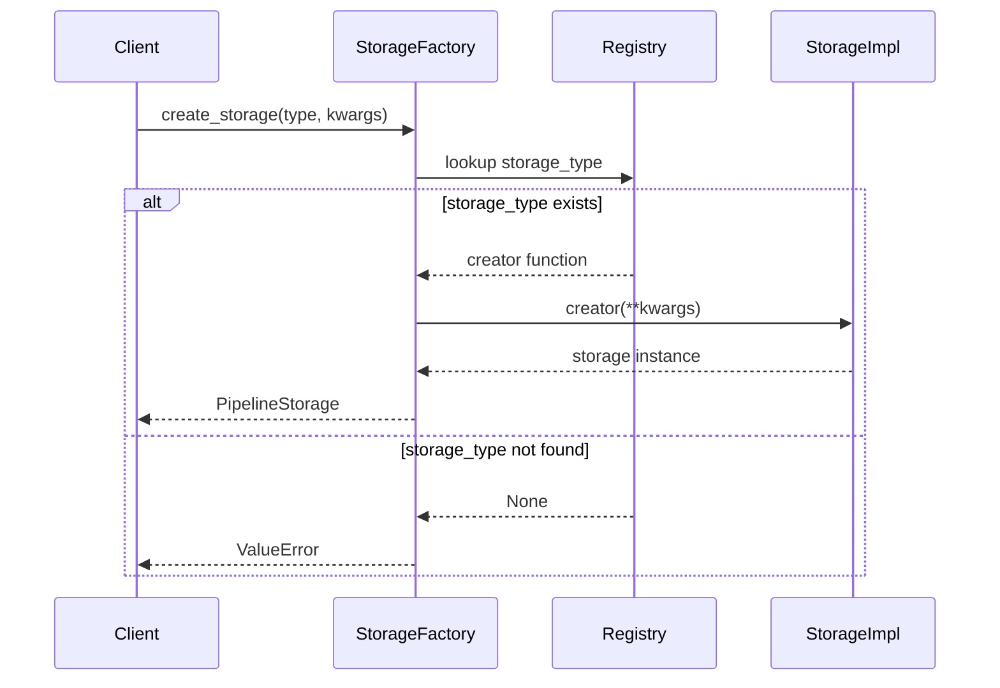
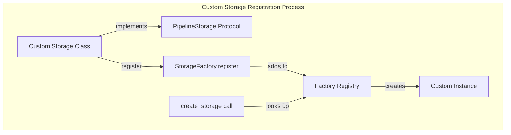
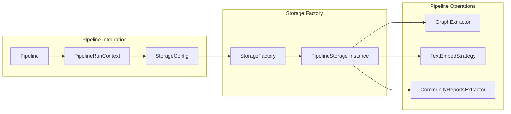

# Storage Factory Module

## Introduction

The storage_factory module provides a centralized factory pattern implementation for creating and managing different types of storage backends in the GraphRAG system. It serves as the primary entry point for instantiating various storage implementations, enabling flexible and extensible storage configuration across the entire system.

## Architecture Overview

The StorageFactory module implements a registry-based factory pattern that allows for dynamic registration and instantiation of storage implementations. This design enables the system to support multiple storage backends while maintaining a consistent interface.



## Core Components

### StorageFactory Class

The `StorageFactory` class is the central component that manages storage implementation registration and instantiation. It provides a clean interface for creating storage instances while maintaining flexibility for custom implementations.

#### Key Features:
- **Registry-based architecture**: Uses a class-level registry to store storage implementations
- **Dynamic registration**: Allows runtime registration of custom storage types
- **Type safety**: Integrates with the system's StorageType enum for consistent type management
- **Extensibility**: Supports custom storage implementations without modifying core code

#### Class Structure:



## Storage Type Integration

The factory integrates with the system's [configuration](configuration.md) module through the `StorageType` enum, ensuring consistent storage type definitions across the entire system.



## Data Flow

The storage factory follows a clear data flow pattern for storage instantiation:



## Built-in Storage Types

The factory comes pre-configured with four built-in storage implementations:

### 1. File Storage ([file_storage](file_storage.md))
- **Type**: `StorageType.file`
- **Implementation**: `FilePipelineStorage`
- **Use Case**: Local file system storage for development and small deployments

### 2. Blob Storage ([blob_storage](blob_storage.md))
- **Type**: `StorageType.blob`
- **Implementation**: `BlobPipelineStorage`
- **Use Case**: Cloud blob storage for scalable deployments

### 3. Memory Storage ([memory_storage](memory_storage.md))
- **Type**: `StorageType.memory`
- **Implementation**: `MemoryPipelineStorage`
- **Use Case**: In-memory storage for testing and temporary operations

### 4. CosmosDB Storage ([cosmosdb_storage](cosmosdb_storage.md))
- **Type**: `StorageType.cosmosdb`
- **Implementation**: `CosmosDBPipelineStorage`
- **Use Case**: Distributed NoSQL storage for enterprise deployments

## Custom Storage Implementation

The factory pattern allows for easy extension with custom storage implementations:



## Integration with Pipeline System

The storage factory integrates seamlessly with the [pipeline_infrastructure](pipeline_infrastructure.md) module, providing storage instances for various pipeline operations:



## Error Handling

The factory implements robust error handling for unknown storage types:

- **Validation**: Checks if storage type is registered before instantiation
- **Error Reporting**: Provides clear error messages for unsupported types
- **Type Safety**: Integrates with configuration enums to prevent invalid types

## Usage Examples

### Basic Storage Creation
```python
from graphrag.storage.factory import StorageFactory
from graphrag.config.enums import StorageType

# Create file storage
storage = StorageFactory.create_storage(
    StorageType.file.value,
    {"base_dir": "/path/to/storage"}
)
```

### Custom Storage Registration
```python
# Register custom storage implementation
StorageFactory.register("custom", CustomPipelineStorage)

# Use custom storage
custom_storage = StorageFactory.create_storage(
    "custom",
    {"custom_param": "value"}
)
```

## Dependencies

The storage_factory module has the following key dependencies:

- **[configuration](configuration.md)**: Uses `StorageType` enum for consistent type definitions
- **[pipeline_storage](pipeline_storage.md)**: Creates instances implementing the `PipelineStorage` protocol
- **Individual storage implementations**: Delegates to specific storage classes for instantiation

## Best Practices

1. **Type Consistency**: Always use the `StorageType` enum values when creating storage instances
2. **Error Handling**: Handle `ValueError` exceptions when creating storage with potentially unknown types
3. **Custom Extensions**: Register custom storage implementations during application initialization
4. **Configuration Integration**: Use storage configuration from the main system configuration for consistency

## Future Considerations

The factory pattern provides a solid foundation for future enhancements:

- **Async Factory Methods**: Potential addition of async creation methods
- **Storage Health Checks**: Integration with system health monitoring
- **Performance Metrics**: Collection of storage instantiation metrics
- **Auto-discovery**: Potential automatic discovery of storage implementations