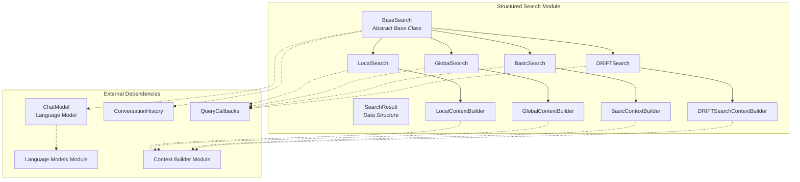
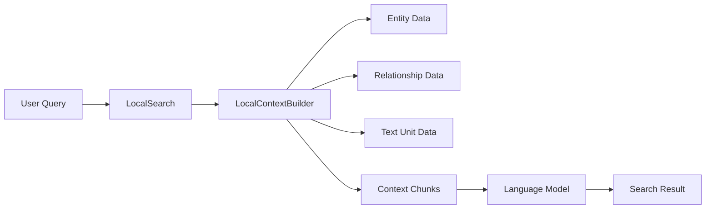
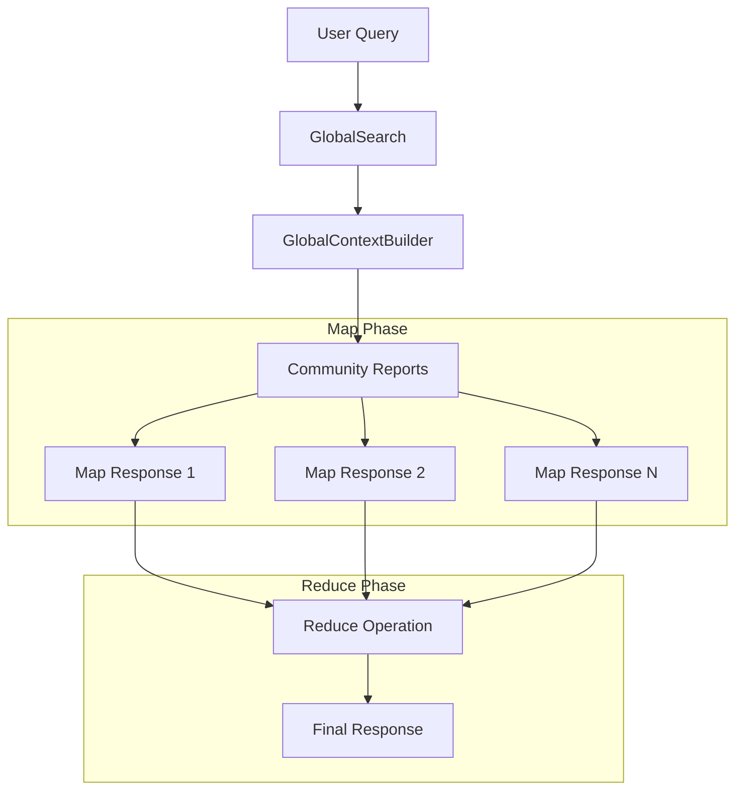
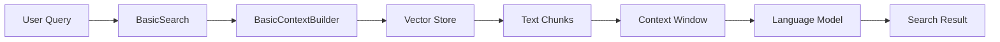
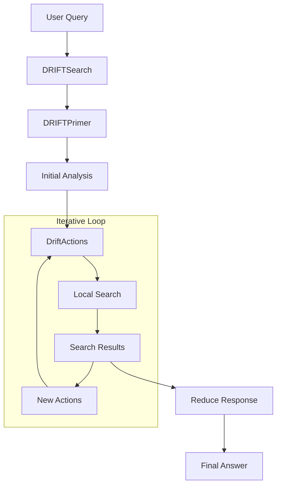
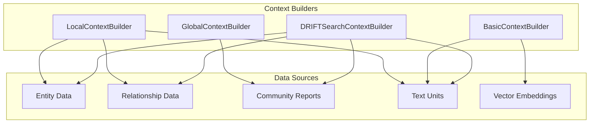

# Structured Search Module Documentation

## Introduction

The structured_search module is the core query processing component of the GraphRAG system, providing multiple search strategies for knowledge graph-based question answering. This module implements a sophisticated search framework that leverages the indexed knowledge graph to deliver contextual, accurate responses to user queries through various search methodologies.

The module supports four distinct search modes:
- **Local Search**: Neighborhood-based search focusing on specific entities and their immediate relationships
- **Global Search**: Community-based search using map-reduce approach across community summaries
- **Basic Search**: Traditional RAG-style vector search on raw text chunks
- **DRIFT Search**: Dynamic, iterative search with follow-up queries and adaptive exploration

## Architecture Overview



## Core Components

### BaseSearch Abstract Class

The `BaseSearch` class serves as the foundation for all search implementations, providing a common interface and shared functionality.

**Key Responsibilities:**
- Defines the contract for search operations through abstract methods
- Manages common dependencies (language model, context builder, token encoder)
- Provides parameter management for both model and context builder configurations
- Supports both synchronous and streaming search operations

**Core Methods:**
- `search()`: Execute a complete search operation
- `stream_search()`: Stream search results incrementally

### SearchResult Data Structure

The `SearchResult` dataclass encapsulates comprehensive search outcome information:

**Response Data:**
- `response`: The generated answer (string, dict, or list)
- `context_data`: Structured context records used for the response
- `context_text`: Actual text strings that were in the context window

**Performance Metrics:**
- `completion_time`: Total execution time
- `llm_calls`: Total number of LLM calls made
- `prompt_tokens`/`output_tokens`: Token usage statistics
- Category breakdowns for detailed analysis

## Search Implementations

### Local Search

**Purpose**: Neighborhood-focused search around specific entities

**Architecture:**


**Key Features:**
- Focuses on entity neighborhoods and immediate relationships
- Uses local context builder to gather relevant entity and relationship data
- Supports conversation history for contextual responses
- Implements streaming for real-time response generation
- Configurable response types and system prompts

**Process Flow:**
1. Build local context using entity and relationship data
2. Format context into system prompt
3. Generate response using language model
4. Track performance metrics and token usage

### Global Search

**Purpose**: Community-based search using map-reduce approach

**Architecture:**


**Key Features:**
- Two-phase approach: map communities to intermediate answers, then reduce to final response
- Parallel processing of community reports for efficiency
- Scoring and ranking of intermediate responses
- Configurable token limits and concurrency controls
- Support for general knowledge incorporation

**Process Flow:**
1. **Map Phase**: Process community reports in parallel to generate key points with scores
2. **Filter & Rank**: Remove low-scoring responses and rank by relevance
3. **Reduce Phase**: Combine top responses into comprehensive final answer
4. **Streaming Support**: Real-time response generation

### Basic Search

**Purpose**: Traditional RAG-style vector search on text chunks

**Architecture:**


**Key Features:**
- Vector similarity search on raw text units
- Simple, straightforward RAG implementation
- Configurable context window and response types
- Streaming support for real-time responses
- Minimal complexity for baseline comparisons

### DRIFT Search

**Purpose**: Dynamic, iterative search with adaptive exploration

**Architecture:**


**Key Features:**
- Multi-step iterative search process
- Automatic generation of follow-up queries
- State management for query progression
- Integration with local search for detailed exploration
- Configurable depth and breadth parameters

**Process Flow:**
1. **Priming**: Initial analysis to identify key aspects and generate follow-up queries
2. **Iterative Exploration**: Execute follow-up searches using local search
3. **State Management**: Track query state and action results
4. **Response Reduction**: Combine all findings into comprehensive answer

## Context Builder Integration

The structured search module relies heavily on context builders to prepare relevant information for each search type:



## Performance and Monitoring

### Token Management
- Comprehensive token usage tracking across all operations
- Configurable token limits for different search phases
- Token encoder integration for accurate counting

### Callback System
- Real-time monitoring of search progress
- Token streaming for user interfaces
- Performance metrics collection
- Error handling and logging

### Concurrency Control
- Semaphore-based concurrency management in global search
- Configurable parallelism levels
- Async/await pattern throughout for scalability

## Error Handling

The module implements robust error handling:
- Graceful degradation on LLM failures
- Empty response handling with appropriate fallbacks
- Exception logging and monitoring
- Token limit management

## Configuration

Each search type supports extensive configuration:
- Model parameters (temperature, max tokens, etc.)
- Context builder parameters (top-k, proportions, etc.)
- Search-specific settings (response types, prompts, etc.)
- Performance tuning options (concurrency, token limits)

## Dependencies

The structured_search module integrates with several other GraphRAG modules:

- **[Language Models](language_models.md)**: Provides LLM capabilities through the ChatModel protocol
- **[Context Builder](query_context_builder.md)**: Supplies relevant context for each search type
- **[Data Models](data_models.md)**: Uses entity, relationship, and community data structures
- **[Callbacks](callbacks.md)**: Enables monitoring and progress tracking

## Usage Patterns

### Basic Usage
```python
# Initialize search with appropriate context builder
search = LocalSearch(
    model=chat_model,
    context_builder=local_context_builder,
    token_encoder=token_encoder
)

# Execute search
result = await search.search("What are the key relationships between entities?")
```

### Streaming Usage
```python
# Stream search results
async for chunk in search.stream_search("Tell me about entity X"):
    print(chunk, end="", flush=True)
```

### Advanced Configuration
```python
# Configure with custom parameters
search = GlobalSearch(
    model=chat_model,
    context_builder=global_context_builder,
    concurrent_coroutines=16,
    max_data_tokens=10000,
    allow_general_knowledge=True
)
```

## Performance Considerations

- **Local Search**: Fastest for entity-specific queries, minimal LLM calls
- **Global Search**: Higher latency due to map-reduce approach, but comprehensive
- **Basic Search**: Moderate performance, depends on vector store efficiency
- **DRIFT Search**: Highest latency due to iterative nature, but most thorough

## Future Enhancements

Potential areas for improvement:
- Caching mechanisms for repeated queries
- Query optimization and planning
- Hybrid search strategies combining multiple approaches
- Advanced ranking and relevance scoring
- Multi-language support enhancements