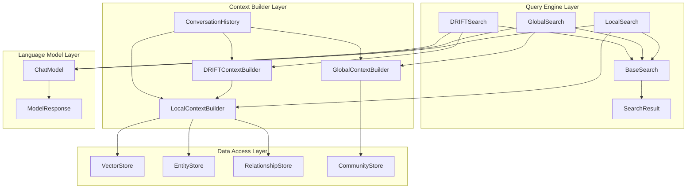
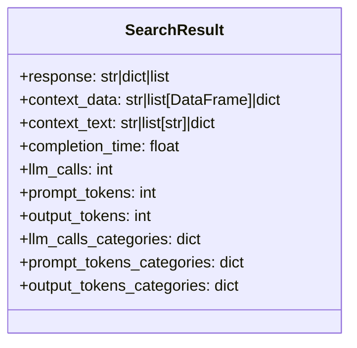
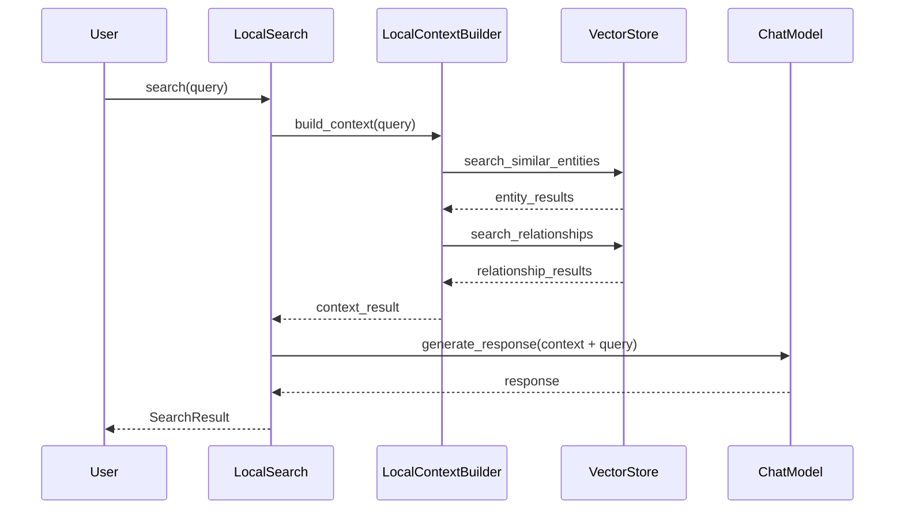
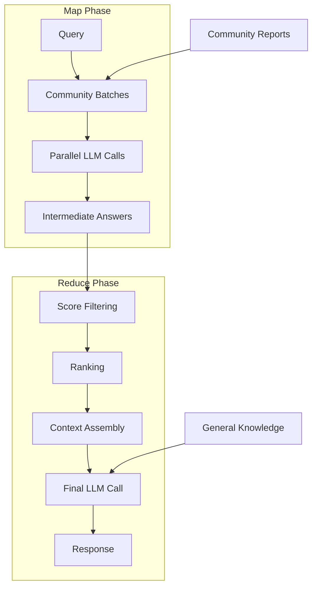
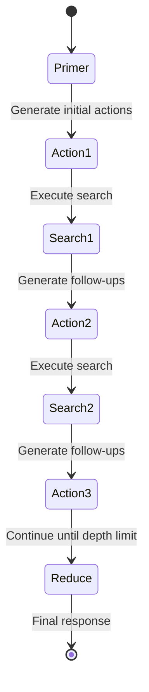
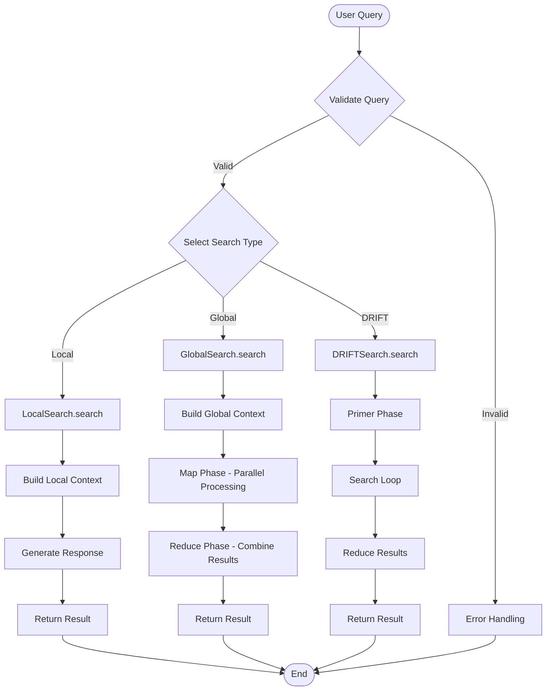
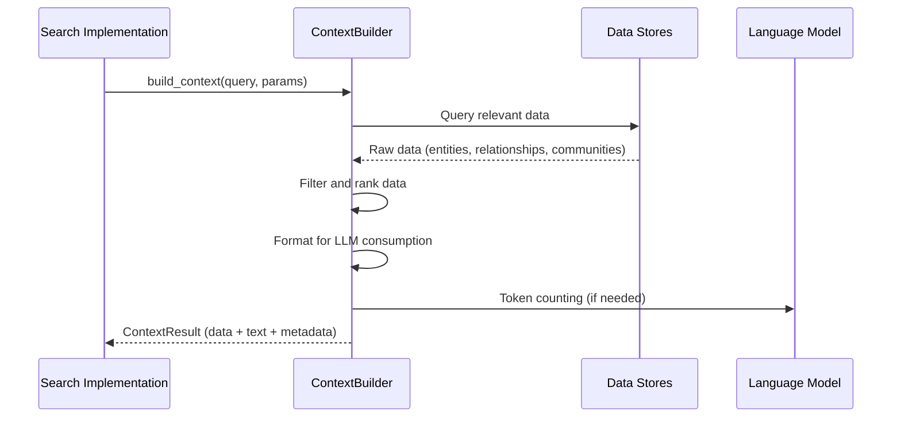
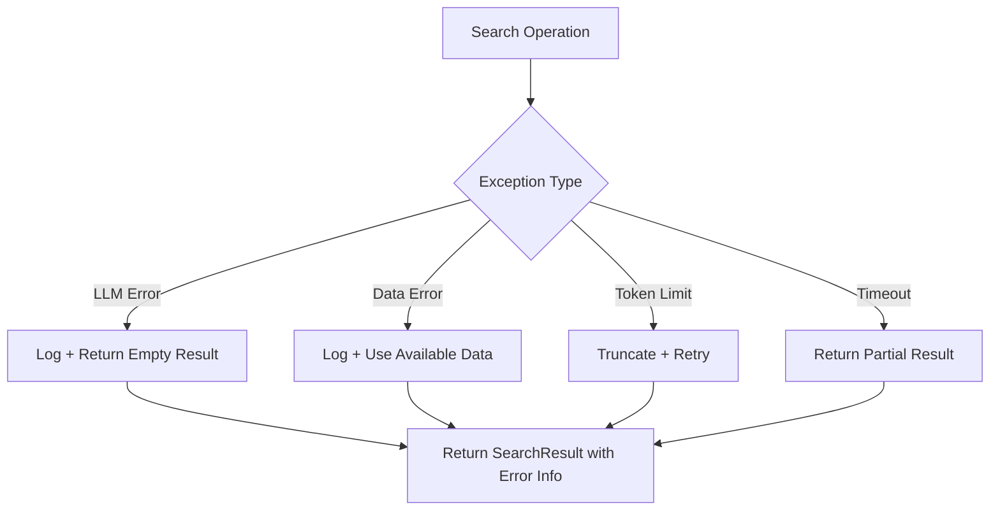

# Structured Search Module Documentation

## Introduction

The structured_search module is a core component of the GraphRAG query engine that provides intelligent search capabilities over knowledge graphs. It implements multiple search strategies including local search, global search, and DRIFT (Dynamic Reasoning and Inference with Follow-up Thoughts) search, each optimized for different types of queries and use cases.

This module serves as the primary interface for querying the knowledge graph constructed during the indexing pipeline, enabling users to extract meaningful insights from their data through natural language queries.

## Architecture Overview

The structured_search module follows a layered architecture with clear separation of concerns:


```mermaid
graph TB
    subgraph "Query Engine Layer"
        BS[BaseSearch]
        SR[SearchResult]
        LS[LocalSearch]
        GS[GlobalSearch]
        DS[DRIFTSearch]
    end
    
    subgraph "Context Builder Layer"
        LCB[LocalContextBuilder]
        GCB[GlobalContextBuilder]
        DCB[DRIFTContextBuilder]
        CH[ConversationHistory]
    end
    
    subgraph "Language Model Layer"
        CM[ChatModel]
        MR[ModelResponse]
    end
    
    subgraph "Data Access Layer"
        VS[VectorStore]
        ES[EntityStore]
        RS[RelationshipStore]
        CS[CommunityStore]
    end
    
    BS --> SR
    LS --> BS
    GS --> BS
    DS --> BS
    
    LS --> LCB
    GS --> GCB
    DS --> DCB
    
    LCB --> VS
    LCB --> ES
    LCB --> RS
    GCB --> CS
    DCB --> LCB
    
    LS --> CM
    GS --> CM
    DS --> CM
    
    CM --> MR
    
    CH --> LCB
    CH --> GCB
    CH --> DCB
```

## Core Components

### BaseSearch Abstract Class

The `BaseSearch` class serves as the foundation for all search implementations, providing a common interface and shared functionality.

**Key Features:**
- Generic type system supporting different context builders
- Standardized search and stream_search methods
- Token encoding and model parameter management
- Integration with conversation history

**Component Relationships:**
- Depends on [ChatModel](language_model.md) for LLM interactions
- Works with various [ContextBuilder](context_builder.md) implementations
- Integrates with [ConversationHistory](context_builder.md) for multi-turn queries

### SearchResult Data Structure

The `SearchResult` dataclass encapsulates all information returned from a search operation:


```mermaid
classDiagram
    class SearchResult {
        +response: str|dict|list
        +context_data: str|list[DataFrame]|dict
        +context_text: str|list[str]|dict
        +completion_time: float
        +llm_calls: int
        +prompt_tokens: int
        +output_tokens: int
        +llm_calls_categories: dict
        +prompt_tokens_categories: dict
        +output_tokens_categories: dict
    }
```

## Search Strategies

### 1. Local Search

Local search focuses on specific entities and their immediate relationships, ideal for targeted queries about particular nodes or edges in the graph.

**Use Cases:**
- Entity-specific queries ("What is Microsoft's revenue?")
- Relationship exploration ("Who are Microsoft's competitors?")
- Attribute-based searches ("Companies founded in 1975")

**Architecture:**

```mermaid
sequenceDiagram
    participant User
    participant LocalSearch
    participant LocalContextBuilder
    participant VectorStore
    participant ChatModel
    
    User->>LocalSearch: search(query)
    LocalSearch->>LocalContextBuilder: build_context(query)
    LocalContextBuilder->>VectorStore: search_similar_entities
    VectorStore-->>LocalContextBuilder: entity_results
    LocalContextBuilder->>VectorStore: search_relationships
    VectorStore-->>LocalContextBuilder: relationship_results
    LocalContextBuilder-->>LocalSearch: context_result
    LocalSearch->>ChatModel: generate_response(context + query)
    ChatModel-->>LocalSearch: response
    LocalSearch-->>User: SearchResult
```

**Key Features:**
- Entity-centric context building
- Relationship traversal within configurable depth
- Support for vector similarity search
- Configurable context window management

### 2. Global Search

Global search operates on community summaries and high-level graph structures, suitable for broad, analytical queries that require understanding of overall patterns.

**Use Cases:**
- Thematic analysis ("What are the main technology trends?")
- Community detection ("What are the key market segments?")
- Pattern recognition ("How has the industry evolved?")

**Architecture:**

```mermaid
graph TD
    subgraph "Map Phase"
        A[Query] --> B[Community Batches]
        B --> C[Parallel LLM Calls]
        C --> D[Intermediate Answers]
    end
    
    subgraph "Reduce Phase"
        D --> E[Score Filtering]
        E --> F[Ranking]
        F --> G[Context Assembly]
        G --> H[Final LLM Call]
        H --> I[Response]
    end
    
    J[Community Reports] --> B
    K[General Knowledge] --> H
```

**Implementation Details:**
- **Map Phase**: Processes community reports in parallel using LLM calls
- **Reduce Phase**: Combines intermediate results into final answer
- **Scoring System**: Ranks responses by relevance and importance
- **Token Management**: Configurable limits for context windows

### 3. DRIFT Search

DRIFT (Dynamic Reasoning and Inference with Follow-up Thoughts) search implements an iterative, exploratory approach that can handle complex, multi-faceted queries.

**Use Cases:**
- Complex analytical queries ("Compare the strategies of top tech companies")
- Multi-hop reasoning ("What factors led to the success of startup X?")
- Exploratory analysis ("What are the emerging patterns in AI adoption?")

**Architecture:**

```mermaid
stateDiagram-v2
    [*] --> Primer
    Primer --> Action1: Generate initial actions
    Action1 --> Search1: Execute search
    Search1 --> Action2: Generate follow-ups
    Action2 --> Search2: Execute search
    Search2 --> Action3: Generate follow-ups
    Action3 --> Reduce: Continue until depth limit
    Reduce --> [*]: Final response
```

**Key Components:**
- **Primer**: Generates initial search actions and follow-up queries
- **Action System**: Encapsulates search operations with scoring
- **Query State**: Maintains search history and context
- **Reduction**: Combines all findings into comprehensive response

## Data Flow

### Search Execution Flow


```mermaid
flowchart TD
    Start([User Query]) --> Validate{Validate Query}
    Validate -->|Valid| Route{Select Search Type}
    Route -->|Local| LocalPath
    Route -->|Global| GlobalPath
    Route -->|DRIFT| DriftPath
    
    LocalPath[LocalSearch.search] --> BuildLocal[Build Local Context]
    BuildLocal --> LocalLLM[Generate Response]
    LocalLLM --> ReturnLocal[Return Result]
    
    GlobalPath[GlobalSearch.search] --> BuildGlobal[Build Global Context]
    BuildGlobal --> MapPhase[Map Phase - Parallel Processing]
    MapPhase --> ReducePhase[Reduce Phase - Combine Results]
    ReducePhase --> ReturnGlobal[Return Result]
    
    DriftPath[DRIFTSearch.search] --> Primer[Primer Phase]
    Primer --> SearchLoop[Search Loop]
    SearchLoop --> ReduceDrift[Reduce Results]
    ReduceDrift --> ReturnDrift[Return Result]
    
    ReturnLocal --> End([End])
    ReturnGlobal --> End
    ReturnDrift --> End
    
    Validate -->|Invalid| Error[Error Handling]
    Error --> End
```

### Context Building Process


```mermaid
sequenceDiagram
    participant Search as Search Implementation
    participant Context as ContextBuilder
    participant Store as Data Stores
    participant Model as Language Model
    
    Search->>Context: build_context(query, params)
    Context->>Store: Query relevant data
    Store-->>Context: Raw data (entities, relationships, communities)
    Context->>Context: Filter and rank data
    Context->>Context: Format for LLM consumption
    Context->>Model: Token counting (if needed)
    Context-->>Search: ContextResult (data + text + metadata)
```

## Integration Points

### Configuration Integration

The structured_search module integrates with the [Configuration](configuration.md) system through:

- **LocalSearchConfig**: Parameters for local search behavior
- **GlobalSearchConfig**: Parameters for global search behavior  
- **Model configurations**: LLM parameters and settings
- **Storage configurations**: Data store connections

### Data Model Dependencies

Search operations work with the [Core Data Model](data_model.md):

- **Entity**: Primary nodes in the knowledge graph
- **Relationship**: Connections between entities
- **Community**: Groups of related entities
- **CommunityReport**: Summaries of community characteristics
- **TextUnit**: Original text segments

### Language Model Integration

The module leverages the [Language Model Abstraction](language_model.md):

- **ChatModel**: Interface for LLM interactions
- **ModelResponse**: Standardized response format
- **Token Management**: Efficient token counting and limits
- **Streaming Support**: Real-time response generation

## Performance Considerations

### Optimization Strategies

1. **Caching**: Integration with [Pipeline Caching](pipeline_caching.md) for repeated queries
2. **Concurrency**: Parallel processing in global search map phase
3. **Token Management**: Intelligent context window optimization
4. **Vector Stores**: Efficient similarity search through [Vector Stores](vector_stores.md)

### Scalability Features

- **Async Operations**: All search methods support asynchronous execution
- **Batch Processing**: Global search processes communities in parallel batches
- **Configurable Limits**: Token limits, concurrency controls, and timeout settings
- **Resource Management**: Proper cleanup and resource allocation

## Error Handling

### Exception Management


```mermaid
flowchart TD
    Try[Search Operation] --> Catch{Exception Type}
    Catch -->|LLM Error| LLMHandler[Log + Return Empty Result]
    Catch -->|Data Error| DataHandler[Log + Use Available Data]
    Catch -->|Token Limit| TokenHandler[Truncate + Retry]
    Catch -->|Timeout| TimeoutHandler[Return Partial Result]
    
    LLMHandler --> Return[Return SearchResult with Error Info]
    DataHandler --> Return
    TokenHandler --> Return
    TimeoutHandler --> Return
```

### Resilience Features

- **Graceful Degradation**: Continues operation with partial data
- **Error Logging**: Comprehensive logging for debugging
- **Fallback Responses**: Default responses when data is unavailable
- **Token Recovery**: Automatic truncation and retry mechanisms

## Usage Examples

### Basic Local Search

```python
from graphrag.query.structured_search.local_search.search import LocalSearch
from graphrag.query.context_builder.builders import LocalContextBuilder

# Initialize components
context_builder = LocalContextBuilder(
    entity_store=entity_store,
    relationship_store=relationship_store,
    vector_store=vector_store
)

local_search = LocalSearch(
    model=chat_model,
    context_builder=context_builder,
    response_type="multiple paragraphs"
)

# Execute search
result = await local_search.search(
    query="What are Microsoft's main products?",
    conversation_history=history
)
```

### Global Search with Streaming

```python
from graphrag.query.structured_search.global_search.search import GlobalSearch

# Configure global search
global_search = GlobalSearch(
    model=chat_model,
    context_builder=global_context_builder,
    concurrent_coroutines=16,
    max_data_tokens=8000
)

# Stream results
async for chunk in global_search.stream_search(
    query="Analyze technology industry trends"
):
    print(chunk, end="", flush=True)
```

### DRIFT Search for Complex Queries

```python
from graphrag.query.structured_search.drift_search.search import DRIFTSearch

drift_search = DRIFTSearch(
    model=chat_model,
    context_builder=drift_context_builder,
    query_state=QueryState()
)

result = await drift_search.search(
    query="Compare the business strategies of major cloud providers",
    reduce=True  # Combine all findings into single response
)
```

## Future Enhancements

### Planned Features

1. **Hybrid Search**: Combining local and global strategies automatically
2. **Query Planning**: Intelligent selection of search strategy based on query analysis
3. **Multi-modal Support**: Integration with image and document search
4. **Federated Search**: Cross-graph query capabilities
5. **Query Optimization**: Automatic query reformulation and optimization

### Performance Improvements

- **Query Result Caching**: Cache similar query results
- **Predictive Loading**: Pre-load likely relevant data
- **Distributed Processing**: Scale across multiple nodes
- **Index Optimization**: Enhanced indexing strategies for faster retrieval

## Related Documentation

- [Query Engine](query_engine.md) - Overview of the query system
- [Context Builder](context_builder.md) - Context construction details
- [Language Model](language_model.md) - LLM integration and management
- [Configuration](configuration.md) - Configuration options and settings
- [Data Model](data_model.md) - Core data structures and relationships
- [Vector Stores](vector_stores.md) - Vector storage and similarity search
- [Pipeline Caching](pipeline_caching.md) - Caching mechanisms and optimization