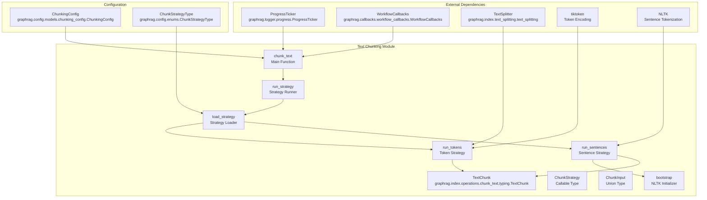
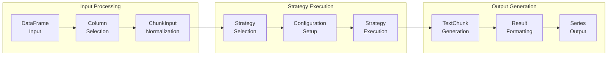
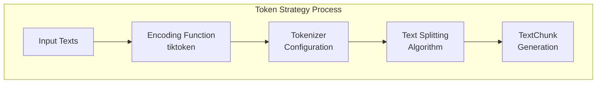
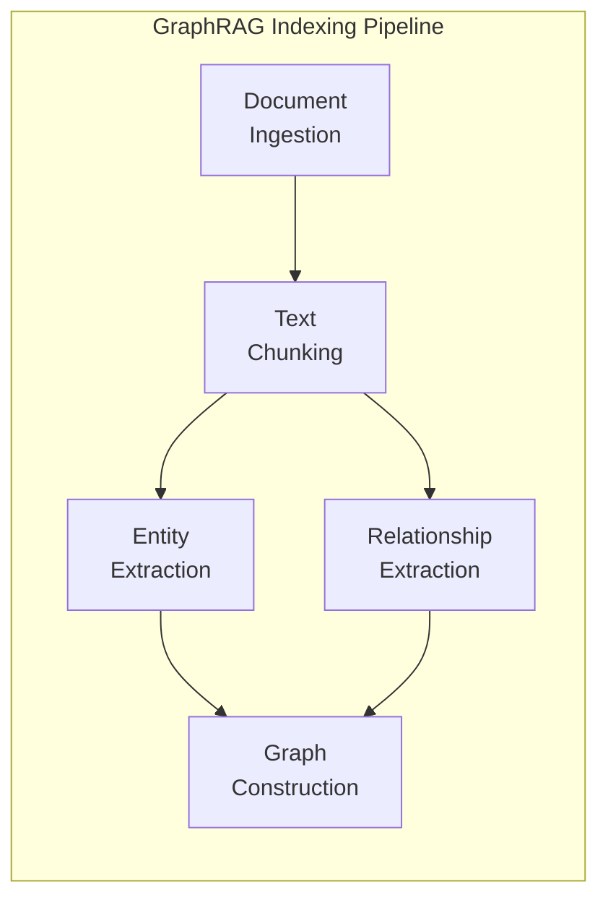
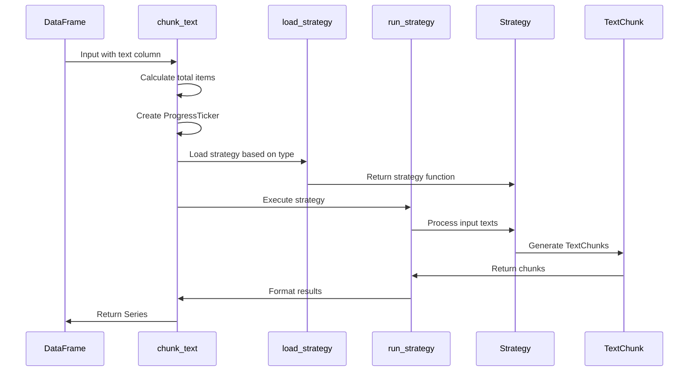

# Text Chunking Module Documentation

## Introduction

The text_chunking module is a critical component of the GraphRAG indexing pipeline, responsible for breaking down large documents into smaller, manageable text units. This process is essential for preparing text data for downstream operations such as entity extraction, relationship identification, and graph construction. The module provides flexible chunking strategies that balance between preserving semantic coherence and meeting token limitations of language models.

## Core Purpose and Functionality

The text_chunking module serves as the foundational text preprocessing step in the GraphRAG pipeline. Its primary responsibilities include:

- **Document Segmentation**: Breaking large documents into smaller text chunks that can be efficiently processed by language models
- **Token Management**: Ensuring chunks adhere to token limits while maintaining semantic coherence
- **Metadata Preservation**: Tracking source document relationships and chunk metadata for downstream processing
- **Strategy Flexibility**: Supporting multiple chunking approaches (token-based, sentence-based) to accommodate different use cases

## Architecture and Component Relationships

### Core Components



### Data Flow Architecture



## Detailed Component Analysis

### TextChunk Data Structure

The `TextChunk` class is the fundamental data structure that represents a text chunk with its associated metadata:

```python
@dataclass
class TextChunk:
    text_chunk: str              # The actual text content
    source_doc_indices: list[int] # Indices of source documents
    n_tokens: int | None = None  # Optional token count
```

This structure ensures that each chunk maintains a link to its source documents, enabling traceability throughout the GraphRAG pipeline.

### Chunking Strategies

#### 1. Token-Based Strategy (`run_tokens`)

The token-based strategy uses the tiktoken library to split text based on token boundaries:

- **Token Limit Management**: Ensures chunks don't exceed specified token limits
- **Overlap Control**: Maintains contextual continuity through configurable overlap
- **Encoding Flexibility**: Supports different encoding models (e.g., cl100k_base)
- **Multi-text Processing**: Handles multiple input texts efficiently



#### 2. Sentence-Based Strategy (`run_sentences`)

The sentence-based strategy uses NLTK for sentence tokenization:

- **Semantic Preservation**: Maintains sentence boundaries for better semantic coherence
- **NLTK Integration**: Leverages NLTK's punkt tokenizer for sentence detection
- **Document Tracking**: Preserves source document relationships
- **Bootstrap Management**: Handles NLTK data downloads and initialization

### Configuration Management

The `ChunkingConfig` class provides comprehensive configuration options:

```python
class ChunkingConfig:
    size: int                    # Maximum chunk size
    overlap: int                 # Overlap between chunks
    group_by_columns: list[str]  # Columns to group by
    strategy: ChunkStrategyType  # Chunking strategy
    encoding_model: str          # Token encoding model
    prepend_metadata: bool       # Include metadata in chunks
    chunk_size_includes_metadata # Count metadata in token limit
```

## Integration with GraphRAG Pipeline

### Position in Indexing Pipeline



The text_chunking module sits at the beginning of the indexing pipeline, transforming raw documents into processable text units that feed into entity and relationship extraction operations.

### Dependencies and Interactions

#### Upstream Dependencies
- **Document Processing**: Receives documents from the document ingestion phase
- **Configuration System**: Uses [configuration](configuration.md) for chunking parameters
- **Progress Tracking**: Integrates with [callbacks](callbacks.md) for workflow monitoring

#### Downstream Consumers
- **Entity Extraction**: Provides text chunks to [graph_extraction](index_operations.md#graph-extraction) operations
- **Relationship Identification**: Supplies context for relationship detection
- **Text Unit Storage**: Creates [TextUnit](data_models.md#text-unit) entities in the data model

## Process Flow and Implementation Details

### Main Processing Flow



### Strategy Loading and Execution

The strategy loading mechanism uses pattern matching to select appropriate chunking strategies:

1. **Strategy Selection**: Based on `ChunkStrategyType` enum (tokens, sentence)
2. **Dynamic Import**: Strategies are loaded on-demand to minimize dependencies
3. **Bootstrap Management**: NLTK initialization is handled automatically for sentence strategy
4. **Error Handling**: Unknown strategies raise descriptive errors

### Input Processing Flexibility

The module handles multiple input formats through the `ChunkInput` type:

- **String Input**: Single text string
- **String List**: List of text strings
- **Tuple List**: List of (document_id, text) tuples for source tracking

This flexibility allows the module to work with various document formats and maintain source relationships.

## Error Handling and Edge Cases

### Token Encoding Errors
- **Encoding Model Validation**: Validates encoding model availability
- **Fallback Mechanisms**: Provides graceful handling of encoding failures
- **Text Normalization**: Handles non-string inputs through automatic conversion

### NLTK Dependencies
- **Lazy Loading**: NLTK is only loaded when sentence strategy is used
- **Bootstrap Management**: Automatic download of required NLTK data
- **Initialization Tracking**: Prevents redundant NLTK initialization

### Progress Tracking
- **Callback Integration**: Works with workflow callbacks for progress reporting
- **Granular Updates**: Provides item-level progress tracking
- **Completion Handling**: Ensures proper progress completion signaling

## Performance Considerations

### Memory Management
- **Streaming Processing**: Uses iterators for memory-efficient chunk generation
- **Batch Processing**: Handles multiple texts in single operations
- **Garbage Collection**: Minimizes memory footprint through efficient data structures

### Processing Optimization
- **Parallel Processing**: Supports concurrent text processing
- **Token Caching**: Efficient token encoding through function reuse
- **Strategy Optimization**: Optimized algorithms for each chunking approach

## Extension Points

### Custom Strategy Development

New chunking strategies can be added by:

1. Implementing the `ChunkStrategy` callable signature
2. Adding strategy to the `ChunkStrategyType` enum
3. Updating the `load_strategy` function
4. Implementing required bootstrap functionality if needed

### Configuration Extensions

The configuration system supports extensions through:

- **Pydantic Validation**: Leverages Pydantic's validation framework
- **Default Management**: Integrates with system-wide defaults
- **Field Extensions**: Supports additional configuration fields

## Testing and Validation

### Strategy Validation
- **Input Validation**: Validates input formats and types
- **Output Consistency**: Ensures consistent TextChunk generation
- **Metadata Integrity**: Validates source document tracking

### Performance Testing
- **Token Count Accuracy**: Validates token counting accuracy
- **Overlap Calculation**: Tests chunk overlap calculations
- **Boundary Conditions**: Tests edge cases and limits

## References and Related Modules

- **[Configuration](configuration.md)**: For chunking configuration details
- **[Data Models](data_models.md)**: For TextUnit and document relationships
- **[Index Operations](index_operations.md)**: For downstream processing operations
- **[Callbacks](callbacks.md)**: For progress tracking and workflow integration
- **[Language Models](language_models.md)**: For token encoding and model integration

## Summary

The text_chunking module provides a robust, flexible foundation for text preprocessing in the GraphRAG pipeline. Its dual-strategy approach (token-based and sentence-based) accommodates different use cases while maintaining semantic coherence and technical constraints. The module's integration with the broader GraphRAG ecosystem ensures seamless data flow from document ingestion to graph construction, making it an essential component for building knowledge graphs from textual data.