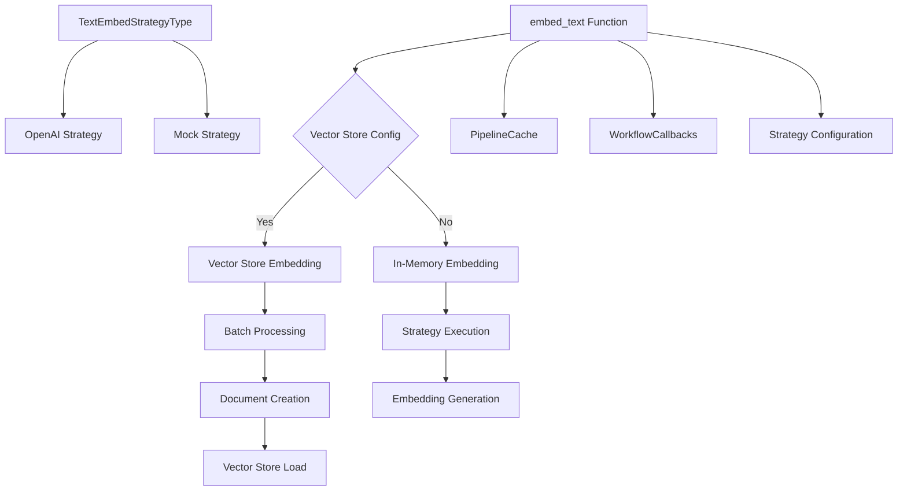
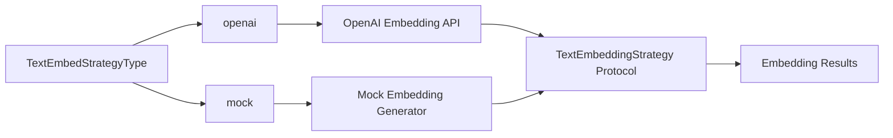
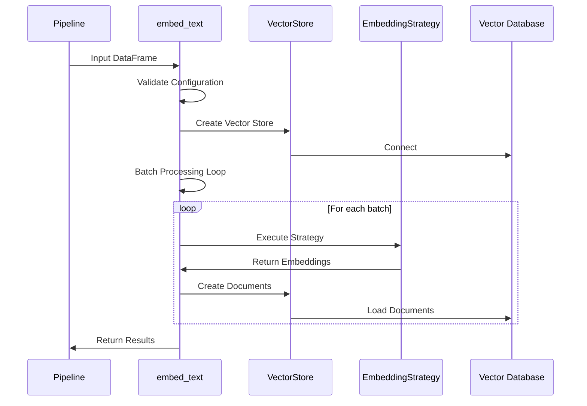
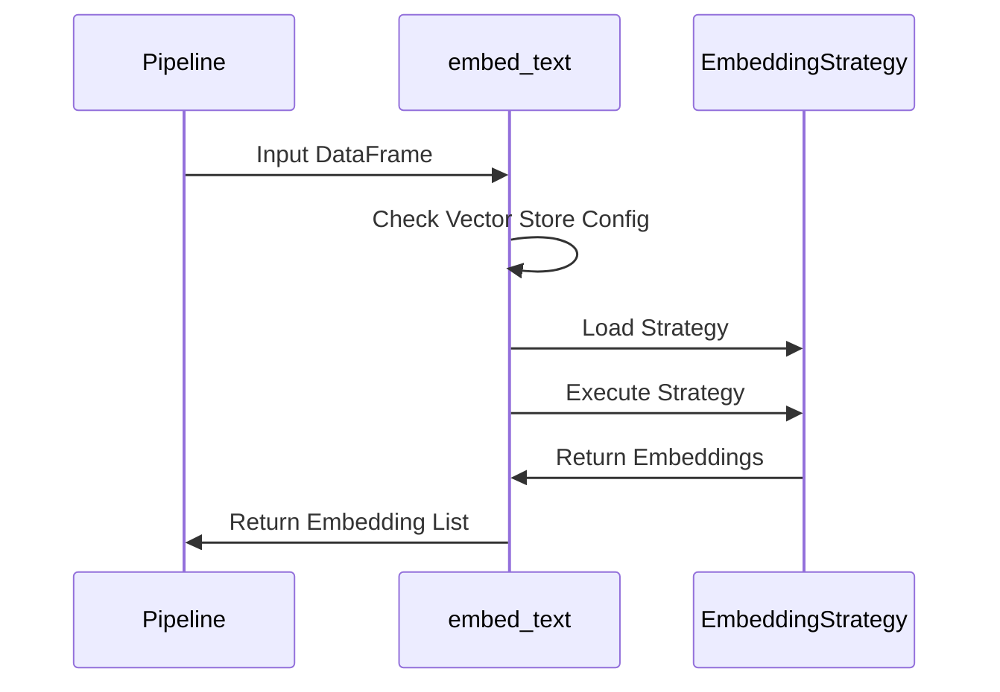
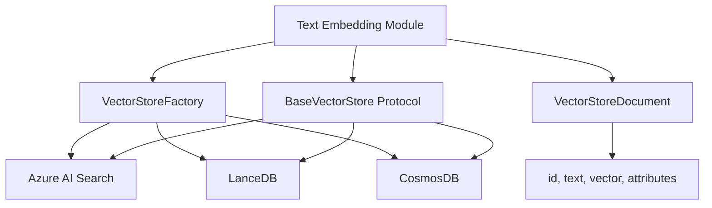

# Text Embedding Module

## Overview

The text embedding module is a core component of the GraphRAG system responsible for converting textual content into vector representations. This module provides the foundation for semantic search, similarity matching, and knowledge graph operations by transforming text into high-dimensional embeddings that can be efficiently stored and queried in vector databases.

## Purpose and Core Functionality

The text embedding module serves as the bridge between raw textual data and vector-based operations within the GraphRAG pipeline. It provides:

- **Text-to-Vector Conversion**: Transforms text content into numerical vector representations using various embedding strategies
- **Batch Processing**: Handles large-scale text embedding operations with configurable batch sizes
- **Vector Store Integration**: Seamlessly integrates with multiple vector database backends
- **Caching Support**: Leverages caching mechanisms to optimize repeated embedding operations
- **Flexible Strategy Pattern**: Supports multiple embedding providers and strategies

## Architecture

### Core Components



### Strategy Pattern Implementation



## Key Components

### TextEmbedStrategyType Enum

The `TextEmbedStrategyType` enumeration defines the available embedding strategies:

- **openai**: Uses OpenAI's embedding models for text vectorization
- **mock**: Provides mock embeddings for testing and development purposes

### embed_text Function

The main entry point for text embedding operations with the following signature:

```python
async def embed_text(
    input: pd.DataFrame,
    callbacks: WorkflowCallbacks,
    cache: PipelineCache,
    embed_column: str,
    strategy: dict,
    embedding_name: str,
    id_column: str = "id",
    title_column: str | None = None,
) -> list
```

**Parameters:**
- `input`: Pandas DataFrame containing text data to be embedded
- `callbacks`: Workflow callbacks for progress reporting and monitoring
- `cache`: Pipeline cache for optimization
- `embed_column`: Column name containing text to embed
- `strategy`: Configuration dictionary for embedding strategy
- `embedding_name`: Name identifier for the embedding operation
- `id_column`: Column containing document IDs (default: "id")
- `title_column`: Optional column for document titles

**Returns:**
- List of embedding vectors for in-memory operations
- Empty list for vector store operations (embeddings stored externally)

## Data Flow

### Vector Store Embedding Flow



### In-Memory Embedding Flow



## Integration Points

### Dependencies

The text embedding module integrates with several other GraphRAG components:

- **[Configuration Module](configuration.md)**: Provides embedding strategy configuration and vector store settings
- **[Vector Stores Module](vector_stores.md)**: Handles persistent storage of embeddings in various vector databases
- **[Caching Module](caching.md)**: Optimizes repeated embedding operations through intelligent caching
- **[Language Models Module](language_models.md)**: Provides the actual embedding models (OpenAI, etc.)
- **[Callbacks Module](callbacks.md)**: Enables progress tracking and monitoring of embedding operations

### Vector Store Integration



## Configuration

### Strategy Configuration

The embedding strategy is configured through a dictionary containing:

```python
strategy = {
    "type": "openai",  # or "mock"
    "vector_store": {
        "type": "lancedb",  # or "azure_ai_search", "cosmosdb"
        "batch_size": 500,
        "overwrite": True,
        "container_name": "default"
    }
}
```

### Batch Processing

The module supports configurable batch processing with a default batch size of 500 documents, optimized for Azure OpenAI service limits.

## Error Handling

The module implements comprehensive error handling for:

- **Missing Columns**: Validates required columns exist in input DataFrame
- **Invalid Strategy**: Ensures strategy type is supported
- **Vector Store Connection**: Handles connection failures to vector databases
- **Embedding Failures**: Manages partial failures during batch processing

## Performance Optimization

### Caching Strategy

The module leverages the PipelineCache to store and retrieve previously computed embeddings, significantly improving performance for repeated operations.

### Batch Processing

Large datasets are processed in configurable batches to:
- Optimize memory usage
- Respect API rate limits
- Enable progress tracking
- Facilitate error recovery

## Usage Examples

### Basic In-Memory Embedding

```python
# Configure embedding strategy
strategy = {
    "type": "openai",
    "model": "text-embedding-ada-002"
}

# Embed text column
embeddings = await embed_text(
    input=dataframe,
    callbacks=callbacks,
    cache=cache,
    embed_column="text",
    strategy=strategy,
    embedding_name="document_embeddings"
)
```

### Vector Store Embedding

```python
# Configure vector store strategy
strategy = {
    "type": "openai",
    "vector_store": {
        "type": "lancedb",
        "batch_size": 500,
        "overwrite": True,
        "uri": "./lancedb"
    }
}

# Embed and store in vector database
await embed_text(
    input=dataframe,
    callbacks=callbacks,
    cache=cache,
    embed_column="text",
    strategy=strategy,
    embedding_name="document_embeddings",
    id_column="id",
    title_column="title"
)
```

## Extension Points

### Custom Embedding Strategies

New embedding strategies can be added by:
1. Implementing the TextEmbeddingStrategy protocol
2. Adding the strategy to the TextEmbedStrategyType enum
3. Updating the load_strategy function

### Vector Store Support

Additional vector stores can be integrated through the VectorStoreFactory registration mechanism.

## Monitoring and Observability

The module provides comprehensive logging and callback integration for:

- **Progress Tracking**: Batch processing progress with detailed metrics
- **Performance Monitoring**: Embedding generation timing and throughput
- **Error Reporting**: Detailed error messages and recovery information
- **Resource Usage**: Memory and API usage tracking

## Security Considerations

- **API Key Management**: Secure handling of embedding service credentials
- **Data Privacy**: Ensuring sensitive text is properly handled during embedding
- **Access Control**: Vector store access permissions and authentication
- **Audit Trail**: Comprehensive logging for compliance and debugging

This module forms a critical component of the GraphRAG pipeline, enabling semantic understanding and retrieval capabilities that power the knowledge graph construction and querying operations.