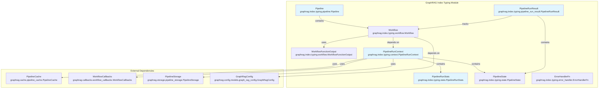
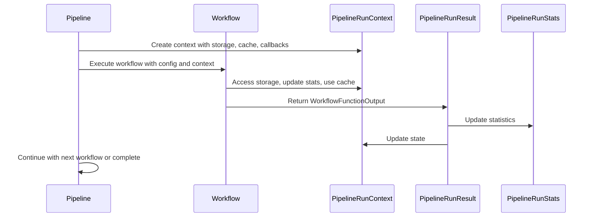
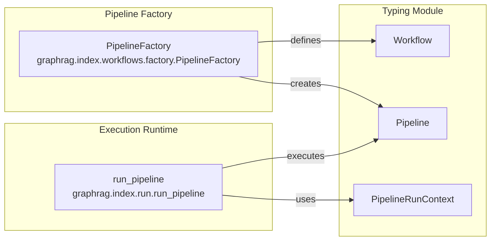
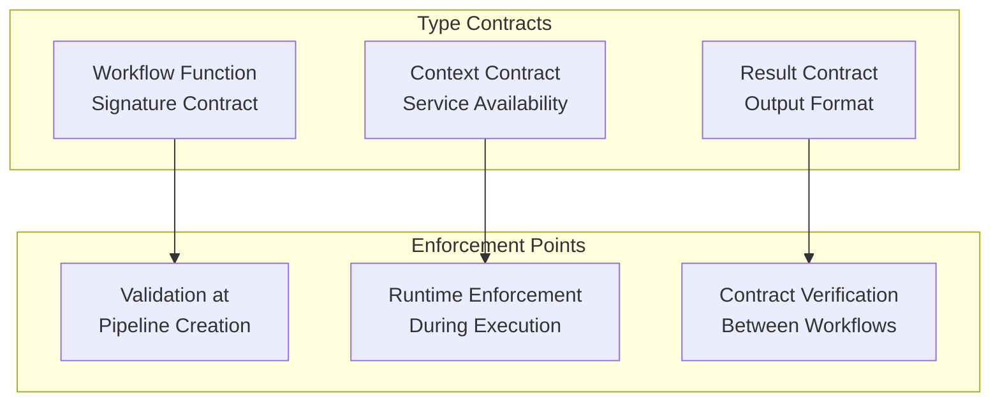

# GraphRAG Index Typing Module

## Introduction

The `typing` module in GraphRAG's indexing system provides the fundamental type definitions and data structures that orchestrate the entire pipeline execution process. This module serves as the backbone for type safety and structured data flow throughout the indexing pipeline, defining how workflows are organized, how context is maintained, and how results are captured and tracked.

The typing module is essential for ensuring reliable pipeline execution, providing clear contracts between different pipeline components, and enabling proper error handling and state management throughout the indexing process.

## Architecture Overview

The typing module consists of five core components that work together to provide a robust foundation for pipeline execution:



## Core Components

### 1. Pipeline Class

The `Pipeline` class serves as the primary orchestrator for the indexing process, managing a collection of workflows and providing methods to control their execution.

**Key Features:**
- **Workflow Management**: Encapsulates and manages a list of workflows
- **Execution Control**: Provides iteration capabilities over workflows
- **Dynamic Modification**: Supports runtime workflow removal by name
- **Name-based Access**: Enables workflow identification and selection

**Usage Pattern:**
```python
pipeline = Pipeline(workflows=[
    ("workflow1", workflow_function1),
    ("workflow2", workflow_function2),
    ("workflow3", workflow_function3)
])

# Iterate through workflows
for workflow_name, workflow_func in pipeline.run():
    # Execute workflow
    pass

# Remove specific workflow
pipeline.remove("workflow2")
```

### 2. Workflow and WorkflowFunctionOutput

The workflow system defines the executable units of the pipeline and their return structures.

**Workflow Type Definition:**
- **Tuple Structure**: `tuple[str, WorkflowFunction]` - pairs workflow name with executable function
- **Function Signature**: `Callable[[GraphRagConfig, PipelineRunContext], Awaitable[WorkflowFunctionOutput]]`
- **Async Support**: All workflow functions are asynchronous for non-blocking execution

**WorkflowFunctionOutput Features:**
- **Flexible Results**: `result: Any | None` - accommodates any type of workflow output
- **Execution Control**: `stop: bool` flag enables early termination to prevent unstable states
- **Logging Integration**: Results designed for downstream logging and monitoring

### 3. PipelineRunContext

The `PipelineRunContext` is the central data structure that maintains all contextual information during pipeline execution, serving as the single source of truth for the current pipeline state.

**Storage Management:**
- **Input Storage**: Handles source documents and initial data
- **Output Storage**: Manages long-term storage for pipeline results
- **Previous Storage**: Supports incremental updates by accessing previous run data

**Runtime Services:**
- **Caching**: Integrates with [caching module](caching.md) for LLM response optimization
- **Callbacks**: Provides hooks for [workflow monitoring](callbacks.md)
- **State Management**: Maintains arbitrary runtime state and pre-computed values
- **Statistics**: Tracks performance metrics and execution statistics

### 4. PipelineRunResult

Captures the outcome of individual workflow executions, providing comprehensive result tracking and error handling capabilities.

**Result Tracking:**
- **Workflow Identification**: Associates results with specific workflow names
- **Flexible Output**: `result: Any | None` accommodates diverse workflow outputs
- **State Preservation**: Maintains ongoing pipeline context state
- **Error Collection**: `errors: list[BaseException] | None` for comprehensive error tracking

### 5. PipelineRunStats

Comprehensive statistics tracking for pipeline performance monitoring and optimization.

**Performance Metrics:**
- **Total Runtime**: Overall pipeline execution time
- **Document Processing**: Tracks total and updated document counts
- **Input Performance**: Measures data loading efficiency
- **Workflow Profiling**: Detailed timing per workflow component

**Usage for Optimization:**
```python
stats = PipelineRunStats(
    total_runtime=125.5,
    num_documents=1000,
    update_documents=50,
    input_load_time=2.3,
    workflows={
        "extract_graph": {"runtime": 45.2, "memory_peak": 1024},
        "create_communities": {"runtime": 23.1, "memory_peak": 512}
    }
)
```

### 6. PipelineState

A flexible type alias for `dict[Any, Any]` that enables dynamic state management throughout pipeline execution.

**Use Cases:**
- **Runtime Variables**: Store temporary computation results
- **Feature Flags**: Enable experimental features dynamically
- **Cross-workflow Communication**: Share data between workflow stages
- **Configuration Overrides**: Modify behavior at runtime

### 7. ErrorHandlerFn

Standardized error handling signature for consistent error processing across the pipeline.

**Error Processing:**
- **Exception Handling**: Processes `BaseException | None` for flexible error types
- **Contextual Information**: Accepts optional message and metadata parameters
- **Consistent Interface**: Standardized signature across all error handling components

## Data Flow Architecture



## Integration with Pipeline Infrastructure

The typing module integrates seamlessly with the broader [pipeline infrastructure](pipeline_infrastructure.md):



## Dependencies and Relationships

### External Module Dependencies

The typing module relies on several key modules for its functionality:

**[Caching Module](caching.md):**
- `PipelineCache` for LLM response optimization
- Reduces redundant API calls and improves performance

**[Storage Module](storage.md):**
- `PipelineStorage` for data persistence
- Multiple storage backends (file, blob, memory, CosmosDB)

**[Callbacks Module](callbacks.md):**
- `WorkflowCallbacks` for execution monitoring
- Enables logging, progress tracking, and error reporting

**[Configuration Module](configuration.md):**
- `GraphRagConfig` for pipeline configuration
- Provides settings and parameters for workflow execution

### Type Safety and Contracts

The typing module establishes clear contracts between pipeline components:



## Error Handling and Resilience

The typing module provides multiple layers of error handling:

1. **Workflow Level**: Individual workflows can return errors in `PipelineRunResult`
2. **Pipeline Level**: Context maintains error state across workflow execution
3. **System Level**: `ErrorHandlerFn` provides standardized error processing
4. **Graceful Degradation**: `stop` flag in `WorkflowFunctionOutput` enables controlled termination

## Performance Considerations

**Memory Management:**
- `PipelineState` uses dictionary for efficient key-value access
- `PipelineRunStats` employs dataclasses for memory-efficient storage
- Context sharing minimizes data duplication across workflows

**Execution Efficiency:**
- Async workflow functions enable concurrent execution
- Generator-based pipeline iteration reduces memory footprint
- Caching integration prevents redundant computations

**Scalability Features:**
- Modular design supports distributed execution
- Storage abstraction enables horizontal scaling
- Statistics tracking supports performance optimization

## Best Practices

### Workflow Development
1. **Type Safety**: Always use proper type hints for workflow functions
2. **Error Handling**: Implement comprehensive error collection and reporting
3. **State Management**: Use `PipelineState` for cross-workflow communication
4. **Performance**: Leverage async patterns for I/O-bound operations

### Context Usage
1. **Storage Selection**: Choose appropriate storage based on data persistence needs
2. **Cache Utilization**: Implement caching strategies for expensive operations
3. **Callback Integration**: Use callbacks for monitoring and debugging
4. **State Cleanup**: Manage state lifecycle to prevent memory leaks

### Result Processing
1. **Result Documentation**: Document expected result types for each workflow
2. **Error Propagation**: Implement proper error handling and propagation
3. **State Updates**: Maintain consistent state across workflow execution
4. **Statistics Tracking**: Leverage stats for performance monitoring

## Extension Points

The typing module provides several extension mechanisms:

1. **Custom Workflows**: Implement `WorkflowFunction` interface for new operations
2. **Storage Backends**: Extend `PipelineStorage` for custom storage solutions
3. **Cache Implementations**: Create custom `PipelineCache` for specialized caching
4. **Callback Handlers**: Implement `WorkflowCallbacks` for custom monitoring

This modular design ensures the typing module can evolve with changing requirements while maintaining backward compatibility and type safety throughout the GraphRAG indexing pipeline.