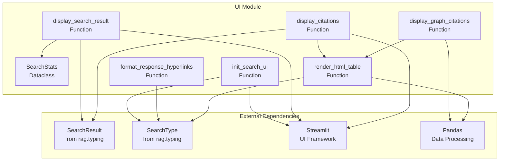
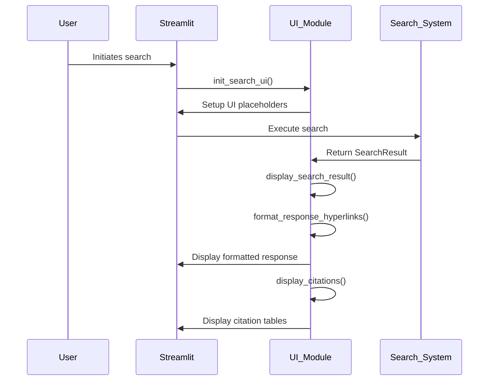
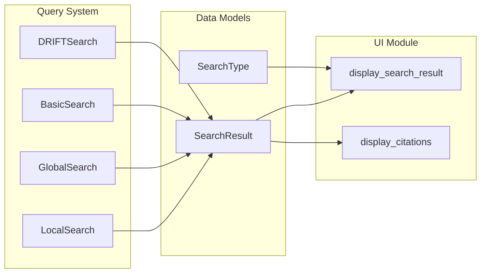

# UI Module Documentation

## Overview

The UI module provides the user interface components for the unified search application, handling the presentation layer of search results, citations, and interactive elements. Built on Streamlit, it offers a web-based interface for visualizing GraphRAG search operations and their results.

## Purpose and Core Functionality

The UI module serves as the presentation layer that:
- Displays search results with formatted responses and hyperlinks
- Renders citations and context data in structured tables
- Provides interactive UI components for different search types
- Handles the visualization of graph-based search results
- Manages session state for UI components

## Architecture

### Component Structure



### Data Flow



## Core Components

### SearchStats
A dataclass that tracks search performance metrics:
- `completion_time`: Time taken to complete the search
- `llm_calls`: Number of LLM calls made during search
- `prompt_tokens`: Total tokens used in prompts

### UI Initialization Functions

#### `init_search_ui()`
Initializes the search UI component with:
- Title and caption display
- Session state management for placeholders
- Container setup for different search types

#### `display_search_result()`
Renders search results with:
- Formatted response with hyperlinks
- Performance statistics display
- Session state updates

#### `display_citations()`
Shows citation data including:
- Source documents
- AI-generated reports
- Extracted entities and relationships
- Structured HTML tables

### Response Formatting

#### `format_response_hyperlinks()`
Converts citation references in responses to clickable hyperlinks:
- Processes multiple entity types (Entities, Sources, Documents, Relationships, Reports)
- Creates anchor links to corresponding citation tables
- Supports multiple citation formats

#### `render_html_table()`
Generates responsive HTML tables for citation display:
- Dynamic column generation
- Text truncation for long content
- Hover tooltips for full content
- Anchor IDs for hyperlink navigation

## Integration with Search System

The UI module integrates with the [query_system](query_system.md) through the SearchResult and SearchType types:



## Search Type Support

The UI supports four search types defined in [rag.typing](unified_search_app.md#rag-module):

| Search Type | UI Tag | Description |
|-------------|--------|-------------|
| Basic | basic | Simple keyword-based search |
| Local | local | Community-based local search |
| Global | global | Global graph-based search |
| DRIFT | drift | Drift-based search algorithm |

Each search type gets its own UI container and session state management.

## Citation Management

### Citation Types
The UI handles multiple citation categories:
- **Sources**: Relevant document chunks
- **Reports**: AI-generated community reports
- **Entities**: Extracted graph entities
- **Relationships**: Entity relationships

### Hyperlink System
Citations in responses are converted to clickable links:
```
Entities (1, 2, +more) → Entities (<a href="#local-entities-1">1</a>, <a href="#local-entities-2">2</a>, +more)
```

## Session State Management

The UI module uses Streamlit's session state to maintain:
- Response placeholders for each search type
- Context placeholders for citations
- Container references for updates

## Performance Considerations

### Text Truncation
- Short truncation: 12 words for table display
- Long truncation: 200 words for tooltips
- Automatic handling of JSON-formatted content

### Responsive Design
- Fixed table layout with word wrapping
- Scrollable containers for large datasets
- Responsive width management

## Usage Examples

### Basic Search Display
```python
# Initialize UI
init_search_ui(container, SearchType.Basic, "Basic Search", "Simple keyword search")

# Display results
display_search_result(container, search_result, search_stats)

# Show citations
display_citations(container, search_result)
```

### Graph Citations
```python
# Display entity and relationship tables
display_graph_citations(entities_df, relationships_df, "local")
```

## Dependencies

The UI module depends on:
- [Streamlit](https://streamlit.io/): Web application framework
- [Pandas](https://pandas.pydata.org/): Data manipulation and table rendering
- [rag.typing](unified_search_app.md#rag-module): Search result types
- Session state management from Streamlit

## Error Handling

The module includes defensive programming practices:
- Null checks for containers and results
- Safe DataFrame conversion
- Graceful handling of missing IDs
- JSON parsing with error fallback

## Future Enhancements

Potential improvements:
- Customizable table themes
- Advanced filtering options
- Export functionality for citations
- Real-time search progress indicators
- Mobile-responsive optimizations