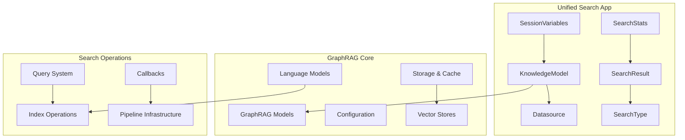
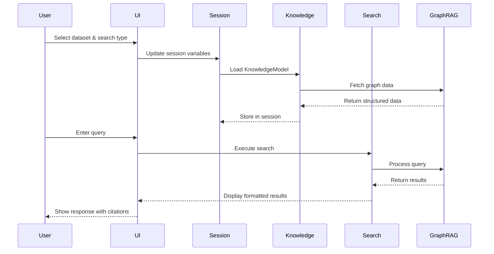

# Unified Search App Documentation

## Overview

The Unified Search App is a comprehensive search interface that leverages GraphRAG (Graph-based Retrieval-Augmented Generation) technology to provide multiple search strategies across knowledge graphs. Built on Streamlit, it offers an interactive web interface for querying graph-indexed data using various search methodologies including local, global, basic RAG, and DRIFT search algorithms.

## Purpose

The application serves as a unified interface for:
- Loading and managing graph-indexed knowledge data
- Executing multiple search strategies on knowledge graphs
- Visualizing search results with citations and context
- Managing session state and user interactions
- Providing real-time search statistics and performance metrics

## Architecture

## Core Components

### 1. Knowledge Management Layer

The knowledge management layer handles the loading and organization of graph-indexed data:

- **KnowledgeModel**: Central data structure containing entities, relationships, community reports, communities, text units, and covariates
- **Datasource**: Abstract interface for reading data from various storage backends
- **Data Loading Functions**: Cached functions for loading specific data types (entities, relationships, communities, etc.)

### 2. Search Interface Layer

Defines the search types and result structures:

- **SearchType**: Enumeration of available search strategies (Basic, Local, Global, Drift)
- **SearchResult**: Standardized result container with response text and context data
- **SearchStats**: Performance metrics including completion time, LLM calls, and token usage

### 3. Session Management Layer

Manages application state and user interactions:

- **SessionVariables**: Comprehensive session state management for datasets, search preferences, and UI state
- **Query Variables**: Specialized variables for tracking user queries and search parameters

### 4. User Interface Layer

Streamlit-based UI components for search interaction:

- **Search UI Components**: Initialization and display functions for different search types
- **Citation Display**: HTML rendering of search context and supporting evidence
- **Response Formatting**: Hyperlink generation and text formatting for enhanced readability

## Data Flow

## Integration with GraphRAG System

The Unified Search App integrates with the broader GraphRAG ecosystem through several key interfaces:

### Data Models Integration
- Utilizes GraphRAG's data models for entities, relationships, communities, and text units
- Leverages the [data_models](data_models.md) module's structured data representations

### Configuration Management
- Integrates with GraphRAG's configuration system for dataset and search parameters
- Uses [configuration](configuration.md) module for environment and model settings

### Search Operations
- Employs GraphRAG's search algorithms through the [query_system](query_system.md) module
- Supports local search, global search, basic RAG, and DRIFT search methodologies

### Storage and Caching
- Utilizes GraphRAG's storage abstractions via the [storage](storage.md) and [caching](caching.md) modules
- Supports multiple storage backends including file, blob, and database storage

## Sub-modules

The application is organized into several focused sub-modules:

### [Knowledge Loader](knowledge_loader.md)
Handles data loading and knowledge model management, including entity extraction, relationship mapping, and community analysis. The KnowledgeModel serves as the central data structure containing all graph-indexed information.

### [RAG Interface](rag.md)
Defines search types, result structures, and the interface between the UI and GraphRAG search algorithms. Provides standardized containers for search results and performance metrics.

### [Session Management](state.md)
Manages application state, user preferences, and session variables for maintaining context across interactions. Tracks user queries, dataset selections, and search preferences.

### [User Interface](ui.md)
Provides Streamlit-based UI components for search interaction, result display, and citation formatting. Includes search statistics tracking and interactive citation generation.

## Key Features

1. **Multi-Strategy Search**: Supports four distinct search approaches (Basic, Local, Global, DRIFT)
2. **Real-time Performance Metrics**: Tracks and displays search performance statistics
3. **Interactive Citations**: Provides clickable citations linking to source data
4. **Session Persistence**: Maintains user context and preferences across interactions
5. **Configurable Data Sources**: Supports multiple storage backends and data formats
6. **Cached Data Loading**: Optimizes performance through intelligent data caching

## Usage Patterns

The application follows a typical pattern:
1. Dataset selection and configuration
2. Knowledge model loading and caching
3. Search strategy selection and parameter configuration
4. Query execution with real-time feedback
5. Result presentation with contextual citations
6. Performance analysis and optimization

This architecture provides a flexible, extensible foundation for graph-based search applications while maintaining clean separation of concerns and supporting multiple deployment scenarios.