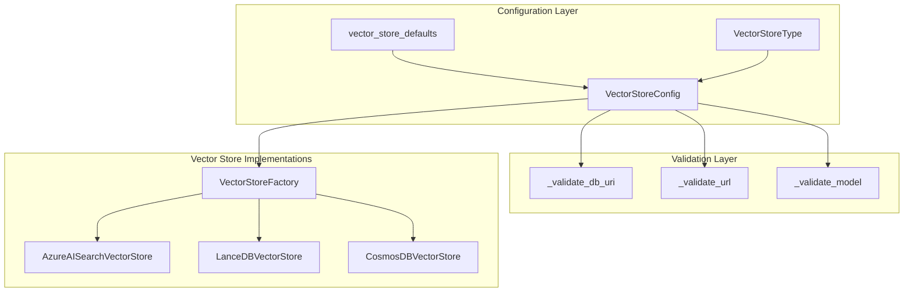
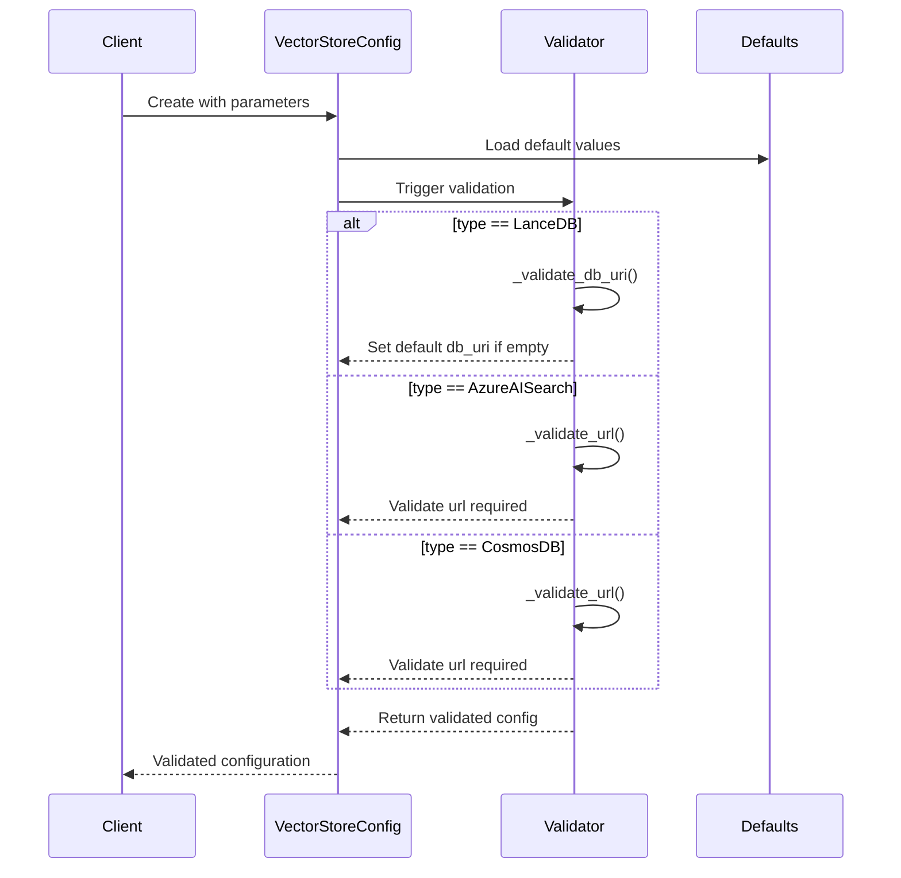
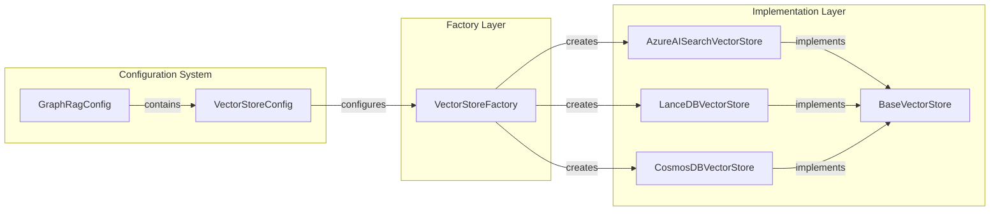

# Vector Store Configuration Module

## Introduction

The `vector_store_config` module provides configuration management for vector store implementations in the GraphRAG system. It defines the `VectorStoreConfig` class, which serves as a centralized configuration model for different vector store backends including Azure AI Search, LanceDB, and CosmosDB. This module ensures type-safe configuration validation and provides sensible defaults for vector store operations.

## Architecture Overview

The vector store configuration module is part of the broader configuration system and integrates with various vector store implementations through a factory pattern. The module's architecture follows a clean separation of concerns, where configuration logic is isolated from implementation details.



## Core Components

### VectorStoreConfig

The `VectorStoreConfig` class is a Pydantic model that encapsulates all configuration parameters required for different vector store backends. It provides:

- **Type-safe configuration**: Uses Pydantic's validation system
- **Backend-specific validation**: Ensures required fields are present for each vector store type
- **Default values**: Provides sensible defaults from `vector_store_defaults`
- **Cross-field validation**: Validates dependencies between configuration fields

#### Configuration Fields

| Field | Type | Description | Default |
|-------|------|-------------|---------|
| `type` | `str` | The vector store type to use | From `vector_store_defaults` |
| `db_uri` | `str \| None` | Database URI (LanceDB only) | `None` |
| `url` | `str \| None` | Database URL (Azure AI Search/CosmosDB) | From `vector_store_defaults` |
| `api_key` | `str \| None` | API key (Azure AI Search) | From `vector_store_defaults` |
| `audience` | `str \| None` | Database audience (Azure AI Search) | From `vector_store_defaults` |
| `container_name` | `str` | Container name | From `vector_store_defaults` |
| `database_name` | `str \| None` | Database name (CosmosDB) | From `vector_store_defaults` |
| `overwrite` | `bool` | Overwrite existing data | From `vector_store_defaults` |

## Data Flow and Validation

The configuration validation follows a systematic approach to ensure data integrity:



## Integration with Vector Store System

The `VectorStoreConfig` integrates with the broader vector store ecosystem through the factory pattern:



## Validation Rules

The module implements specific validation rules for each vector store type:

### LanceDB Validation
- **db_uri**: Optional, defaults to `vector_store_defaults.db_uri` if not provided
- **url**: Must be empty (not used for LanceDB)

### Azure AI Search Validation
- **url**: Required field
- **api_key**: Optional but recommended
- **audience**: Optional
- **db_uri**: Must be empty (not used for Azure AI Search)

### CosmosDB Validation
- **url**: Required field
- **database_name**: Optional with defaults
- **db_uri**: Must be empty (not used for CosmosDB)

## Dependencies

The vector store configuration module depends on several other components:

- **[graphrag.config.defaults](defaults.md)**: Provides default values for configuration parameters
- **[graphrag.config.enums](enums.md)**: Defines the `VectorStoreType` enumeration
- **[graphrag.vector_stores.factory](vector_stores.md)**: Uses the configuration to create appropriate vector store instances

## Usage Patterns

### Basic Configuration
```python
from graphrag.config.models.vector_store_config import VectorStoreConfig

# Create with defaults
config = VectorStoreConfig()

# Create with specific type
config = VectorStoreConfig(type="lancedb")
```

### Validation Examples
```python
# This will validate successfully for LanceDB
config = VectorStoreConfig(type="lancedb")

# This will raise validation error for Azure AI Search without URL
config = VectorStoreConfig(type="azure_ai_search")
# Raises: vector_store.url is required when vector_store.type == azure_ai_search
```

## Error Handling

The module provides clear error messages to guide users in correct configuration:

- **Missing required fields**: Indicates which fields are required for specific vector store types
- **Invalid field combinations**: Warns when fields are used incorrectly
- **Configuration guidance**: Suggests running `graphrag init` to select correct vector store type

## Extension Points

The module is designed for extensibility:

- **New vector store types**: Can be added by extending the `VectorStoreType` enum
- **Additional validation**: New validation methods can be added to the model validator
- **Custom defaults**: Default values can be modified through the defaults system

## Related Documentation

- [Vector Stores Module](vector_stores.md) - For implementation details of vector store backends
- [Configuration System](configuration.md) - For overall configuration architecture
- [GraphRag Configuration](graph_rag_config.md) - For main configuration model that includes vector store config