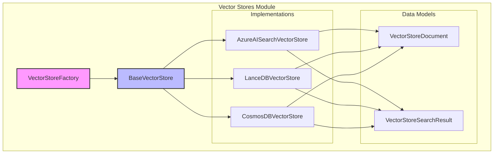
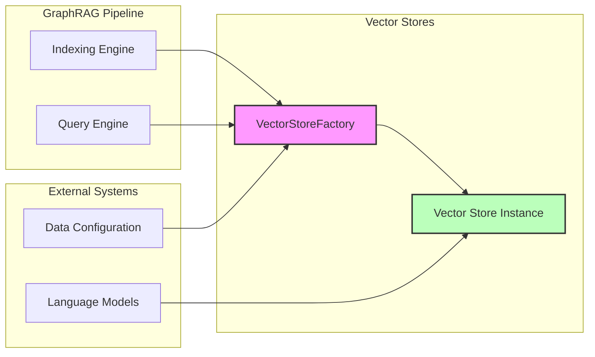

# Vector Stores Module

## Overview

The `vector_stores` module provides a unified interface for managing vector storage and similarity search operations across different vector database implementations. It serves as the core infrastructure for storing and retrieving vector embeddings in the GraphRAG system, enabling efficient similarity-based document retrieval.

## Purpose

This module abstracts the complexity of different vector database backends by providing:
- A common interface for vector storage operations
- Factory pattern for creating vector store instances
- Support for multiple vector database implementations
- Standardized document and search result formats
- Both vector-based and text-based similarity search capabilities

## Architecture



## Core Components

### VectorStoreFactory
The factory class responsible for creating vector store instances based on configuration. It supports:
- Registration of custom vector store implementations
- Built-in support for Azure AI Search, LanceDB, and CosmosDB
- Runtime creation of vector store instances

See [factory documentation](factory.md) for detailed implementation details.

### BaseVectorStore
Abstract base class defining the common interface for all vector store implementations. It specifies:
- Connection management
- Document loading and storage
- Similarity search operations (vector and text-based)
- Document filtering and retrieval

See [base documentation](base.md) for detailed interface specifications.

### Data Models
- **VectorStoreDocument**: Represents a document with vector embedding and metadata
- **VectorStoreSearchResult**: Contains search results with similarity scores

Detailed data model specifications are available in the [base documentation](base.md).

## Vector Store Implementations

### Azure AI Search
Enterprise-grade vector search using Azure's managed search service. Features:
- HNSW (Hierarchical Navigable Small World) algorithm for efficient vector search
- Integration with Azure identity and security
- Support for hybrid search scenarios
- Configurable vector search profiles

See [Azure AI Search documentation](azure_ai_search.md) for implementation details and configuration options.

### LanceDB
Open-source vector database optimized for AI workloads. Features:
- Persistent storage with ACID transactions
- PyArrow-based data format for efficient operations
- Local and cloud deployment options
- Built-in filtering capabilities

See [LanceDB documentation](lancedb.md) for detailed usage patterns and performance characteristics.

### CosmosDB
Microsoft's globally distributed database service with vector search capabilities. Features:
- Global distribution and multi-region replication
- Automatic scaling and performance optimization
- Vector distance calculations with DiskANN indexing
- Fallback to local similarity calculations for development environments

See [CosmosDB documentation](cosmosdb.md) for connection management and deployment considerations.

## Integration with GraphRAG System



The vector stores module integrates with:
- **Indexing Engine**: Stores document embeddings during graph construction
- **Query Engine**: Retrieves similar documents for search operations
- **Language Models**: Provides text embedding capabilities for search
- **Configuration System**: Manages vector store type and connection settings

## Usage Patterns

### Factory Pattern
```python
# Create vector store instance
vector_store = VectorStoreFactory.create_vector_store(
    vector_store_type="lancedb",
    kwargs={"db_uri": "./data/lancedb"}
)
```

### Document Operations
```python
# Load documents with embeddings
vector_store.load_documents(documents, overwrite=True)

# Search by vector
results = vector_store.similarity_search_by_vector(query_embedding, k=10)

# Search by text
results = vector_store.similarity_search_by_text(query_text, text_embedder, k=10)
```

## Configuration

Vector stores are configured through the [configuration module](configuration.md) using `VectorStoreConfig` which specifies:
- Vector store type (LanceDB, Azure AI Search, CosmosDB)
- Connection parameters and credentials
- Collection/database names
- Vector dimensions and indexing settings

## Dependencies

- **Data Models**: Uses [data_models](data_models.md) for document and entity representations
- **Language Models**: Integrates with [language_models](language_models.md) for text embedding
- **Configuration**: Managed through [configuration](configuration.md) module
- **Storage**: May use underlying [storage](storage.md) for persistence

## Performance Considerations

- **Vector Dimensionality**: Default 1536 dimensions, configurable per implementation
- **Indexing Strategy**: HNSW for Azure AI Search, DiskANN for CosmosDB, native for LanceDB
- **Batch Operations**: Support for bulk document loading and search
- **Filtering**: ID-based filtering with pre-filtering capabilities
- **Distance Metrics**: Cosine similarity as default metric

## Error Handling

- Connection failures with retry logic
- Graceful fallbacks for unsupported operations (e.g., CosmosDB emulator)
- Validation of required parameters and configurations
- Proper cleanup of resources on disconnection