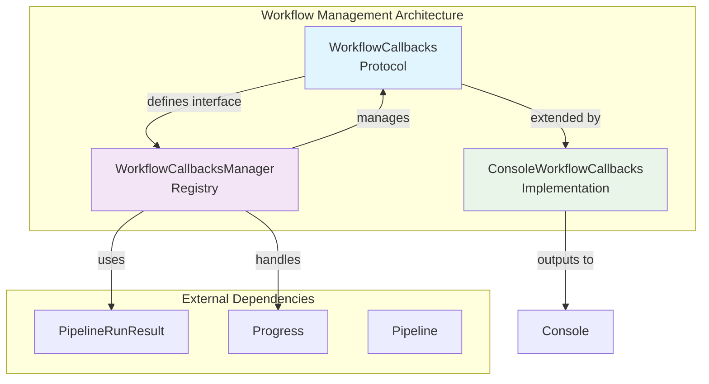
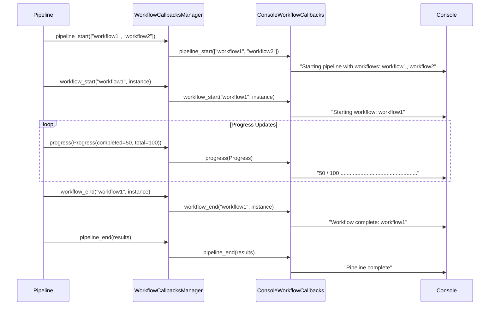
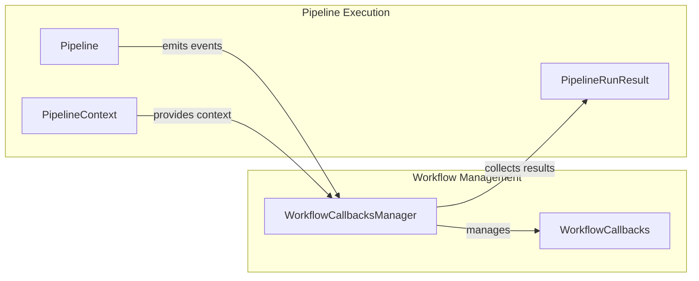

# Workflow Management Module

## Introduction

The workflow_management module provides a comprehensive callback system for monitoring and managing the execution of GraphRAG's indexing pipeline workflows. This module enables real-time tracking of pipeline progress, workflow lifecycle events, and execution results through a flexible, extensible callback architecture.

## Architecture Overview

The workflow management system is built around three core components that work together to provide comprehensive workflow monitoring capabilities:



## Core Components

### WorkflowCallbacks Protocol

The `WorkflowCallbacks` protocol defines the interface for all workflow monitoring callbacks. It establishes a contract for implementing custom monitoring behavior at key points in the pipeline execution lifecycle.

**Key Features:**
- Protocol-based design for flexible implementation
- No-op default implementation for selective override
- Support for pipeline-level and workflow-level events
- Progress tracking capabilities

**Interface Methods:**
- `pipeline_start(names: list[str])`: Signals pipeline initialization
- `pipeline_end(results: list[PipelineRunResult])`: Signals pipeline completion
- `workflow_start(name: str, instance: object)`: Individual workflow start
- `workflow_end(name: str, instance: object)`: Individual workflow completion
- `progress(progress: Progress)`: Progress updates during execution

### WorkflowCallbacksManager

The `WorkflowCallbacksManager` implements a registry pattern for managing multiple callback implementations. It acts as a central coordinator that broadcasts events to all registered callbacks.

**Key Features:**
- Registry pattern for multiple callback management
- Thread-safe callback invocation
- Graceful handling of callback failures
- Support for dynamic callback registration

**Implementation Details:**
- Maintains internal list of callback instances
- Iterates through all registered callbacks for each event
- Defensive programming with hasattr checks
- No-op behavior when no callbacks are registered

### ConsoleWorkflowCallbacks

The `ConsoleWorkflowCallbacks` provides a concrete implementation that outputs workflow events to the console, offering immediate visibility into pipeline execution.

**Key Features:**
- Real-time console output for workflow events
- Progress bar visualization
- Verbose mode for detailed instance information
- Clean, formatted output for readability

**Output Format:**
- Pipeline start/end notifications
- Workflow start/end messages
- Dynamic progress bars with percentage completion
- Optional verbose instance details

## Data Flow Architecture



## Integration with Pipeline Infrastructure

The workflow management system integrates seamlessly with the [pipeline_infrastructure](pipeline_infrastructure.md) module:



## Usage Patterns

### Basic Console Monitoring
```python
from graphrag.callbacks.console_workflow_callbacks import ConsoleWorkflowCallbacks
from graphrag.callbacks.workflow_callbacks_manager import WorkflowCallbacksManager

# Create callback manager
manager = WorkflowCallbacksManager()

# Register console callbacks
console_callbacks = ConsoleWorkflowCallbacks(verbose=True)
manager.register(console_callbacks)

# Use with pipeline (pipeline integration details in pipeline_infrastructure.md)
```

### Custom Callback Implementation
```python
from graphrag.callbacks.workflow_callbacks import WorkflowCallbacks
from graphrag.index.typing.pipeline_run_result import PipelineRunResult

class CustomWorkflowCallbacks(WorkflowCallbacks):
    def pipeline_start(self, names: list[str]) -> None:
        # Custom pipeline start logic
        log_to_database(f"Pipeline started: {names}")
    
    def progress(self, progress: Progress) -> None:
        # Custom progress tracking
        update_dashboard(progress.completed_items, progress.total_items)
```

## Relationship to Other Modules

### Configuration Module
The workflow management system can be configured through the [configuration](configuration.md) module, allowing users to enable/disable specific callback types and configure verbosity levels.

### Storage Module
Workflow execution logs and results can be persisted using the [storage](storage.md) module, enabling historical analysis and debugging capabilities.

### Language Models Module
Progress callbacks may be used to provide feedback during long-running language model operations in the [language_models](language_models.md) module.

## Error Handling and Resilience

The workflow management system implements several resilience patterns:

1. **Defensive Callback Invocation**: Each callback method includes hasattr checks to prevent errors from unimplemented methods
2. **Isolated Callback Failures**: Individual callback failures don't affect other registered callbacks
3. **Graceful Degradation**: The system continues operation even if some callbacks fail

## Performance Considerations

- **Minimal Overhead**: Protocol-based design ensures minimal performance impact
- **Efficient Broadcasting**: Manager uses simple iteration for callback distribution
- **Progress Throttling**: Progress updates can be throttled to prevent console spam
- **Memory Management**: No persistent state maintained between workflow executions

## Extension Points

The workflow management system provides several extension opportunities:

1. **Custom Callback Implementations**: Implement WorkflowCallbacks protocol for specialized monitoring
2. **Composite Callbacks**: Create callbacks that combine multiple monitoring strategies
3. **Async Callbacks**: Extend the pattern for asynchronous callback execution
4. **Metrics Collection**: Integrate with metrics systems for performance monitoring

## Best Practices

1. **Keep Callbacks Lightweight**: Avoid heavy processing in callback methods
2. **Handle Exceptions**: Implement proper exception handling in custom callbacks
3. **Use Appropriate Verbosity**: Leverage verbose flags for detailed debugging
4. **Register Early**: Register callbacks before pipeline execution begins
5. **Clean Up Resources**: Properly manage resources in custom callback implementations

## Monitoring and Observability

The workflow management system serves as the foundation for comprehensive pipeline observability:

- **Execution Tracking**: Monitor pipeline and workflow start/end times
- **Progress Visualization**: Real-time progress tracking for long-running operations
- **Result Collection**: Capture and analyze pipeline execution results
- **Performance Metrics**: Track execution duration and resource usage

This system enables operators to maintain visibility into GraphRAG's complex indexing workflows, facilitating debugging, performance optimization, and operational monitoring.