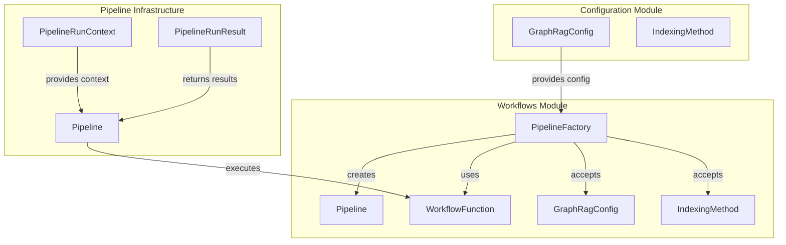
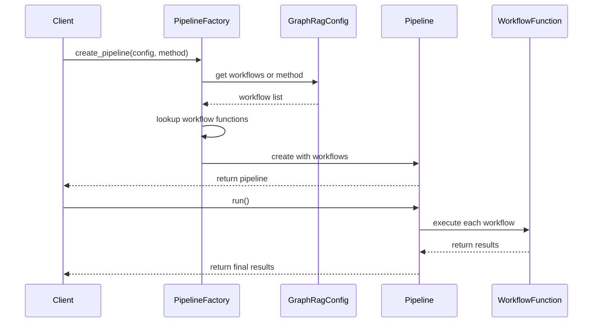
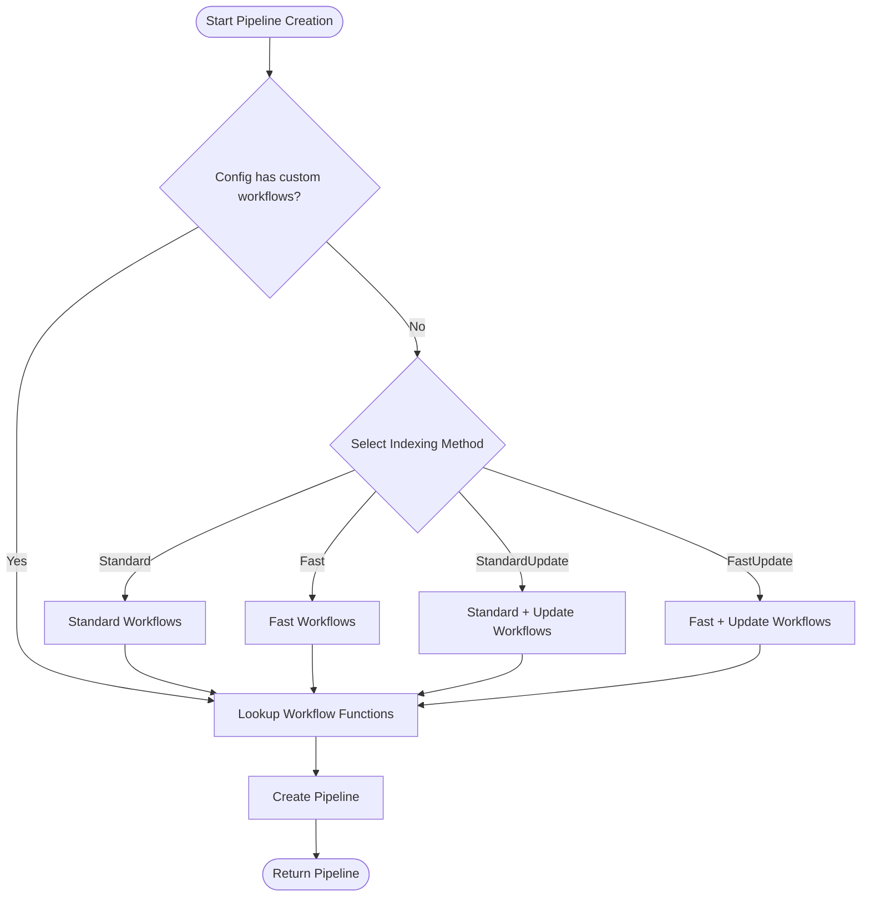

# Workflows Module Documentation

## Introduction

The workflows module serves as the central orchestration layer for GraphRAG's indexing pipeline. It provides a factory-based system for constructing and managing complex data processing workflows that transform raw documents into a structured knowledge graph. The module implements a flexible pipeline architecture that supports multiple indexing strategies and enables incremental updates to existing knowledge graphs.

## Core Architecture

### PipelineFactory

The `PipelineFactory` class is the cornerstone of the workflows module, implementing a registry pattern for managing workflow functions and pipeline configurations. It provides a centralized mechanism for creating different types of indexing pipelines based on configuration requirements.

### Key Design Patterns

1. **Factory Pattern**: Centralizes pipeline creation logic
2. **Registry Pattern**: Manages workflow function registration
3. **Strategy Pattern**: Supports multiple indexing methods (Standard, Fast, Update variants)
4. **Template Method**: Defines common pipeline structure with customizable workflows

## Component Relationships



## Data Flow Architecture



## Workflow Registration System

### Default Workflow Chains

The module pre-registers four distinct indexing strategies:

#### 1. Standard Indexing
```python
_standard_workflows = [
    "create_base_text_units",
    "create_final_documents", 
    "extract_graph",
    "finalize_graph",
    "extract_covariates",
    "create_communities",
    "create_final_text_units",
    "create_community_reports",
    "generate_text_embeddings",
]
```

#### 2. Fast Indexing
```python
_fast_workflows = [
    "create_base_text_units",
    "create_final_documents",
    "extract_graph_nlp",  # NLP-based extraction
    "prune_graph",
    "finalize_graph",
    "create_communities", 
    "create_final_text_units",
    "create_community_reports_text",
    "generate_text_embeddings",
]
```

#### 3. Standard Update
```python
_update_workflows = [
    "update_final_documents",
    "update_entities_relationships",
    "update_text_units",
    "update_covariates",
    "update_communities",
    "update_community_reports",
    "update_text_embeddings",
    "update_clean_state",
]
```

#### 4. Fast Update
Combines fast workflows with update workflows for incremental processing.

## Process Flow Diagram



## Integration Points

### Configuration Integration
The factory integrates with the [configuration module](configuration.md) through:
- `GraphRagConfig`: Provides pipeline configuration and custom workflow overrides
- `IndexingMethod`: Defines available indexing strategies

### Pipeline Infrastructure Integration
Works with [pipeline infrastructure](pipeline_infrastructure.md) components:
- `Pipeline`: Executes the workflow sequence
- `PipelineRunContext`: Provides execution context
- `PipelineRunResult`: Returns execution results

### Workflow Dependencies
Individual workflows depend on various system components:
- [Data Models](data_models.md): Entity, Relationship, Community, Document
- [Index Operations](index_operations.md): Graph extraction, text embedding, community analysis
- [Storage](storage.md): Data persistence between workflows
- [Language Models](language_models.md): AI-powered processing

## Usage Patterns

### Basic Pipeline Creation
```python
# Create a standard indexing pipeline
config = GraphRagConfig()
pipeline = PipelineFactory.create_pipeline(config, IndexingMethod.Standard)
```

### Custom Workflow Registration
```python
# Register custom workflow functions
PipelineFactory.register("my_custom_workflow", my_workflow_function)
PipelineFactory.register_pipeline("custom_method", ["workflow1", "workflow2"])
```

### Configuration-Driven Pipelines
```python
# Use custom workflows from configuration
config = GraphRagConfig(workflows=["custom1", "custom2"])
pipeline = PipelineFactory.create_pipeline(config)
```

## Error Handling and Validation

The factory implements several validation mechanisms:

1. **Workflow Existence**: Validates that all referenced workflows are registered
2. **Configuration Validation**: Ensures pipeline configuration is valid
3. **Method Validation**: Verifies indexing method is supported

## Performance Considerations

### Workflow Optimization
- **Standard Method**: Full AI-powered processing, highest quality
- **Fast Method**: NLP-based extraction for faster processing
- **Update Methods**: Incremental processing for existing graphs

### Memory Management
- Workflows are executed sequentially to manage memory usage
- Pipeline configuration allows for workflow customization
- Storage integration enables data persistence between workflows

## Extensibility

The factory pattern enables easy extension through:

1. **Custom Workflow Registration**: Add new processing steps
2. **Pipeline Method Registration**: Define new indexing strategies
3. **Configuration Integration**: Override workflows via configuration

## Monitoring and Observability

Integration with [callbacks module](callbacks.md) provides:
- Workflow execution tracking
- Performance monitoring
- Error reporting and handling

## Security Considerations

- Workflow functions are validated before execution
- Configuration-based workflow overrides require proper validation
- Factory methods ensure type safety in pipeline creation

## Future Enhancements

Potential areas for expansion:
- Dynamic workflow discovery
- Conditional workflow execution
- Parallel workflow processing
- Workflow dependency management
- Advanced error recovery mechanisms