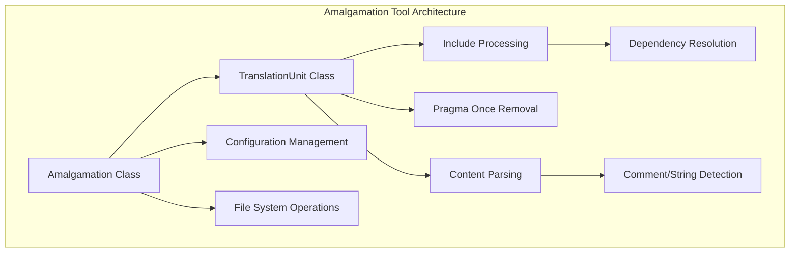
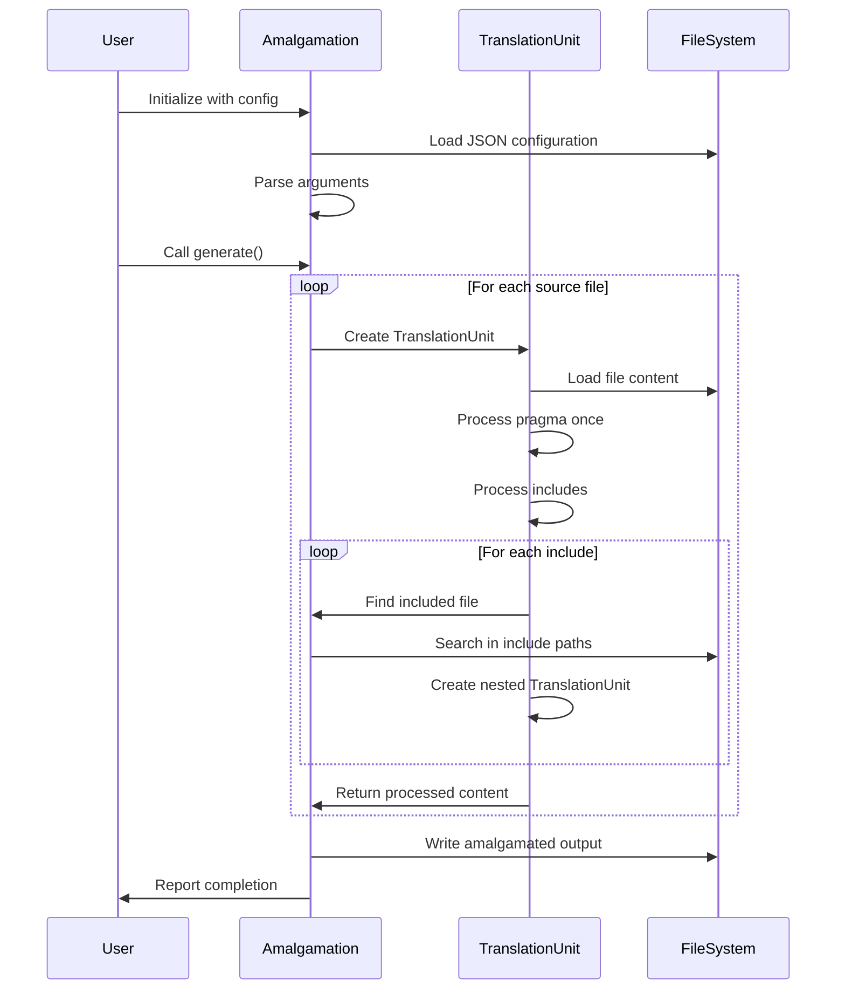
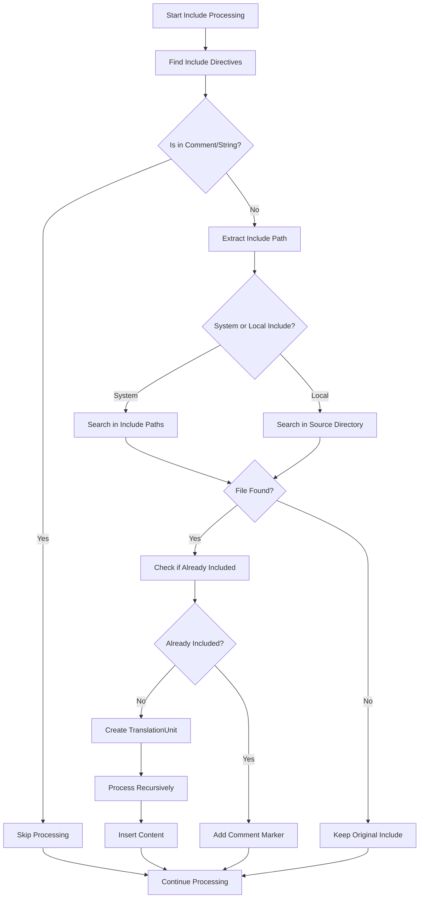

# Amalgamation Tool Documentation

## Introduction

The amalgamation-tool is a Python utility designed to combine multiple C/C++ source and header files into a single amalgamated file. This tool is particularly useful for creating single-header libraries or reducing the number of files in a project for easier distribution. The tool processes include directives, removes duplicate pragma once statements, and intelligently handles file dependencies to create a clean, unified output.

## Core Functionality

The amalgamation tool provides a sophisticated approach to code amalgamation by:

- Processing C/C++ include directives while preserving comments and string literals
- Removing redundant `#pragma once` directives from included files
- Maintaining proper file ordering based on dependency analysis
- Supporting both system includes (`<header>`) and local includes (`"header"`)
- Providing configurable include paths for flexible file resolution

## Architecture

### Component Overview

The amalgamation tool consists of two primary components that work together to process and combine source files:



### Core Components

#### Amalgamation Class

The `Amalgamation` class serves as the main orchestrator for the amalgamation process. It manages the overall workflow, configuration, and file operations.

**Key Responsibilities:**
- Configuration loading and validation from JSON files
- File path resolution and include path management
- Coordination of translation unit processing
- Final amalgamation file generation
- Progress reporting and verbose output

**Key Methods:**
- `__init__()`: Initializes the amalgamation with configuration and arguments
- `generate()`: Orchestrates the complete amalgamation process
- `actual_path()`: Resolves relative paths to absolute paths
- `find_included_file()`: Searches for included files in specified directories

#### TranslationUnit Class

The `TranslationUnit` class represents individual source files and handles the detailed processing of each file's content.

**Key Responsibilities:**
- File content loading and parsing
- Include directive processing and expansion
- Pragma once directive removal
- Comment and string literal preservation
- Recursive processing of included files

**Key Methods:**
- `__init__()`: Initializes the translation unit with file path and amalgamation context
- `_process()`: Coordinates all processing steps
- `_process_includes()`: Handles include directive expansion
- `_process_pragma_once()`: Removes pragma once directives
- `_find_skippable_contexts()`: Identifies comments and strings to preserve

## Data Flow

### Amalgamation Process Flow



### Include Processing Flow



## Configuration

The amalgamation tool uses a JSON configuration file to define its behavior. The configuration supports the following parameters:

```json
{
    "target": "output/amalgamated.h",
    "sources": [
        "src/main.h",
        "src/utils.h",
        "src/core.c"
    ],
    "include_paths": [
        "include/",
        "third_party/"
    ]
}
```

**Configuration Options:**
- `target`: Output file path for the amalgamated result
- `sources`: Ordered list of source files to process
- `include_paths`: Directories to search for included files

## Command Line Interface

The tool provides a command-line interface with the following options:

```bash
python amalgamate.py [-v] -c config.json -s source_path [-p prologue.(c|h)]
```

**Arguments:**
- `-v, --verbose`: Enable verbose output (yes/no)
- `-c, --config`: Path to JSON configuration file (required)
- `-s, --source`: Source code directory path (required)
- `-p, --prologue`: Optional prologue file to prepend to output

## File Processing Logic

### Include Directive Handling

The tool processes include directives with sophisticated context awareness:

1. **Pattern Matching**: Uses regex to identify `#include` directives
2. **Context Validation**: Checks if include is within comments or strings
3. **File Resolution**: Searches in appropriate directories based on include type
4. **Duplicate Prevention**: Tracks included files to prevent infinite recursion
5. **Content Integration**: Replaces includes with actual file content

### Comment and String Preservation

The tool preserves the integrity of code by:

- Identifying C-style comments (`/* */`)
- Detecting C++-style comments (`//`)
- Recognizing string literals (`" "`)
- Skipping include processing within these contexts

### Pragma Once Processing

For non-root files, the tool removes `#pragma once` directives to prevent conflicts in the amalgamated output while maintaining the original file structure.

## Dependencies

The amalgamation tool has minimal external dependencies, relying primarily on Python standard library modules:

- `argparse`: Command-line argument parsing
- `datetime`: Timestamp generation for prologues
- `json`: Configuration file processing
- `os`: File system operations and path handling
- `re`: Regular expression processing for code parsing

## Error Handling

The tool implements several error handling mechanisms:

- **File Not Found**: Raises `IOError` when source files are missing
- **Invalid Configuration**: Handles JSON parsing errors gracefully
- **Missing Includes**: Preserves original include when file cannot be found
- **Circular Dependencies**: Prevents infinite recursion through file tracking

## Use Cases

The amalgamation tool is particularly valuable for:

1. **Single-Header Libraries**: Creating distributable header-only libraries
2. **Build Simplification**: Reducing complex multi-file projects to single files
3. **Code Distribution**: Simplifying deployment by minimizing file count
4. **Embedded Systems**: Creating monolithic files for resource-constrained environments
5. **Library Distribution**: Providing easy-to-integrate single-file versions

## Best Practices

### Configuration Guidelines

- Order source files according to dependency requirements
- Include all necessary directories in include_paths
- Use relative paths for better portability
- Test the amalgamated output thoroughly

### File Organization

- Keep include statements clean and consistent
- Use pragma once in header files for standalone usage
- Organize code with clear separation of concerns
- Document dependencies between files

### Performance Considerations

- The tool processes files recursively, so deep include hierarchies may impact performance
- Large projects may benefit from selective amalgamation
- Consider memory usage when processing very large codebases

## Integration with Build Systems

The amalgamation tool can be integrated into various build systems:

- **Make**: Add as a preprocessing step before compilation
- **CMake**: Use custom commands to generate amalgamated files
- **Shell Scripts**: Automate amalgamation as part of release process
- **CI/CD Pipelines**: Generate amalgamated versions for distribution

## Limitations

While powerful, the tool has some limitations:

- Does not handle complex preprocessor macros in includes
- Limited to trivial include directives
- Cannot process conditional includes based on macros
- Does not expand preprocessor definitions
- Requires manual configuration of source order

## Future Enhancements

Potential improvements could include:

- Support for macro expansion in include directives
- Automatic dependency analysis and ordering
- Integration with package managers
- Support for other programming languages
- Parallel processing for large codebases
- Incremental amalgamation for faster rebuilds