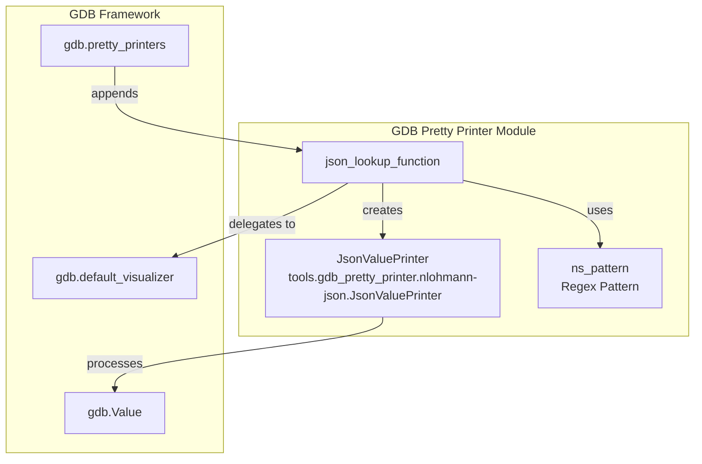
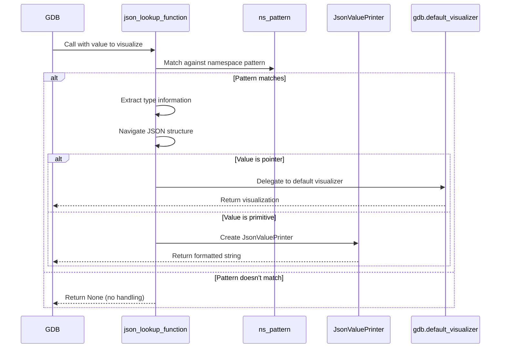
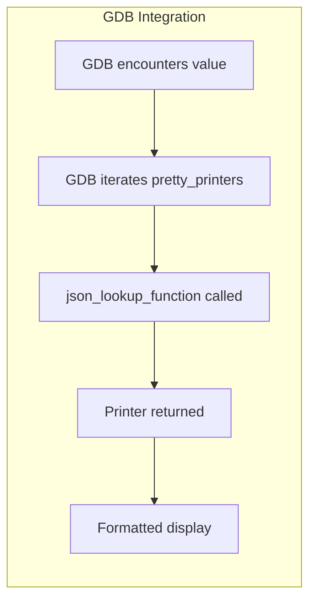
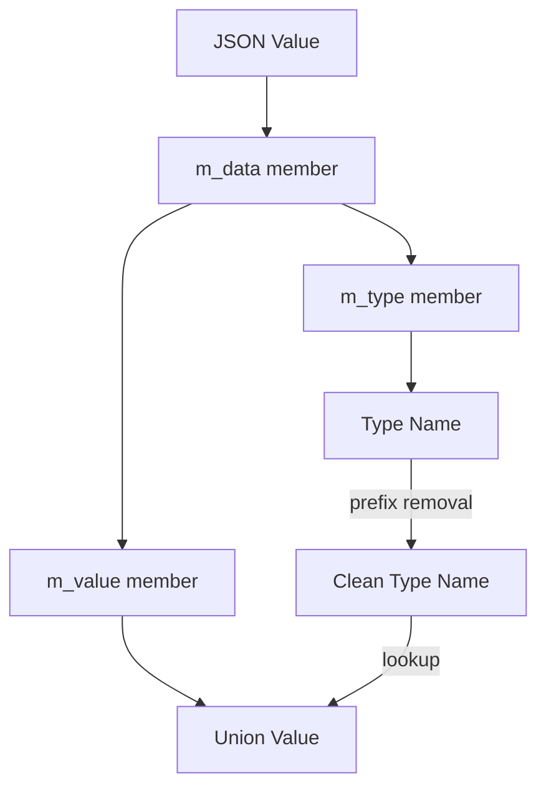

# GDB Pretty Printer Module

## Introduction

The `gdb-pretty-printer` module provides enhanced debugging support for nlohmann/json C++ library types within GDB (GNU Debugger). It implements custom pretty printers that transform complex JSON object representations into human-readable formats during debugging sessions, making it significantly easier for developers to inspect JSON data structures at runtime.

This module is particularly valuable for C++ developers working with the nlohmann/json library, as it eliminates the need to manually parse complex internal representations of JSON objects when debugging applications.

## Architecture Overview

The module follows a single-component architecture centered around the `JsonValuePrinter` class, which integrates with GDB's pretty printing framework through a lookup function mechanism.



## Core Components

### JsonValuePrinter Class

**Location**: `tools.gdb_pretty_printer.nlohmann-json.JsonValuePrinter`

The `JsonValuePrinter` is the core component responsible for formatting JSON values into readable strings. It implements GDB's pretty printer interface by providing a `to_string()` method that converts complex data types into simplified representations.

**Key Features:**
- Handles floating-point number formatting with precision control
- Strips trailing zeros from floating-point representations
- Falls back to default string representation for non-float types
- Integrates seamlessly with GDB's value visualization system

### json_lookup_function

This function serves as the entry point for GDB's pretty printing system. It:
- Identifies nlohmann/json types using regex pattern matching
- Extracts type information from the JSON object's internal structure
- Navigates the JSON object's `m_data`, `m_type`, and `m_value` members
- Delegates to appropriate visualizers or creates custom printers

### Regex Pattern (ns_pattern)

A compiled regular expression pattern that matches nlohmann/json namespace structures, supporting:
- Base namespace: `nlohmann::`
- Versioned namespaces: `nlohmann::json_abi*`
- Version numbers: `_vX_Y_Z` format
- Type name extraction for further processing

## Data Flow



## Integration with GDB

The module integrates with GDB through the global `gdb.pretty_printers` list, which maintains a collection of lookup functions. When GDB encounters a value that needs visualization, it iterates through these functions until one returns a valid printer object.



## JSON Object Structure Navigation

The pretty printer navigates nlohmann/json's internal structure to extract meaningful data:



## Error Handling

The module implements defensive programming practices:
- Exception handling around union value access
- Graceful fallback to type name display on errors
- Pattern matching failure results in no handling (allows GDB to use default visualization)

## Usage

To use this pretty printer in GDB:

1. Source the Python script in your GDB session:
   ```
   (gdb) source tools/gdb_pretty_printer/nlohmann-json.py
   ```

2. The printer automatically activates when nlohmann/json objects are encountered

3. Inspect JSON objects normally - they will display in formatted form:
   ```
   (gdb) print my_json_object
   $1 = {"key": "value", "number": 42.5}
   ```

## Dependencies

This module has minimal external dependencies:
- **gdb**: Core debugging framework providing the pretty printing API
- **re**: Python regular expression module for pattern matching
- **nlohmann/json**: The target library whose types are being visualized

## Relationship to Other Modules

The `gdb-pretty-printer` module operates independently of other modules in the system:

- **[amalgamation-tool](amalgamation-tool.md)**: While the amalgamation tool processes source code, the pretty printer operates on runtime objects
- **[header-server](header-server.md)**: The header server manages development workflows, while the pretty printer enhances debugging experiences

## Performance Considerations

- Regex compilation happens once at module load time
- Minimal overhead during debugging sessions
- Efficient type matching through compiled patterns
- Lazy evaluation - only processes values when explicitly inspected

## Extensibility

The module can be extended to support:
- Additional nlohmann/json type variants
- Custom formatting options for specific data types
- Enhanced error reporting and diagnostics
- Support for other JSON library implementations

## Maintenance Notes

- The regex pattern may need updates if nlohmann/json namespace structure changes
- Version detection logic should be verified with new library releases
- Testing should cover various JSON value types and edge cases
- Consider GDB version compatibility when modifying integration code