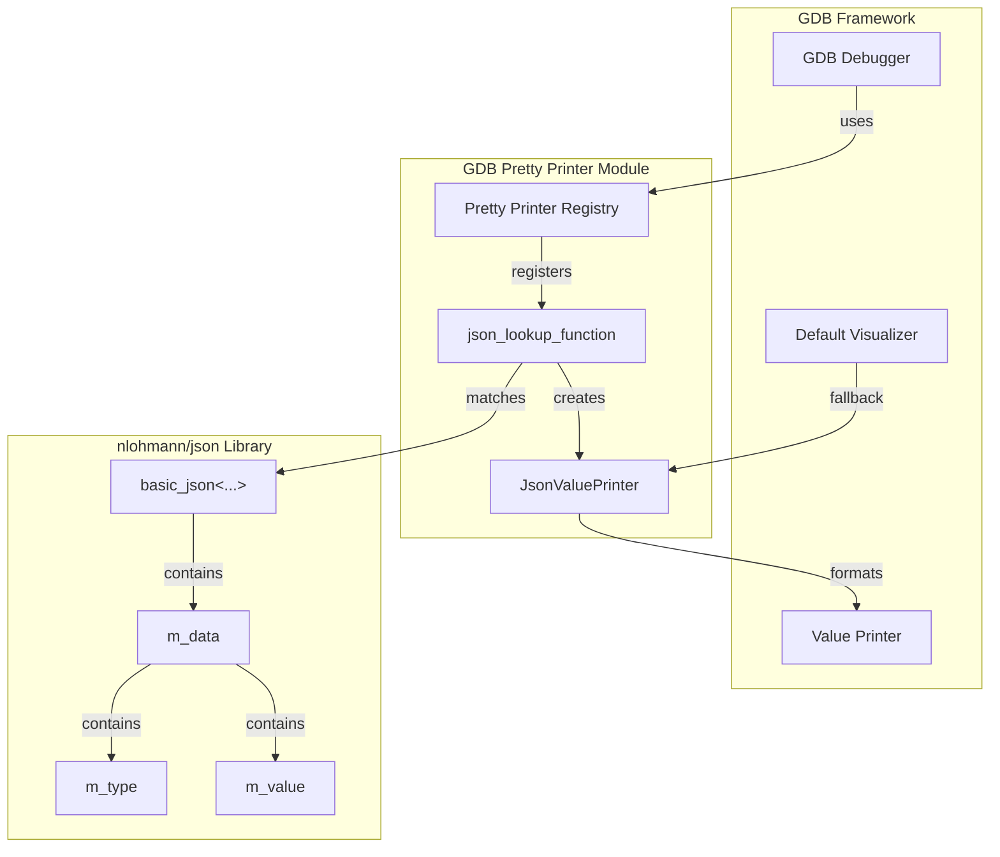
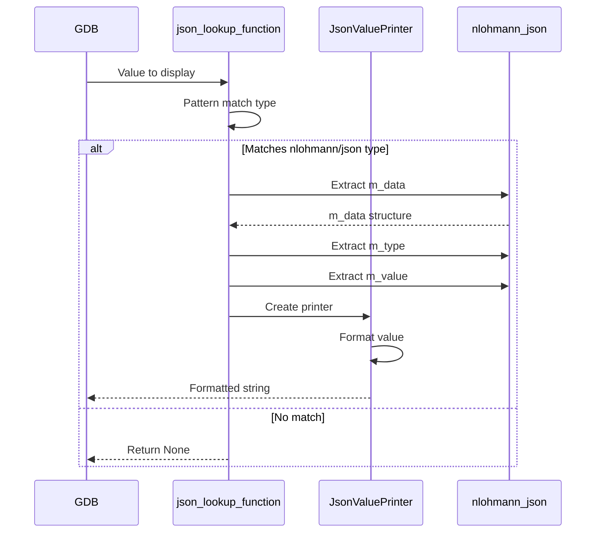
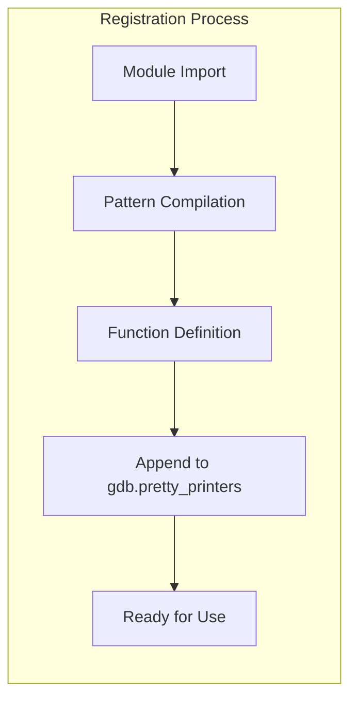
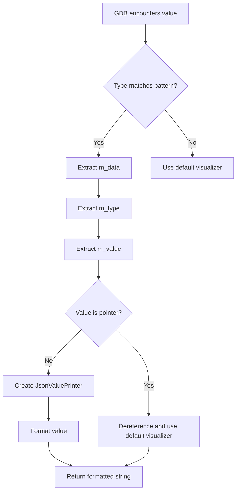

# GDB Pretty Printer Module Documentation

## Introduction

The `gdb_pretty_printer` module provides debugging support for the nlohmann/json library by implementing custom GDB pretty printers. This module enhances the debugging experience by providing human-readable representations of JSON values when debugging applications that use the nlohmann/json library.

## Module Overview

The module consists of a single core component that integrates with GDB's pretty printing framework to display JSON values in a more readable format during debugging sessions.

## Core Components

### JsonValuePrinter

**Location**: `tools.gdb_pretty_printer.nlohmann-json.JsonValuePrinter`

The `JsonValuePrinter` class is the main component responsible for providing custom visualization of nlohmann/json library types in GDB. It implements GDB's pretty printer interface to transform complex JSON data structures into readable string representations.

#### Key Features:
- **Type Pattern Matching**: Uses regex patterns to identify nlohmann/json types
- **Value Extraction**: Navigates through the internal structure of JSON objects
- **Custom Formatting**: Provides specialized formatting for floating-point numbers
- **GDB Integration**: Seamlessly integrates with GDB's visualization system

#### Implementation Details:

```python
class JsonValuePrinter:
    "Print a json-value"
    
    def __init__(self, val):
        self.val = val
    
    def to_string(self):
        if self.val.type.strip_typedefs().code == gdb.TYPE_CODE_FLT:
            return ("%.6f" % float(self.val)).rstrip("0")
        return self.val
```

The printer handles floating-point numbers specially by formatting them to 6 decimal places and removing trailing zeros, providing cleaner output for JSON numeric values.

## Architecture

### Module Architecture



### Data Flow



## Component Interaction

### Pretty Printer Registration



### Value Processing Flow



## Integration with GDB

The module integrates with GDB through the following mechanisms:

1. **Pretty Printer Registration**: The `json_lookup_function` is appended to `gdb.pretty_printers` list
2. **Type Pattern Matching**: Uses regex to identify nlohmann/json types with namespace patterns
3. **Value Navigation**: Traverses the internal structure of JSON objects to extract meaningful data
4. **Fallback Handling**: Provides appropriate fallback to GDB's default visualizers when needed

## Usage

To use this pretty printer in GDB:

1. Import the module in your GDB session
2. The printer automatically registers itself
3. When debugging code using nlohmann/json, JSON values will be displayed in a readable format

## Dependencies

This module has the following dependencies:

- **GDB Python API**: Core dependency for pretty printer functionality
- **nlohmann/json Library**: The library this module provides debugging support for
- **Python re module**: For regex pattern matching

## Technical Details

### Namespace Pattern

The module uses a comprehensive regex pattern to match nlohmann/json namespace variations:

```
nlohmann(::json_abi(?P<tags>\w*)(_v(?P<v_major>\d+)_(?P<v_minor>\d+)_(?P<v_patch>\d+))?)?::(?P<name>.+)
```

This pattern accounts for:
- Base namespace: `nlohmann::`
- ABI tags: `nlohmann::json_abi<tags>::`
- Version information: `nlohmann::json_abi<tags>_v<major>_<minor>_<patch>::`

### Type Extraction

The module navigates through the JSON object's internal structure:
1. Accesses `m_data` member
2. Extracts `m_type` to determine JSON value type
3. Uses type information to access appropriate union member in `m_value`
4. Handles both direct values and pointer types

## Error Handling

The module includes exception handling to gracefully manage cases where:
- JSON structure is unexpected
- Memory access issues occur
- Type information is corrupted

In such cases, it falls back to displaying the type information rather than crashing.

## Relationship to Other Modules

This module is standalone and focused specifically on GDB debugging support. It doesn't directly interact with other modules in the system but provides essential debugging capabilities for applications using the nlohmann/json library.

## Conclusion

The `gdb_pretty_printer` module enhances the debugging experience for developers working with the nlohmann/json library by providing clear, readable representations of JSON values in GDB. Its integration with GDB's pretty printing framework makes it transparent to use once loaded, automatically improving the display of JSON data structures during debugging sessions.