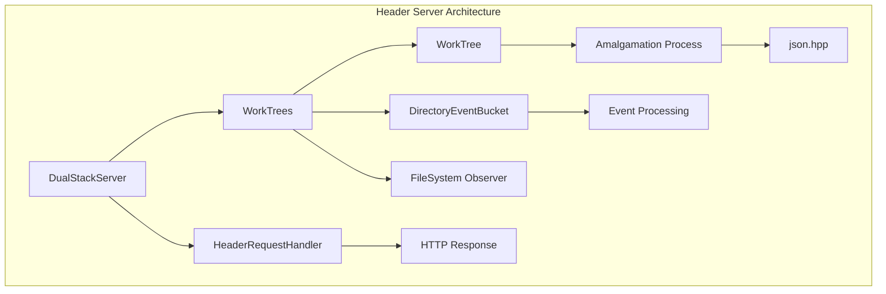
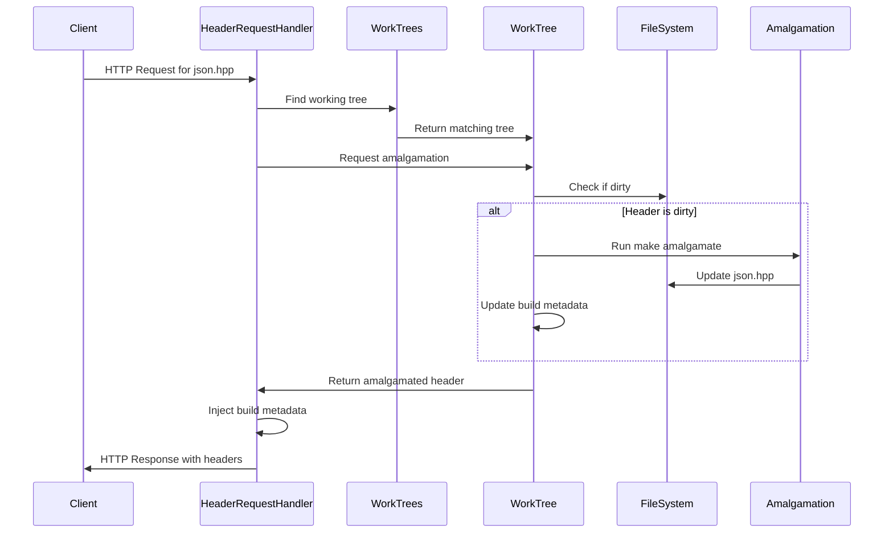
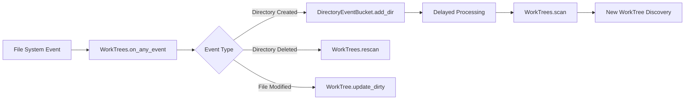
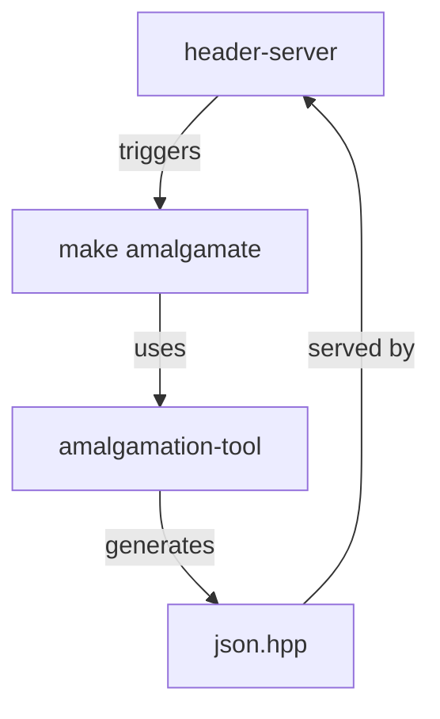

# Header Server Module Documentation

## Introduction

The header-server module is a specialized HTTP/HTTPS server designed to serve amalgamated C++ header files for the nlohmann/json project. It provides real-time header amalgamation and delivery services, automatically rebuilding headers when source files change and injecting build metadata into the served content.

## Core Functionality

The module implements a development server that:
- Monitors project directories for changes to C++ header sources
- Automatically triggers amalgamation of header files when changes are detected
- Serves the amalgamated headers via HTTP/HTTPS with build metadata injection
- Supports multiple working trees simultaneously
- Provides CORS support for cross-origin requests
- Prevents caching to ensure fresh content delivery

## Architecture Overview



## Component Details

### DualStackServer
- **Purpose**: HTTP/HTTPS server with dual-stack IPv4/IPv6 support
- **Type**: ThreadingHTTPServer subclass
- **Key Features**:
  - SSL/TLS support with configurable certificates
  - IPv6 with IPv4 fallback capability
  - Thread-safe request handling
  - Integration with WorkTrees for header management

### HeaderRequestHandler
- **Purpose**: Custom HTTP request handler for header file serving
- **Type**: SimpleHTTPRequestHandler subclass
- **Key Features**:
  - Path translation for header file requests
  - Automatic header amalgamation on request
  - Build metadata injection (build count and timestamp)
  - CORS headers for cross-origin requests
  - Anti-caching headers for development

### WorkTrees
- **Purpose**: Manages multiple project working trees and file system monitoring
- **Type**: FileSystemEventHandler subclass
- **Key Features**:
  - Recursive directory scanning for project roots
  - Real-time file system event monitoring
  - Automatic working tree discovery and management
  - Event batching through DirectoryEventBucket
  - Thread-safe tree management

### WorkTree
- **Purpose**: Represents a single project working tree
- **Type**: Data class with build capabilities
- **Key Features**:
  - Project root validation
  - Header amalgamation triggering
  - Build count and timestamp tracking
  - Dirty state management
  - Make command integration

### DirectoryEventBucket
- **Purpose**: Batches file system events to prevent excessive rebuilds
- **Type**: Event aggregation class
- **Key Features**:
  - Time-based event batching
  - Configurable delay and threshold parameters
  - Thread-safe event processing
  - Common path extraction for efficient rebuilds

## Data Flow



## File System Monitoring Flow



## Configuration and Setup

The server supports configuration through a YAML file (`serve_header.yml`) with the following options:

```yaml
# Server binding configuration
bind: null  # Bind address (null for all interfaces)
port: 8443  # Server port

# HTTPS configuration
https:
  enabled: true
  cert_file: localhost.pem
  key_file: localhost-key.pem

# Root directory for scanning
root: .
```

## Integration with Amalgamation Tool

The header-server module works in conjunction with the [amalgamation-tool](amalgamation-tool.md) to provide real-time header generation:



The server calls the `make amalgamate` command in the appropriate working tree, which in turn uses the amalgamation tool to combine multiple header files into a single `json.hpp` file.

## Request Processing

### Path Resolution
1. Client requests a header file (typically `json.hpp`)
2. Handler translates the virtual path to filesystem path
3. Automatically adds `single_include/nlohmann/` if needed
4. Locates the corresponding WorkTree instance

### Header Serving
1. Validates the requested path matches a known working tree
2. Triggers amalgamation if the tree is marked dirty
3. Injects build metadata (build count and timestamp)
4. Adds appropriate HTTP headers (CORS, anti-caching)
5. Streams the amalgamated header to the client

## Error Handling

- **404 Not Found**: Returned for invalid request paths
- **Connection Errors**: Gracefully handled with debug logging
- **File System Errors**: Directory scanning continues despite individual failures
- **Build Failures**: Amalgamation errors are logged but don't crash the server

## Security Features

- **SSL/TLS Support**: Configurable HTTPS with modern TLS versions
- **CORS Headers**: Configurable cross-origin resource sharing
- **Path Validation**: Prevents directory traversal attacks
- **No Directory Listing**: Only serves specific header files

## Performance Optimizations

- **Event Batching**: Reduces redundant rebuilds through DirectoryEventBucket
- **Dirty State Tracking**: Only rebuilds when necessary
- **Threading**: Handles multiple concurrent requests
- **Caching Prevention**: Ensures clients always receive latest headers

## Usage Examples

### Basic Usage
```bash
# Start the server with default settings
python tools/serve_header/serve_header.py

# Start with custom make command
python tools/serve_header/serve_header.py --make=mingw32-make
```

### Configuration File
Create `serve_header.yml` in the project root:
```yaml
port: 8080
https:
  enabled: false
root: /path/to/project
```

## Dependencies

- **watchdog**: File system event monitoring
- **PyYAML**: Configuration file parsing
- **ssl**: HTTPS support
- **http.server**: Base HTTP server functionality
- **subprocess**: Make command execution

## Thread Safety

All components implement appropriate locking mechanisms:
- WorkTrees uses a tree_lock for thread-safe tree management
- DirectoryEventBucket uses a lock for event processing
- HTTP server is inherently thread-safe for request handling

## Logging and Monitoring

The module provides comprehensive logging:
- Server startup and configuration
- Working tree discovery and management
- File system events and processing
- Header amalgamation and serving
- Error conditions and exceptions

Log format: `[YYYY-MM-DD HH:MM:SS] LEVEL: message`