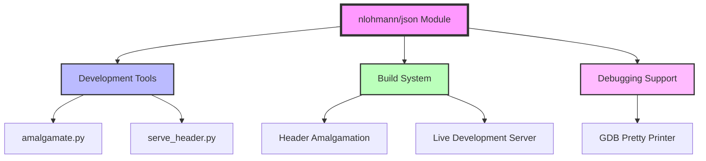
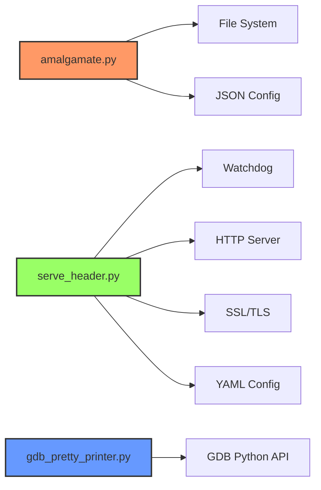

# nlohmann/json Documentation

## Overview

The nlohmann/json library is a modern C++ JSON library that provides an intuitive and easy-to-use API for working with JSON data. This module encompasses the development tools and utilities that support the library's build process, debugging capabilities, and development workflow.

## Architecture

The nlohmann--json module is organized into several specialized tools that facilitate different aspects of library development and usage:



## Core Functionality

### 1. Header Amalgamation System
The amalgamation system combines multiple C++ header files into a single distributable header file. This process:
- Processes include directives and dependencies
- Removes duplicate pragma once directives
- Handles both local and system includes
- Preserves comment and string contexts

**Key Components:**
- [TranslationUnit](amalgamate.md#translationunit-class) - Processes individual source files
- [Amalgamation](amalgamate.md#amalgamation-class) - Orchestrates the amalgamation process

### 2. Development Server
A sophisticated HTTP/HTTPS server that provides live header serving capabilities for development workflows:
- Monitors file system changes in real-time
- Automatically rebuilds amalgamated headers
- Supports multiple working trees simultaneously
- Provides build metadata injection

**Key Components:**
- [DualStackServer](serve_header.md#dualstackserver-class) - HTTP/HTTPS server implementation
- [WorkTrees](serve_header.md#worktrees-class) - File system monitoring and management
- [HeaderRequestHandler](serve_header.md#headerrequesthandler-class) - Custom HTTP request handling

### 3. Debugging Support
GDB pretty printer for enhanced debugging of JSON values during development:
- Automatic type detection for nlohmann::json objects
- Custom value visualization
- Namespace pattern matching for versioned ABI

**Key Components:**
- [JsonValuePrinter](gdb_pretty_printer.md#jsonvalueprinter-class) - Custom GDB value visualization

## Module Dependencies



## Usage Patterns

### Development Workflow
1. **Local Development**: Use `serve_header.py` for live header serving during development
2. **Build Process**: Use `amalgamate.py` to create distributable single headers
3. **Debugging**: Enable GDB pretty printer for enhanced JSON value inspection

### Integration Points
- CMake build system integration
- Continuous integration support
- Package manager compatibility
- IDE integration capabilities

## File Structure

```
nlohmann--json/
├── tools/
│   ├── amalgamate/
│   │   └── amalgamate.py          # Header amalgamation tool
│   ├── serve_header/
│   │   └── serve_header.py        # Development HTTP server
│   └── gdb_pretty_printer/
│       └── nlohmann-json.py       # GDB debugging support
└── include/                       # Main library headers
    └── nlohmann/
        └── json.hpp               # Primary header file
```

## Related Documentation

For detailed information about specific tools and components, refer to:
- [amalgamate.py Documentation](amalgamate.md) - Header amalgamation system
- [serve_header.py Documentation](serve_header.md) - Development server
- [gdb_pretty_printer Documentation](gdb_pretty_printer.md) - Debugging support

## Performance Considerations

- **Amalgamation**: Single header reduces compile-time overhead but increases file size
- **Development Server**: File system monitoring may impact I/O performance on large projects
- **Memory Usage**: Pretty printer adds minimal overhead during debugging sessions

## Security Notes

- Development server supports HTTPS with TLS 1.2+ minimum
- File system access is restricted to project directories
- No authentication mechanism in development server (intended for local use only)