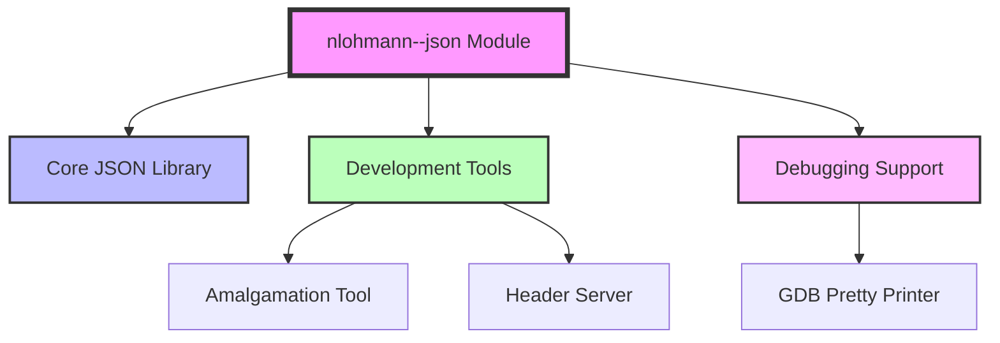
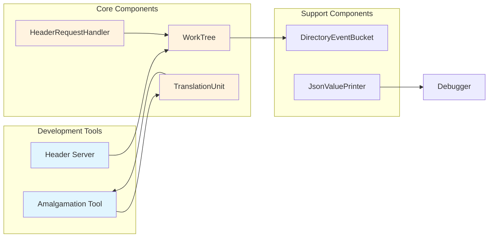
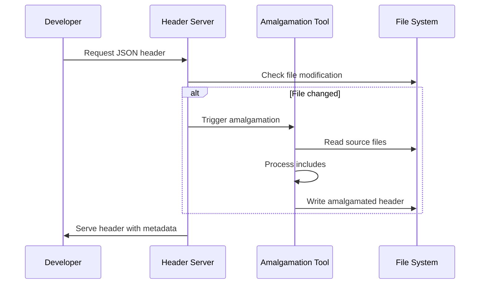

# nlohmann--json Module Documentation

## Overview

The nlohmann--json module is a comprehensive JSON library for C++ that provides tools for JSON processing, development utilities, and debugging support. This module encompasses the core JSON library functionality along with essential development and maintenance tools.

## Architecture

The module is organized into several key sub-modules that work together to provide a complete JSON processing ecosystem:

```mermaid
graph TD
    A[nlohmann--json Module] --> B[Core JSON Library]
    A --> C[Development Tools]
    A --> D[Debugging Support]
    
    C --> C1[Amalgamation Tool]
    C --> C2[Header Server]
    
    D --> D1[GDB Pretty Printer]
    
    style A fill:#f9f,stroke:#333,stroke-width:4px
    style B fill:#bbf,stroke:#333,stroke-width:2px
    style C fill:#bfb,stroke:#333,stroke-width:2px
    style D fill:#fbf,stroke:#333,stroke-width:2px
```

## Sub-modules

### 1. Amalgamation Tool (tools/amalgamate/)

The amalgamation tool is responsible for combining multiple C++ source files into a single header file. This process creates a self-contained JSON library that can be easily integrated into projects without complex build configurations.

**Key Components:**
- `TranslationUnit`: Processes individual source files and handles include dependencies
- `Amalgamation`: Orchestrates the amalgamation process and manages file inclusion

**Features:**
- Recursive include processing with dependency resolution
- Comment and string preservation during processing
- Pragma once directive handling
- Configurable include paths and source directories

### 2. Header Server (tools/serve_header/)

The header server provides a development web server that dynamically serves amalgamated JSON headers. It monitors file changes and automatically rebuilds headers when source files are modified.

**Key Components:**
- `WorkTree`: Manages individual JSON project directories and tracks build state
- `WorkTrees`: Monitors multiple project directories and handles file system events
- `HeaderRequestHandler`: HTTP request handler for serving JSON headers with build metadata
- `DualStackServer`: HTTP/HTTPS server supporting both IPv4 and IPv6
- `DirectoryEventBucket`: Batches file system events to optimize rebuild performance

**Features:**
- Real-time header amalgamation on file changes
- Build count and timestamp injection
- CORS support for cross-origin requests
- SSL/TLS support for secure serving
- Event-driven file system monitoring

### 3. GDB Pretty Printer (tools/gdb_pretty_printer/)

Provides enhanced debugging support for JSON values within GDB, allowing developers to inspect JSON data structures more effectively during debugging sessions.

**Key Components:**
- `JsonValuePrinter`: Custom pretty printer for JSON values in GDB
- `json_lookup_function`: Registration function for GDB pretty printer integration

**Features:**
- Automatic JSON type detection and formatting
- Namespace pattern matching for nlohmann JSON types
- Union value extraction and display
- Integration with GDB's default visualizers

## Component Interactions

```mermaid
graph LR
    subgraph "Development Tools"
        A[Amalgamation Tool]
        B[Header Server]
    end
    
    subgraph "Core Components"
        C[WorkTree]
        D[TranslationUnit]
        E[HeaderRequestHandler]
    end
    
    subgraph "Support Components"
        F[DirectoryEventBucket]
        G[JsonValuePrinter]
    end
    
    A --> D
    D --> A
    B --> C
    C --> F
    E --> C
    G --> H[Debugger]
    
    style A fill:#e1f5fe
    style B fill:#e1f5fe
    style C fill:#fff3e0
    style D fill:#fff3e0
    style E fill:#fff3e0
```

## Data Flow

```mermaid
sequenceDiagram
    participant Dev as Developer
    participant Server as Header Server
    participant Amalg as Amalgamation Tool
    participant FS as File System
    
    Dev->>Server: Request JSON header
    Server->>FS: Check file modification
    alt File changed
        Server->>Amalg: Trigger amalgamation
        Amalg->>FS: Read source files
        Amalg->>Amalg: Process includes
        Amalg->>FS: Write amalgamated header
    end
    Server->>Dev: Serve header with metadata
```

## Integration Points

The module components work together to provide a seamless development experience:

1. **Development Workflow**: The header server monitors source files and automatically triggers amalgamation when changes are detected
2. **Build Process**: The amalgamation tool creates distributable headers from source components
3. **Debugging Experience**: The GDB pretty printer enhances debugging capabilities for JSON data structures

## Configuration

The module supports configuration through:
- YAML configuration files for the header server (serve_header.yml)
- JSON configuration files for the amalgamation process
- Command-line arguments for tool customization

## Dependencies

The module has minimal external dependencies:
- Standard C++ library for core functionality
- Python standard library for development tools
- watchdog library for file system monitoring
- http.server for header serving capabilities

## Usage Scenarios

1. **Library Development**: Developers working on the JSON library can use the header server for real-time testing
2. **Integration Testing**: The amalgamation tool creates single-file distributions for easy integration
3. **Debugging**: The GDB pretty printer assists in debugging applications using the JSON library
4. **Continuous Integration**: The tools can be integrated into CI/CD pipelines for automated builds

## Related Documentation

- [Amalgamation Tool Documentation](amalgamation-tool.md) - Detailed documentation of the amalgamation process and configuration
- [Header Server Documentation](header-server.md) - Complete guide to the development server and its features
- [GDB Pretty Printer Documentation](gdb-pretty-printer.md) - Debugging support and pretty printing configuration