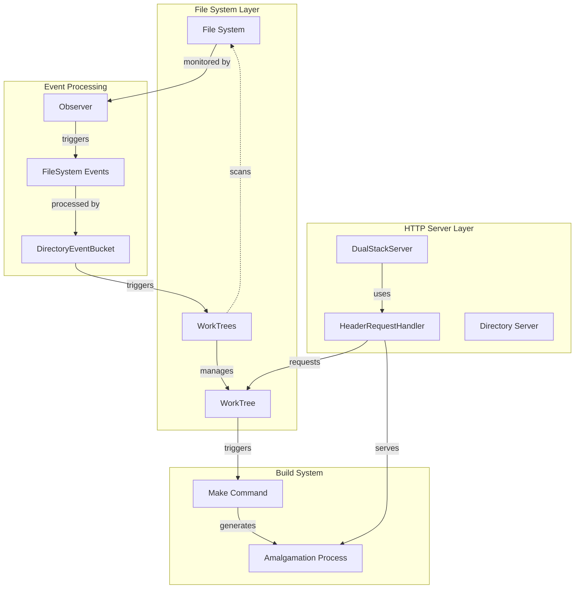
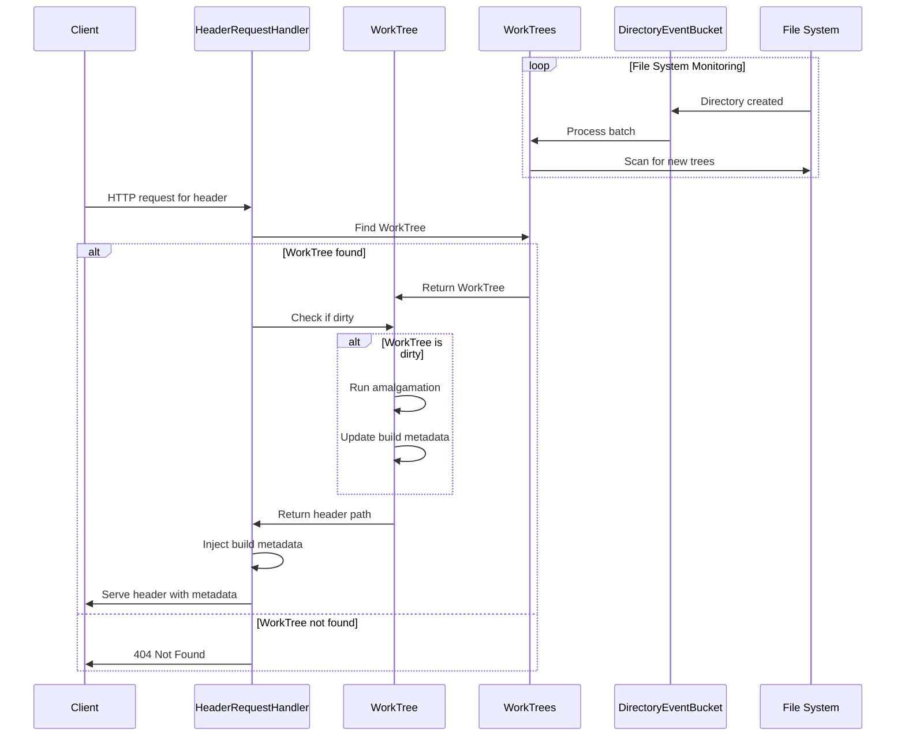
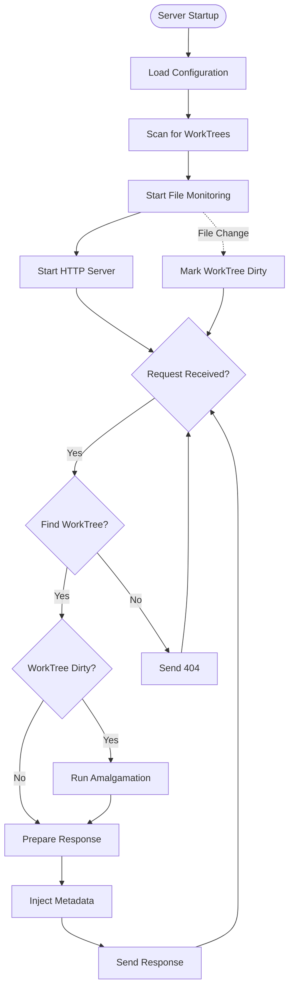

# serve_header Module Documentation

## Introduction

The `serve_header` module is a development server designed to serve amalgamated C++ header files for the nlohmann/json project. It provides a real-time development environment where header files are automatically regenerated when source files change, and served via HTTP/HTTPS with build metadata injection.

## Core Functionality

The module implements a file system monitoring system that:
- Scans for working trees containing nlohmann/json projects
- Monitors source file changes in real-time
- Automatically triggers header amalgamation when changes are detected
- Serves the generated headers via HTTP/HTTPS
- Injects build metadata (build count and timestamp) into served headers

## Architecture Overview



## Component Details

### DualStackServer
- **Purpose**: HTTP/HTTPS server with IPv4/IPv6 dual-stack support
- **Responsibilities**:
  - Binds to both IPv4 and IPv6 addresses
  - Handles SSL/TLS encryption when configured
  - Manages the WorkTrees instance for request handling
- **Key Features**:
  - Configurable via YAML configuration file
  - Support for HTTPS with certificate management
  - Threading support for concurrent requests

### HeaderRequestHandler
- **Purpose**: Custom HTTP request handler for serving amalgamated headers
- **Responsibilities**:
  - Translates HTTP paths to file system paths
  - Locates appropriate WorkTree for requested headers
  - Triggers amalgamation if needed
  - Injects build metadata into served headers
- **Key Features**:
  - Path translation for single_include directory
  - Build count and timestamp injection
  - CORS headers for cross-origin requests
  - Cache prevention headers

### WorkTree
- **Purpose**: Represents a single nlohmann/json working tree
- **Responsibilities**:
  - Tracks amalgamation state (dirty/clean)
  - Manages build count and timestamps
  - Executes amalgamation process
- **Key Features**:
  - Dirty state tracking for incremental builds
  - Build metadata management
  - Configurable make command

### WorkTrees
- **Purpose**: Manages collection of working trees and file system monitoring
- **Responsibilities**:
  - Scans for working trees in directory structure
  - Monitors file system events
  - Updates working tree states
- **Key Features**:
  - Recursive directory scanning
  - Real-time file system monitoring
  - Dynamic addition/removal of working trees

### DirectoryEventBucket
- **Purpose**: Buffers and batches file system events
- **Responsibilities**:
  - Collects directory creation events
  - Buffers events with time-based threshold
  - Triggers batch processing
- **Key Features**:
  - Event debouncing to prevent excessive processing
  - Time-based event batching
  - Thread-safe operation

### ExitHandler
- **Purpose**: Custom logging handler for fatal error handling
- **Responsibilities**:
  - Monitors log levels
  - Triggers system exit on critical errors
- **Key Features**:
  - Configurable exit threshold
  - Immediate process termination

## Data Flow



## Process Flow



## Configuration

The module supports configuration via a YAML file (`serve_header.yml`) with the following options:

```yaml
# Server binding configuration
bind: null  # null for all interfaces, or specific IP
port: 8443  # HTTP/HTTPS port

# HTTPS configuration
https:
  enabled: true
  cert_file: localhost.pem
  key_file: localhost-key.pem

# Root directory for scanning
root: .
```

## Dependencies

The module relies on several external components:

- **watchdog**: File system event monitoring
- **PyYAML**: Configuration file parsing
- **ssl**: HTTPS support
- **http.server**: Base HTTP server functionality

For the amalgamation process, it depends on:
- **make**: Build system execution
- **nlohmann/json build system**: Header amalgamation

## Integration with Other Modules

The serve_header module works in conjunction with the [amalgamate](amalgamate.md) module:
- Uses the same project structure detection logic
- Triggers the amalgamation process via make commands
- Serves the generated headers from the amalgamation process

## Usage Examples

### Basic Usage
```bash
# Start the server with default settings
python serve_header.py

# Start with custom make command
python serve_header.py --make=gmake
```

### Configuration File
Create a `serve_header.yml` file:
```yaml
port: 8080
https:
  enabled: false
root: /path/to/projects
```

## Security Considerations

- HTTPS is enabled by default with TLS 1.2+ requirement
- CORS headers allow cross-origin requests (configurable if needed)
- File system access is restricted to detected working trees
- No authentication mechanism (intended for development use)

## Performance Characteristics

- **File System Monitoring**: Real-time with event batching
- **Amalgamation**: On-demand, only when source files change
- **HTTP Serving**: Multi-threaded request handling
- **Memory Usage**: Proportional to number of working trees

## Error Handling

- **File System Errors**: Graceful handling of disappeared paths
- **Build Failures**: Silent failure with logging (amalgamation errors don't crash server)
- **Network Errors**: Connection reset handling for client disconnections
- **Configuration Errors**: Informative error messages with fallback to defaults

## Logging

The module provides comprehensive logging with:
- Timestamped log entries
- Working tree lifecycle events
- Build process status
- HTTP request processing
- Error conditions with stack traces

Log levels can be configured via standard Python logging configuration.