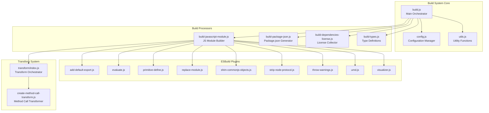
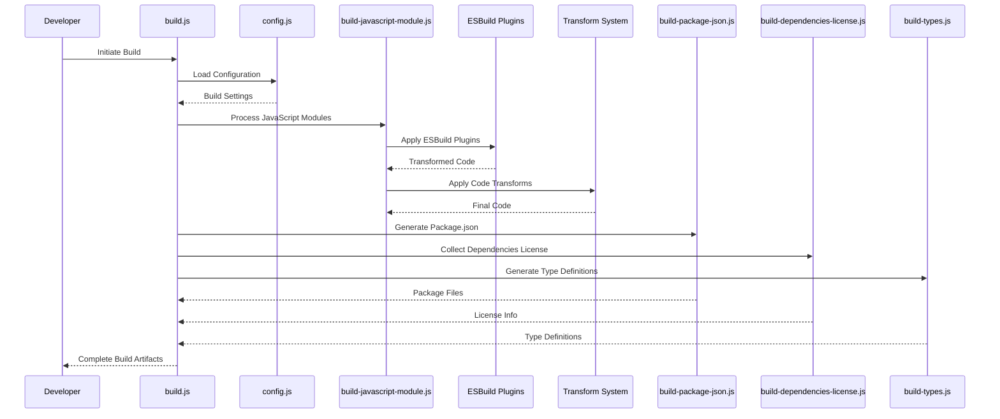
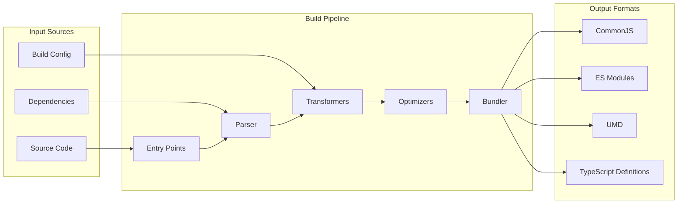
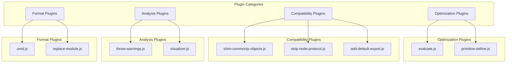

# Build Module Documentation

## Introduction

The build module is a comprehensive build system responsible for compiling, bundling, and packaging the Prettier codebase for distribution. It handles multiple output formats, dependency management, license generation, and type definitions while providing extensive plugin architecture for customization.

## Architecture Overview

## Core Components

### Main Build Orchestrator

**`build.js`** serves as the central command center that coordinates all build activities. It manages the build pipeline, handles configuration loading, and ensures proper sequencing of build tasks.

### Configuration Management

**`config.js`** provides centralized configuration management for the build system. It handles build targets, output formats, plugin configurations, and environment-specific settings.

### Build Processors

The build system employs specialized processors for different aspects of the build process:

- **`build-javascript-module.js`**: Handles JavaScript module compilation and bundling using ESBuild
- **`build-package-json.js`**: Generates appropriate package.json files for different distribution formats
- **`build-dependencies-license.js`**: Aggregates and generates license information for all dependencies
- **`build-types.js`**: Manages TypeScript definition files and type generation

### ESBuild Plugin Architecture

The build system implements a comprehensive plugin architecture with specialized plugins:

- **`add-default-export.js`**: Adds default exports to modules that need them
- **`evaluate.js`**: Evaluates expressions during build time for optimization
- **`primitive-define.js`**: Defines primitive values and constants
- **`replace-module.js`**: Replaces specific modules with alternatives
- **`shim-commonjs-objects.js`**: Provides CommonJS compatibility shims
- **`strip-node-protocol.js`**: Removes Node.js protocol prefixes
- **`throw-warnings.js`**: Handles build warnings and errors
- **`umd.js`**: Generates UMD (Universal Module Definition) format outputs
- **`visualizer.js`**: Provides build visualization and analysis

### Transform System

**`transform/index.js`** orchestrates code transformations, while **`create-method-call-transform.js`** provides specific method call transformations for optimization and compatibility.

## Build Process Flow

## Data Flow Architecture

## Plugin System Architecture

## Integration with Website Module

The build module works closely with the [website module](website.md) to provide build artifacts for the documentation site and playground. The build system generates the necessary JavaScript bundles and assets that power the interactive playground and documentation features.

## Key Features

### Multi-Format Output Support
- CommonJS modules for Node.js compatibility
- ES Modules for modern JavaScript environments
- UMD format for universal compatibility
- TypeScript definitions for type safety

### Advanced Plugin System
- Modular plugin architecture for extensibility
- Custom ESBuild plugins for specific transformations
- Transform pipeline for code optimization
- License aggregation for compliance

### Development and Production Modes
- Development mode with source maps and debugging
- Production mode with optimization and minification
- Configurable build targets and environments
- Comprehensive error handling and reporting

## Build Configuration

The build system supports extensive configuration options:

- **Entry Points**: Multiple entry points for different build targets
- **Output Formats**: Configurable output formats (CJS, ESM, UMD)
- **External Dependencies**: Control over external dependency handling
- **Optimization Levels**: Configurable optimization settings
- **Source Maps**: Optional source map generation
- **Type Definitions**: TypeScript definition generation control

## Error Handling and Reporting

The build system implements comprehensive error handling:

- **Build Warnings**: Non-fatal issues reported via throw-warnings.js
- **Error Aggregation**: Collection and reporting of all build errors
- **Validation**: Input validation and configuration checking
- **Recovery**: Graceful handling of build failures

## Performance Optimization

The build system incorporates several performance optimizations:

- **Parallel Processing**: Concurrent build tasks where possible
- **Caching**: Intelligent caching of build artifacts
- **Tree Shaking**: Dead code elimination
- **Code Splitting**: Optimal bundle splitting strategies
- **Minification**: Code size reduction for production builds

## Security Considerations

The build system includes security measures:

- **Dependency Scanning**: License compliance checking
- **Code Evaluation**: Safe evaluation of build-time expressions
- **Module Replacement**: Controlled module substitution
- **Protocol Stripping**: Removal of potentially unsafe protocols

## Maintenance and Extensibility

The modular architecture allows for easy maintenance and extension:

- **Plugin Development**: Clear interfaces for custom plugins
- **Transform Addition**: Easy addition of new code transformations
- **Configuration Extension**: Flexible configuration system
- **Documentation**: Comprehensive inline documentation

This build system serves as the foundation for preparing Prettier for distribution across multiple platforms and environments, ensuring compatibility, performance, and maintainability of the final build artifacts.